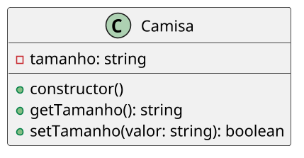

# [TRAIN] Comprando uma camisa XG

<!-- toc-table -->


## Intro

O objetivo dessa atividade é implementar uma classe que controle o tamanho válido de uma camisa.

Nesta atividade você vai praticar **encapsulamento** com o atributo privado `size`, um getter para consulta e um setter validador. O objeto já deve nascer em estado válido, e o setter deve preservar a **invariante** de que o tamanho pertence ao conjunto permitido.

### Mensagens do programa

As explicações da atividade estão em português, mas o texto produzido pelo programa deve ficar em inglês. Use, por exemplo:

- `Enter shirt size`
- `fail: invalid size`
- `Congratulations, you bought a shirt size`

## Regras

- Os tamanhos serão identificados como uma variável tipo texto, e os valores válidos são "PP", "P", "M" e "G", "GG" e "XG".
- Faça o objeto `Shirt` iniciar com um tamanho padrão válido.
- O construtor deve primeiro inicializar o atributo privado com esse tamanho padrão e depois chamar `setSize()` para tentar aplicar o tamanho recebido.
- Crie o método estático `getAllowedSizes()` para retornar uma nova lista com os tamanhos permitidos.
- Crie o método `setSize()` que apenas aceita os valores válidos de tamanho.
- O método `getSize()` deve consultar o estado sem alterá-lo.
- O método `setSize()` deve validar o valor antes de alterar o atributo.
- Caso o valor seja válido, retorne `true` e atualize `size`. Caso seja inválido, retorne `false` sem alterar o estado.
- O setter não deve imprimir mensagens; o loop da interface deve informar quais são os valores permitidos quando receber `false`.
- Faça um código de teste criando uma camisa com tamanho padrão e pedindo para o usuário informar o tamanho desejado.
- Mantenha o usuário preso no loop até que ele insira um valor válido.

## Diagrama

A classe `Shirt` protege seu `size` privado e garante que apenas os tamanhos permitidos façam parte de seu estado. A constante indica o tamanho padrão e `getAllowedSizes()` concentra o conjunto permitido sem expor uma lista interna compartilhada. O getter, o setter e o loop têm responsabilidades distintas: consulta, validação/alteração e interação.



## Guide

Aqui um exemplo de código python incompleto que implementa a classe `Shirt` e um loop para pedir o tamanho da camisa ao usuário.

O ponto principal é preservar a invariante dentro de `setSize()`: se o valor não pertence ao conjunto permitido, o método retorna `false` e mantém o estado anterior.

Pergunta de reflexão: por que a lista de tamanhos válidos não deve ficar apenas no loop de entrada?

```py

class Shirt:
    DEFAULT_SIZE: str = "P"

    def __init__(self, size: str) -> None:
        self.__size: str = Shirt.DEFAULT_SIZE
        self.setSize(size)

    def getSize(self) -> str:
        return self.__size

    @staticmethod
    def getAllowedSizes() -> list[str]:
        return ["PP", "P", "M", "G", "GG", "XG"]

    def setSize(self, size: str) -> bool:
        # valide o valor; retorne False sem alterar o estado se ele for inválido
        pass

# loop principal
shirt = Shirt() # criando camisa

while True: # mantendo usuário no loop
    print("Enter shirt size")
    size = input() # lendo a resposta
    if shirt.setSize(size): # tentando atribuir o tamanho informado
        break
    else:
        print("fail: invalid size")
        print("Allowed sizes are:", ", ".join(Shirt.getAllowedSizes()))

print("Congratulations, you bought a shirt size", shirt.getSize())
```

## Draft

<!-- links .cache/starter -->
<!-- links -->
