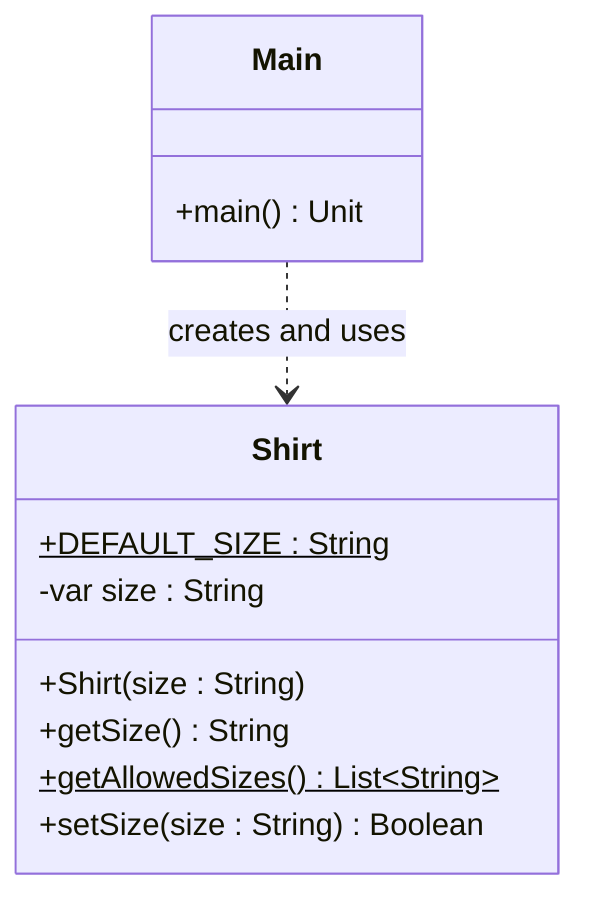

# [TRAIN] Camisa de tamanho fixo

<!-- toc-table -->


## Intro

O objetivo dessa atividade é implementar uma classe que controle o tamanho válido de uma camisa.

Nesta atividade você vai praticar **encapsulamento** com a propriedade privada `size`, o método `getSize()` para consulta e o método `setSize(size: String): Boolean` para validação. O objeto já deve nascer em estado válido, e `setSize` deve preservar a **invariante** de que o tamanho pertence ao conjunto permitido.

### Mensagens do programa

As explicações da atividade estão em português, mas o texto produzido pelo programa deve ficar em inglês. Use, por exemplo:

- `Enter shirt size`
- `fail: invalid size`
- `Congratulations, you bought a shirt size`

## Regras

- Os tamanhos são textos, e os valores válidos são `PP`, `P`, `M`, `G`, `GG` e `XG`.
- Faça o objeto `Shirt` iniciar com um tamanho padrão válido.
- O construtor deve primeiro inicializar a propriedade privada com esse tamanho padrão e depois chamar `setSize()` para tentar aplicar o tamanho recebido.
- Crie o método estático `getAllowedSizes()` para retornar uma nova lista com os tamanhos permitidos.
- Crie o método `setSize()` que apenas aceita os valores válidos de tamanho.
- O método `getSize()` deve consultar o estado sem alterá-lo.
- O método `setSize()` deve validar o valor antes de alterar a propriedade.
- Caso o valor seja válido, retorne `true` e atualize `size`. Caso seja inválido, retorne `false` sem alterar o estado.
- `setSize` não deve imprimir mensagens; o loop da interface deve informar quais são os valores permitidos quando receber `false`.
- Faça um código de teste criando uma camisa com tamanho padrão e pedindo para o usuário informar o tamanho desejado.
- Mantenha o usuário preso no loop até que ele insira um valor válido.

## Diagrama

`Shirt` protege seu tamanho e concentra a lista de tamanhos válidos. `setSize()` valida antes de alterar o estado; `getAllowedSizes()` devolve uma nova lista; `main` conduz o loop e apresenta as mensagens.


```mermaid
%%{init: { "fontFamily": "monospace" } }%%
classDiagram
    direction TB

    class Shirt {
        +DEFAULT_SIZE : String$
        -var size : String
        +Shirt(size : String)
        +getSize() String
        +getAllowedSizes() List~String~$
        +setSize(size : String) Boolean
    }

    class Main {
        +main() Unit
    }

    Main ..> Shirt : creates and uses
```

## Guide

Aqui um exemplo Kotlin incompleto que implementa a classe `Shirt` e a validação do tamanho.

O ponto principal é preservar a invariante dentro de `setSize()`: se o valor não pertence ao conjunto permitido, o método retorna `false` e mantém o estado anterior. A lista permitida fica no `companion object` para ser consultada sem depender de uma instância.

Pergunta de reflexão: por que a lista de tamanhos válidos não deve ficar apenas no loop de entrada?

```kotlin
class Shirt {
    companion object {
        const val DEFAULT_SIZE: String = "P"

        fun getAllowedSizes(): List<String> = listOf("PP", "P", "M", "G", "GG", "XG")
    }

    private var size: String = DEFAULT_SIZE

    constructor(size: String) {
        setSize(size)
    }

    fun getSize(): String = size

    fun setSize(size: String): Boolean {
        // valide o valor; retorne false sem alterar o estado se ele for inválido
        return false
    }
}

val shirt: Shirt = Shirt(Shirt.DEFAULT_SIZE)
```

Verifique os limites e o estado após falha: `PP`, `P`, `M`, `G`, `GG` e `XG` devem ser aceitos; `XXL` deve ser rejeitado; depois de criar a camisa com `P`, uma tentativa inválida deve manter `getSize()` igual a `P`. Cada chamada de `getAllowedSizes()` deve devolver uma lista nova.

<!-- MERMAID -->

## Draft

<!-- links .cache/starter -->
<!-- end -->
