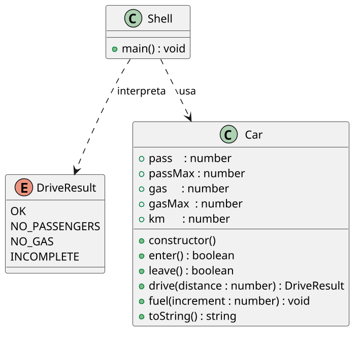

# Um carro simples

<!-- toc-table -->
[Intro](#intro) | [Regras](#regras) | [Diagrama](#diagrama) | [Guide](#guide) | [Shell](#shell) | [Draft](#draft)
-- | -- | -- | -- | -- | --
<!-- toc-table -->


## Intro

Nesta atividade, vamos implementar um carro ecológico. Ele deve ser capaz de embarcar e desembarcar pessoas, abastecer e andar. A atividade também introduz uma primeira separação de responsabilidades entre lógica de negócio e interação com o usuário.

- A classe Car representa o carro e deve conter seu estado e suas regras de negócio.
- A classe Shell representa a interface de linha de comando e deve cuidar da leitura dos comandos e da apresentação dos resultados.
- A classe Car não deve utilizar System.out.
- `enter` e `leave` devem retornar `boolean`, pois cada um possui apenas uma forma de falha relevante.
- `drive` deve retornar um valor do tipo `DriveResult`, pois possui falhas distintas.
- O Shell deve interpretar cada retorno e decidir qual mensagem apresentar ao usuário.

## Regras

- O carro deve ser inicializado com o tanque vazio, sem ninguém dentro e com 0 quilômetros percorridos. Suporta até 2 pessoas e até 100 litros de combustível.
- Construtor do Carro
  - `pass`: 0 passageiros.
  - `km`: 0 quilômetros percorridos.
  - `passMax`: Máximo de 2 pessoas.
  - `gas`: 0 litros de gasolina.
  - `gasMax`: Máximo de 100 litros de gasolina.
- Mostrar `$show`
  - Imprime a chamada do método `toString` do carro.
  - `toString` - Retorna uma string com o estado atual do carro no formato:
    - `pass: {pass}, gas: {gas}, km: {km}`.
- Entrar `$enter`
  - Embarca uma pessoa por vez, mas não além do máximo.
  - Se o carro estiver lotado, emite a mensagem de erro.
    - `fail: limite de pessoas atingido`.
- Sair `$leave`
  - Desembarca uma pessoa por vez.
  - Se não houver ninguém no carro, emite a mensagem de erro.
    - `fail: nao ha ninguem no carro`.
- Abastecer certa quantidade `$fuel increment`
  - Abastece o tanque com a quantidade de litros de combustível passada.
  - Caso tente abastecer acima do limite, descarta o valor excedente.
- Dirigir certa distância `$drive distance`
  - Para dirigir, o carro consome combustível e aumenta a quilometragem.
  - Só pode dirigir se houver combustível e se houver alguém no carro.
  - Caso não haja ninguém no carro, emite a mensagem de erro.
    - `fail: nao ha ninguem no carro`
  - Caso não haja combustível, emite a mensagem de erro.
    - `fail: tanque vazio`
  - Caso não exista combustível suficiente para completar a viagem inteira, dirija o máximo possível e emite uma mensagem de falha.
    - `fail: viagem incompleta`.

## Diagrama

O diagrama separa o domínio (`Car` e `DriveResult`) da interface (`Shell`). `Car` mantém apenas o estado e as regras do carro; `Shell` lê comandos e interpreta os resultados.



## Guide

[](https://youtu.be/LM6KM4eLi3U)

- Comece pelo construtor e pelo `toString`, conferindo o estado inicial com `$show`.
- Implemente `enter` e `leave`, retornando `false` quando a operação não puder ser feita.
- Implemente `fuel`, garantindo que o tanque não ultrapasse `gasMax`.
- Implemente `drive`, preservando a ordem das validações: primeiro passageiro, depois combustível.
- No `Shell`, declare constantes para as mensagens e traduza os retornos diretamente na `main`: cada `false` de `enter` e `leave` deve usar sua mensagem específica, e cada `DriveResult` de `drive` deve ser tratado no `switch` correspondente.

Pergunta de reflexão: que problema surgiria se `drive` imprimisse as mensagens diretamente dentro de `Car`?

## Shell

```bash
#TEST_CASE inicializar
$show
pass: 0, gas: 0, km: 0

#TEST_CASE entrar
$enter
$enter
$show
pass: 2, gas: 0, km: 0

#TEST_CASE limite
$enter
fail: limite de pessoas atingido
$show
pass: 2, gas: 0, km: 0

#TEST_CASE sair
$leave
$show
pass: 1, gas: 0, km: 0

#TEST_CASE limite saida
$leave
$leave
fail: nao ha ninguem no carro
$show
pass: 0, gas: 0, km: 0
$end
```

***

```bash
#TEST_CASE abastecer
$fuel 60
$show
pass: 0, gas: 60, km: 0

#TEST_CASE dirigir vazio
$drive 10
fail: nao ha ninguem no carro

#TEST_CASE dirigir
$enter
$drive 10
$show
pass: 1, gas: 50, km: 10

#TEST_CASE para longe
$drive 70
fail: viagem incompleta
$drive 10
fail: tanque vazio
$show
pass: 1, gas: 0, km: 60

#TEST_CASE enchendo o tanque
$fuel 200
$show
pass: 1, gas: 100, km: 60
$end
#
```

## Draft

<!-- links .cache/starter -->
<!-- links -->
