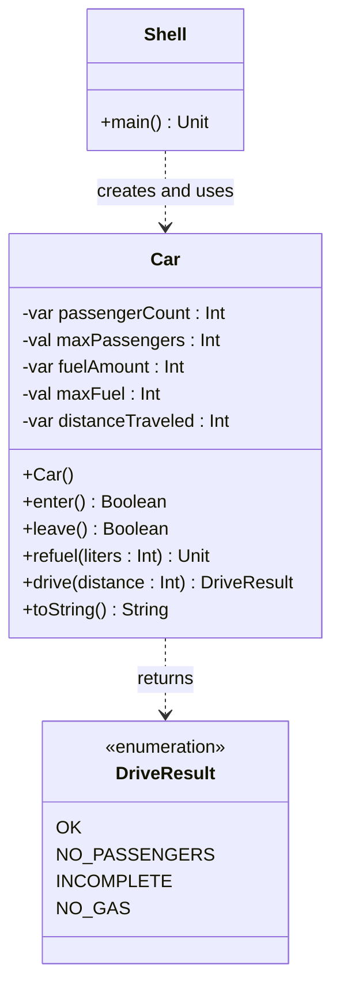

# [ALONE] Carro dirigível

<!-- toc-table -->
[Intro](#intro) | [Regras](#regras) | [Diagrama ](#diagrama-) | [Guide](#guide) | [Shell](#shell) | [Draft](#draft)
-- | -- | -- | -- | -- | --
<!-- toc-table -->


## Intro

Nesta atividade, vamos implementar um carro ecológico. Ele deve ser capaz de embarcar e desembarcar pessoas, abastecer e andar. A atividade também introduz uma primeira separação de responsabilidades entre lógica de negócio e interação com o usuário.

- A classe `Car` representa o carro e deve conter seu estado e suas regras de negócio.
- A classe `Shell` representa a interface de linha de comando e deve cuidar da leitura dos comandos e da apresentação dos resultados.
- A classe `Car` não deve ler entrada nem imprimir saída.
- `enter(): Boolean` e `leave(): Boolean` retornam `false` quando a operação não pode ser realizada.
- `drive(distance: Int): DriveResult` retorna o resultado da tentativa, pois há falhas distintas.
- O Shell deve interpretar cada retorno e decidir qual mensagem apresentar ao usuário.

## Regras

- O carro deve ser inicializado com o tanque vazio, sem ninguém dentro e com 0 quilômetros percorridos. Suporta até 2 pessoas e até 100 litros de combustível.
- Construtor `Car()`
  - `passengerCount: Int` começa em `0`.
  - `distanceTraveled: Int` começa em `0` quilômetros percorridos.
  - `maxPassengers: Int` é `2`.
  - `fuelAmount: Int` começa em `0` litros de combustível.
  - `maxFuel: Int` é `100` litros de combustível.
- Mostrar `$show`
  - Imprime a chamada de `toString(): String` do carro.
  - `toString(): String` retorna o estado atual do carro no formato:
    - `pass: {pass}, gas: {gas}, km: {km}`.
- Entrar `$enter`
  - Embarca uma pessoa por vez, mas não além do máximo.
  - Se o carro estiver lotado, emite a mensagem de erro.
    - `fail: car is full`.
- Sair `$leave`
  - Desembarca uma pessoa por vez.
  - Se não houver ninguém no carro, emite a mensagem de erro.
    - `fail: car is empty`.
- Abastecer certa quantidade `$refuel liters`
  - Abastece o tanque com a quantidade de litros de combustível passada.
  - Caso tente abastecer acima do limite, descarta o valor excedente.
- Dirigir certa distância `$drive distance`
  - Para dirigir, o carro consome combustível e aumenta a quilometragem.
  - Só pode dirigir se houver combustível e se houver alguém no carro.
  - Caso não haja ninguém no carro, emite a mensagem de erro.
    - `fail: car is empty`
  - Caso não haja combustível, emite a mensagem de erro.
    - `fail: empty tank`
  - Caso não exista combustível suficiente para completar a viagem inteira, dirija o máximo possível e emite uma mensagem de falha.
    - `fail: incomplete trip`.

## Diagrama <!-- @diagrama -->

O diagrama separa o domínio (`Car` e `DriveResult`) da interface (`Shell`). `Car` mantém apenas o estado e as regras do carro; `Shell` lê comandos, converte os resultados em mensagens e os apresenta.


```mermaid
%%{init: { "fontFamily": "monospace" } }%%
classDiagram
    direction TB

    class DriveResult {
        <<enumeration>>
        OK
        NO_PASSENGERS
        INCOMPLETE
        NO_GAS
    }

    class Car {
        -var passengerCount : Int
        -val maxPassengers : Int
        -var fuelAmount : Int
        -val maxFuel : Int
        -var distanceTraveled : Int
        +Car()
        +enter() Boolean
        +leave() Boolean
        +refuel(liters : Int) Unit
        +drive(distance : Int) DriveResult
        +toString() String
    }

    class Shell {
        +main() Unit
    }

    Car ..> DriveResult : returns
    Shell ..> Car : creates and uses

```

## Guide

- Comece pelo construtor e por `toString(): String`, conferindo o estado inicial com `$show`.
- Implemente `enter(): Boolean` e `leave(): Boolean`, retornando `false` quando a operação não puder ser feita.
- Implemente `refuel(liters: Int)`, garantindo que o tanque não ultrapasse `maxFuel`.
- Implemente `drive(distance: Int): DriveResult`, preservando a ordem das validações: primeiro passageiro, depois combustível.
- No `Shell`, declare constantes para as mensagens e traduza os retornos na interface: cada `false` de `enter()` e `leave()` deve usar sua mensagem específica, e cada `DriveResult` de `drive()` deve ser traduzido para a mensagem correspondente.

Pergunta de reflexão: que problema surgiria se `drive` imprimisse as mensagens diretamente dentro de `Car`?

## Shell

```bash
#TEST_CASE init
$show
pass: 0, gas: 0, km: 0

#TEST_CASE enter
$enter
$enter
$show
pass: 2, gas: 0, km: 0

#TEST_CASE full
$enter
fail: car is full
$show
pass: 2, gas: 0, km: 0

#TEST_CASE leave
$leave
$show
pass: 1, gas: 0, km: 0

#TEST_CASE empty
$leave
$leave
fail: car is empty
$show
pass: 0, gas: 0, km: 0
$end
```

***

```bash
#TEST_CASE refuel
$refuel 60
$show
pass: 0, gas: 60, km: 0

#TEST_CASE drive empty
$drive 10
fail: car is empty

#TEST_CASE drive
$enter
$drive 10
$show
pass: 1, gas: 50, km: 10

#TEST_CASE far trip
$drive 70
fail: incomplete trip
$drive 10
fail: empty tank
$show
pass: 1, gas: 0, km: 60

#TEST_CASE fill tank
$refuel 200
$show
pass: 1, gas: 100, km: 60
$end
#
```

## Draft

<!-- links .cache/starter -->
<!-- links -->
