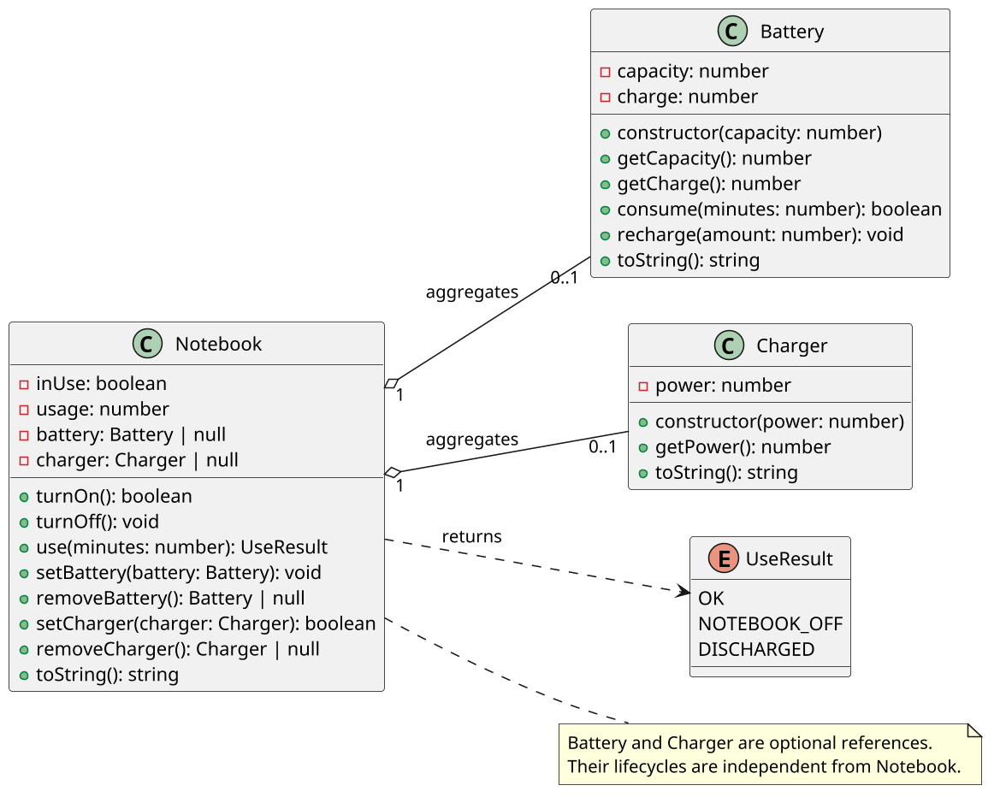

# Charger: agregação e coordenação por etapas

<!-- toc-table -->
[Intro](#intro) | [Regras](#regras) | [Diagrama](#diagrama) | [Guide](#guide) | [Shell](#shell) | [Draft](#draft)
-- | -- | -- | -- | -- | --
<!-- toc-table -->


## Intro

Esta atividade conduz a construção incremental de um `Notebook` que coordena uma `Battery` e um `Charger`. A cada etapa, um novo comportamento torna necessária uma nova responsabilidade ou uma nova colaboração entre os objetos.

O objetivo principal é praticar agregação e coordenação sem transferir para o `Notebook` as regras que pertencem aos componentes.

## Regras

- `Notebook` agrega no máximo uma `Battery` e um `Charger`.
- `Battery` e `Charger` são criados fora do `Notebook` e continuam existindo quando removidos.
- Os atributos de domínio devem ser privados.
- As classes de domínio não leem entrada nem imprimem mensagens.
- Métodos de domínio retornam `bool`, enums ou componentes removidos. Mensagens pertencem ao `Shell`.
- `Battery` inicia com `charge` igual a `capacity` e mantém `0 <= charge <= capacity`.
- `Battery.consume(minutes)` reduz a carga. Quando não há carga suficiente, zera a bateria e informa falha.
- `Battery.recharge(amount)` aumenta a carga sem ultrapassar a capacidade.
- O `Notebook` pode ser ligado quando possui bateria com carga ou carregador.
- Em uso somente com bateria, o notebook consome uma unidade de carga por minuto.
- Em uso somente com carregador, o notebook acumula minutos de uso.
- Com bateria e carregador, o notebook acumula minutos de uso e recarrega a bateria usando `power * minutes`.
- Se a bateria descarregar durante o uso, o notebook desliga.
- Remover a única fonte de energia enquanto o notebook está ligado também o desliga.

### Contrato observável

Os comandos usam camelCase: `$show`, `$turnOn`, `$turnOff`, `$use`, `$setBattery`, `$removeBattery`, `$setCharger`, `$removeCharger` e `$end`.

As mensagens observáveis são:

- `fail: cannot turn on`
- `fail: notebook is off`
- `fail: battery discharged`
- `fail: charger is already connected`
- `fail: no battery`
- `fail: no charger`

## Diagrama

[](assets/diagrama.png)

## Guide

Implemente e execute uma etapa por vez. Os testes do Shell estão ordenados para acompanhar essa progressão.

### 1. Estado mínimo do Notebook

Crie `Notebook` com o estado privado `inUse` e o acumulador `usage`. Implemente `turnOn`, `turnOff`, `use` e `toString`. Primeiro, o notebook deve iniciar desligado e recusar o uso quando estiver desligado ou não possuir uma fonte de energia.

Use `UseResult` para distinguir `OK`, `NOTEBOOK_OFF` e `DISCHARGED`. O `Shell` converte esses valores nas mensagens do contrato.

### 2. Battery e consumo

Crie `Battery` com `capacity` e `charge`. O construtor inicia a carga no máximo. Implemente `consume` e `recharge`, mantendo a invariante dentro da própria classe.

Adicione a referência opcional à bateria no `Notebook`, com `setBattery` e `removeBattery`. O notebook coordena quando consumir, mas não altera `charge` diretamente. Se o consumo falhar, desligue o notebook e retorne `DISCHARGED`.

### 3. Charger e agregação

Crie `Charger` com `power`. Adicione uma referência opcional no `Notebook`. `setCharger` deve retornar `false` quando já houver carregador; `removeCharger` retorna o objeto removido ou `None`.

A existência do carregador permite ligar e usar o notebook sem bateria. Quando ele for a única fonte de energia e for removido, o notebook deve desligar.

### 4. Colaboração entre os componentes

Quando houver bateria e carregador, `Notebook.use` deve delegar as operações de consumo e recarga aos componentes. A bateria deve permanecer limitada à capacidade, inclusive quando a recarga calculada for maior que o espaço disponível.

Reflita: quais regras seriam quebradas se `Notebook` recebesse um setter genérico para `charge`? Qual é o ciclo de vida de cada objeto? Por que as remoções retornam o objeto, em vez de apenas apagarem a referência?

## Shell

```bash
#TEST_CASE initial state
$show
Notebook: off
$turnOn
fail: cannot turn on
$use 5
fail: notebook is off
$end
```

___

```bash
#TEST_CASE charger without battery
$setCharger 2
$turnOn
$show
Notebook: on for 0 min, Charger 2W
$use 5
$show
Notebook: on for 5 min, Charger 2W
$setCharger 3
fail: charger is already connected
$removeCharger
Removed 2W
$removeCharger
fail: no charger
$show
Notebook: off
$end
```

___

```bash
#TEST_CASE battery without charger
$setBattery 10
$turnOn
$use 4
$show
Notebook: on for 4 min, Battery 6/10
$use 6
$show
Notebook: on for 10 min, Battery 0/10
$use 1
fail: battery discharged
$show
Notebook: off, Battery 0/10
$end
```

___

```bash
#TEST_CASE battery removal
$setBattery 10
$turnOn
$use 3
$removeBattery
Removed 7/10
$removeBattery
fail: no battery
$show
Notebook: off
$end
```

___

```bash
#TEST_CASE battery and charger
$setBattery 10
$setCharger 3
$turnOn
$use 2
$show
Notebook: on for 2 min, Charger 3W, Battery 10/10
$use 4
$show
Notebook: on for 6 min, Charger 3W, Battery 10/10
$end
```

___

```bash
#TEST_CASE battery discharge after charger removal
$setBattery 5
$setCharger 2
$turnOn
$use 5
$show
Notebook: on for 5 min, Charger 2W, Battery 5/5
$removeCharger
Removed 2W
$use 6
fail: battery discharged
$show
Notebook: off, Battery 0/5
$end
```

## Draft

<!-- links .cache/starter -->
<!-- links -->
