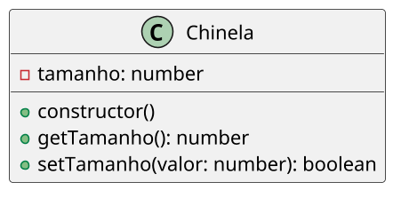

# [GUIA] Comprando uma chinela 40/41

<!-- toc-table -->
<!-- toc-table -->


## Intro

O objetivo dessa atividade é implementar uma classe que controle o tamanho válido de uma chinela.

Nesta atividade você vai praticar **encapsulamento**: o tamanho fica em um atributo privado e só pode ser consultado pelo getter `getTamanho` ou alterado pelo setter `setTamanho`. O setter deve preservar a **invariante** de que o tamanho seja par e esteja entre 20 e 50.

## Regras

- Uma chinela tem um valor tamanho que é um número par entre 20 e 50, incluindo 20 e 50.
- Faça o objeto chinela iniciar com tamanho 0 e controle através do método `setTamanho` para que apenas valores válidos sejam atribuídos.
- O método `setTamanho` deve retornar `true` quando alterar o tamanho e `false` quando rejeitar o valor. Ele não deve imprimir mensagens.
- O método `getTamanho` deve apenas consultar o estado do objeto.
- Por fim, crie um loop no qual um objeto chinela é criado e é perguntado ao usuário qual seu tamanho de chinela.
- Mantenha o usuário preso no loop até que ele insira um valor válido.
- Caso ele digite um valor inválido, o loop deve interpretar o retorno do setter e exibir uma mensagem de erro adequada.

## Diagrama

O tamanho é um detalhe interno da classe `Chinela`. O getter permite a consulta e o setter concentra a validação da invariante, mantendo a interface responsável apenas pela leitura e pelas mensagens. Essa divisão aplica encapsulamento, responsabilidade única, KISS e torna a regra fácil de testar sem entrada do usuário.



## Guide

[](https://youtu.be/pC3DMuHVFHE?si=XIylk3z3zABCD0hj)


```py

class Chinela:
    # inicialização da chinela com valor de tamanho 0
    def __init__(self):    # isso é o construtor em python
        self.__tamanho = 0 # quando tem __ na frente em python é privado

    def getTamanho(self): # métodos em python tem self como primeiro atributo
        return self.__tamanho

    def setTamanho(self, valor: int) -> bool:
        # validar o valor; retorne false sem alterar o estado se ele for inválido

# loop principal
chinela = Chinela() # criando chinela com valor tamanho padrão

while chinela.getTamanho() == 0: # mantendo usuário no loop
    print("Digite seu tamanho de chinela")
    tamanho = int(input()) # lendo a resposta e convertendo pra inteiro
    if not chinela.setTamanho(tamanho): # o domínio retorna falha sem imprimir
        print("Tamanho inválido, informe um número par entre 20 e 50")

print("Parabens, você comprou uma chinela tamanho", chinela.getTamanho())
```
