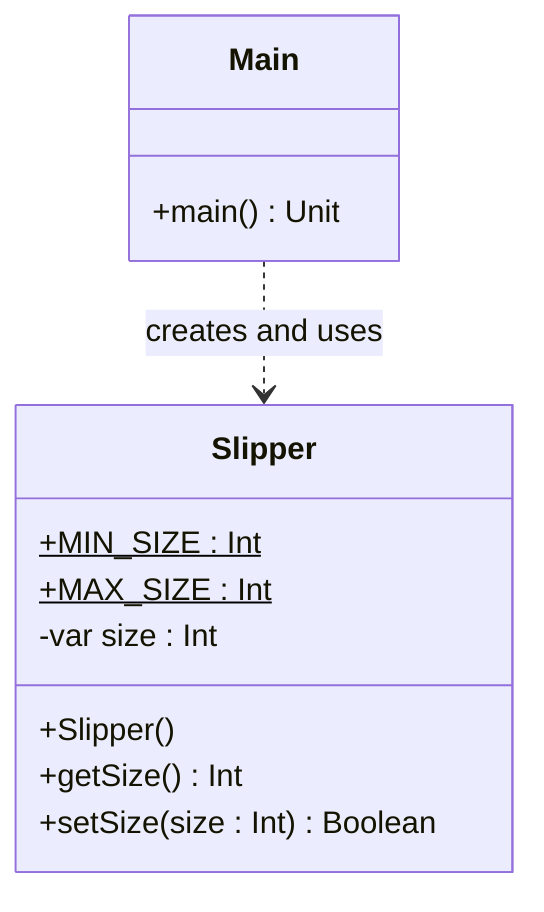

# [GUIDE] Chinela de números pares

<!-- toc-table -->


## Intro

O objetivo dessa atividade é implementar uma classe que controle o tamanho válido de uma chinela.

Nesta atividade você vai praticar **encapsulamento**: o tamanho fica na propriedade privada `size` e só pode ser consultado por `getSize()` ou alterado por `setSize(size: Int): Boolean`. O objeto já deve nascer em estado válido, e `setSize` deve preservar a **invariante** de que o tamanho seja par e esteja entre 20 e 50.

### Mensagens do programa

As explicações da atividade estão em português, mas o texto produzido pelo programa deve ficar em inglês. Use, por exemplo:

- `Enter slipper size`
- `fail: invalid size`
- `Congratulations, you bought a slipper size`

## Regras

- Uma chinela tem um valor tamanho que é um número par entre 20 e 50, incluindo 20 e 50.
- Faça o objeto `Slipper` iniciar com o menor tamanho válido e controle a propriedade através de `setSize(size: Int): Boolean` para que apenas valores válidos sejam atribuídos.
- O método `setSize` deve retornar `true` quando alterar o tamanho e `false` quando rejeitar o valor. Ele não deve imprimir mensagens.
- O método `getSize(): Int` deve apenas consultar o estado do objeto.
- Por fim, crie um loop no qual um objeto chinela é criado e é perguntado ao usuário qual seu tamanho de chinela.
- Mantenha o usuário preso no loop até que ele insira um valor válido.
- Caso ele digite um valor inválido, o loop deve interpretar o retorno do setter e exibir uma mensagem de erro adequada.

## Diagrama

O tamanho é um detalhe interno da classe `Slipper`. As constantes indicam os limites válidos do domínio. O getter permite a consulta e o setter concentra a validação da invariante, mantendo a interface responsável apenas pela leitura e pelas mensagens.


```mermaid
%%{init: { "fontFamily": "monospace" } }%%
classDiagram
    direction TB

    class Slipper {
        +MIN_SIZE : Int$
        +MAX_SIZE : Int$
        -var size : Int
        +Slipper()
        +getSize() Int
        +setSize(size : Int) Boolean
    }

    class Main {
        +main() Unit
    }

    Main ..> Slipper : creates and uses
```

## Guide

Implemente a classe `Slipper` antes do loop. O ponto principal é garantir que apenas `setSize()` consiga alterar a propriedade privada.

Pergunta de reflexão: o que poderia acontecer se o código do loop alterasse o tamanho diretamente?

```kotlin
class Slipper {
    companion object {
        const val MIN_SIZE: Int = 20
        const val MAX_SIZE: Int = 50
    }

    private var size: Int = MIN_SIZE

    fun getSize(): Int = size

    fun setSize(size: Int): Boolean {
        // Rejeite tamanho inválido sem alterar size; atualize e retorne true quando válido.
        TODO("validar tamanho")
    }
}

fun main(): Unit {
    val slipper: Slipper = Slipper()

    while (true) {
        println("Enter slipper size")
        val size: Int = readln().toInt()
        if (!slipper.setSize(size)) {
            println("fail: invalid size")
        } else {
            break
        }
    }

    println("Congratulations, you bought a slipper size ${slipper.getSize()}")
}
```

Verifique pelo menos estes casos: `20` e `50` devem ser aceitos; `19`, `51` e qualquer tamanho ímpar devem ser rejeitados; depois de uma rejeição, o tamanho anterior deve permanecer válido. Por exemplo, após aceitar `20`, chame `setSize(21)` e depois `setSize(50)`: a tentativa com `21` deve retornar `false` sem alterar `size`, e `50` deve ser aceito.

<!-- MERMAID -->
