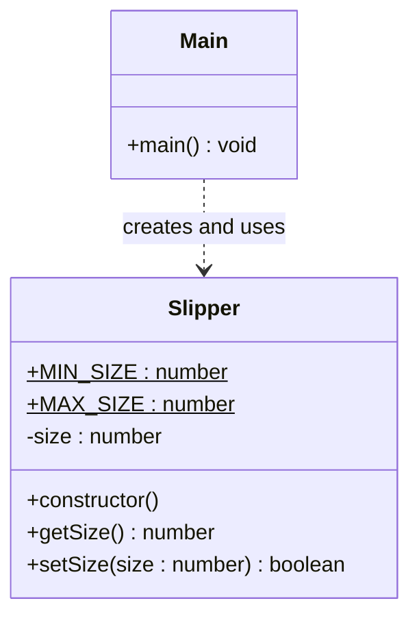

# [GUIDE] Chinela de números pares

<!-- toc-table -->


## Intro

O objetivo dessa atividade é implementar uma classe que controle o tamanho válido de uma chinela.

Nesta atividade você vai praticar **encapsulamento**: o tamanho fica no atributo privado `size` e só pode ser consultado por `get_size()` ou alterado por `set_size()`. O objeto já deve nascer em estado válido, e o setter deve preservar a **invariante** de que o tamanho seja par e esteja entre 20 e 50.

### Mensagens do programa

As explicações da atividade estão em português, mas o texto produzido pelo programa deve ficar em inglês. Use, por exemplo:

- `Enter slipper size`
- `fail: invalid size`
- `Congratulations, you bought a slipper size`

## Regras

- Uma chinela tem um valor tamanho que é um número par entre 20 e 50, incluindo 20 e 50.
- Faça o objeto `Slipper` iniciar com o menor tamanho válido e controle o atributo através de `set_size()` para que apenas valores válidos sejam atribuídos.
- O método `set_size()` deve retornar `true` quando alterar o tamanho e `false` quando rejeitar o valor. Ele não deve imprimir mensagens.
- O método `get_size()` deve apenas consultar o estado do objeto.
- Por fim, crie um loop no qual um objeto chinela é criado e é perguntado ao usuário qual seu tamanho de chinela.
- Mantenha o usuário preso no loop até que ele insira um valor válido.
- Caso ele digite um valor inválido, o loop deve interpretar o retorno do setter e exibir uma mensagem de erro adequada.

## Diagrama

O tamanho é um detalhe interno da classe `Slipper`. As constantes indicam os limites válidos do domínio. O getter permite a consulta e o setter concentra a validação da invariante, mantendo a interface responsável apenas pela leitura e pelas mensagens.


```mermaid
%%{init: { "fontFamily": "monospace" } }%%
classDiagram
    direction TB

    class Slipper {
        +MIN_SIZE : number$
        +MAX_SIZE : number$
        -size : number
        +constructor()
        +getSize() number
        +setSize(size : number) boolean
    }

    class Main {
        +main() void
    }

    Main ..> Slipper : creates and uses
```

## Guide

[Vídeo de apoio](https://youtu.be/pC3DMuHVFHE?si=XIylk3z3zABCD0hj)

Implemente a classe `Slipper` antes do loop. O ponto principal é garantir que apenas `set_size()` consiga alterar o atributo privado.

Pergunta de reflexão: o que poderia acontecer se o código do loop alterasse o tamanho diretamente?

```py

class Slipper:
    MIN_SIZE: int = 20
    MAX_SIZE: int = 50

    def __init__(self) -> None:
        self.__size: int = Slipper.MIN_SIZE

    def get_size(self) -> int:
        return self.__size

    def set_size(self, size: int) -> bool:
        # valide o valor; retorne False sem alterar o estado se ele for inválido
        pass

# loop principal
slipper = Slipper() # criando chinela com valor tamanho padrão

while True: # mantendo usuário no loop
    print("Enter slipper size")
    size = int(input()) # lendo a resposta e convertendo pra inteiro
    if not slipper.set_size(size): # o domínio retorna falha sem imprimir
        print("fail: invalid size")
    else:
        break # tamanho válido, saindo do loop

print("Congratulations, you bought a slipper size", slipper.get_size())
```

Verifique pelo menos estes casos: `20` e `50` devem ser aceitos; `19`, `51` e qualquer tamanho ímpar devem ser rejeitados; depois de uma rejeição, o tamanho anterior deve permanecer válido. Por exemplo, após aceitar `20`, tente `21` e depois `50`: a tentativa com `21` deve mostrar `fail: invalid size`, sem alterar o objeto, e `50` deve ser aceito.

<!-- MERMAID -->
