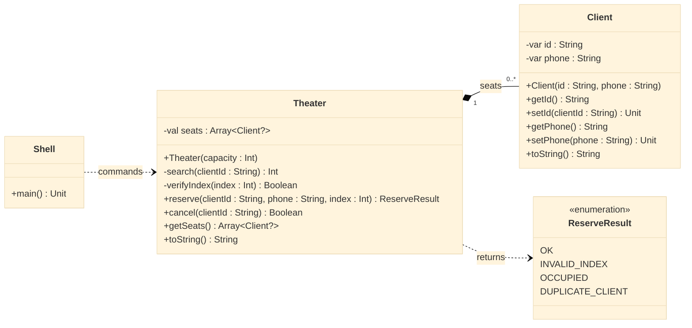

# [GUIDE] Cinema: posições fixas e ausência

<!-- toc-table -->
[Intro](#intro) | [Diagrama](#diagrama) | [Guide](#guide) | [Shell](#shell) | [Draft](#draft)
-- | -- | -- | -- | --
<!-- toc-table -->


## Intro

O objetivo desta atividade é implementar métodos para manipular uma sala de cinema, permitindo a reserva, cancelamento e consulta de cadeiras.

Esta atividade introduz vetor de tamanho fixo com posições significativas. Cada índice representa uma cadeira real da sala; por isso, reservar a cadeira `0` é diferente de reservar a cadeira `3`. Uma posição vazia será representada por `null`, e o código precisa verificar essa possibilidade antes de acessar o cliente.

- **Descrição**
  - A sala de cinema é representada pela classe Sala `Theater`, que possui um conjunto de cadeiras, cada uma associada a um cliente ou vazia.
  - Os métodos a serem implementados permitirão reservar uma cadeira para um cliente, cancelar a reserva de uma cadeira e consultar o estado das cadeiras na sala.
  - Cada cadeira pode estar associada a um objeto Cliente `Client`, representando um cliente que reservou a cadeira, ou ser nula, indicando que a cadeira está vazia.
  - Os métodos fornecidos devem lidar com validações, como verificar se a cadeira existe, se está ocupada e se o cliente já está presente na sala.

- **Responsabilidades**
  - A classe Sala `Theater` é responsável por gerenciar as operações relacionadas às cadeiras na sala de cinema.
    - Métodos a serem implementados:
      - públicos: são métodos acessados por outras classes.
        - `reserve(clientId: String, phone: String, index: Int): ReserveResult`: retorna o resultado da tentativa de reservar uma cadeira para um cliente.
        - `cancel(clientId: String): Boolean`: retorna `true` quando cancela a reserva ou `false` quando o cliente não está no cinema.
        - `getSeats(): Array<Client?>`: retorna uma cópia do estado atual das cadeiras, sem expor a coleção interna.
        - `toString(): String`: retorna uma representação textual do estado atual das cadeiras na sala.
      - privados: são métodos apenas de uso interno, utilizados para auxiliar as operações da classe.
        - `search(clientId: String): Int`: procura o índice da cadeira reservada pelo ID do cliente, ou `-1` se não for encontrado.
        - `verifyIndex(index: Int): Boolean`: verifica se um índice de cadeira é válido na sala.
  - A classe `Client` é responsável por representar os clientes que reservam cadeiras na sala de cinema.
    - A classe possui métodos para obter e definir o ID e telefone do cliente, bem como uma representação em string do cliente.

Os resultados das operações pertencem ao domínio; o `Shell` é responsável por convertê-los nas mensagens exibidas nos casos de falha. A cópia retornada por `getSeats()` impede que um cliente altere diretamente a coleção e quebre a capacidade fixa ou a representação de cadeiras vazias.


## Diagrama

`Theater` possui um vetor de tamanho fixo e cada posição pode conter um `Client` ou `null`. O teatro cria os clientes durante a reserva e controla a coleção interna; a cópia retornada por `getSeats` não substitui esse estado.



No diagrama, propriedades, parâmetros, tipos e assinaturas seguem a notação Kotlin (`clientId : String`, `getSeats() Array<Client?>`). Os setters foram preservados porque fazem parte do contrato didático atual. Os nomes dos comandos do Shell permanecem iguais por fazerem parte do contrato externo.

## Guide

- Inicialize `seats` com `Array(capacity) { null }`, mantendo exatamente a quantidade de cadeiras criada.
- Faça `verifyIndex` validar o índice antes de acessar o vetor.
- Em `reserve`, verifique índice inválido, cadeira ocupada e cliente duplicado antes de criar e armazenar `Client`.
- Em `cancel`, procure o cliente pelo ID e substitua a posição encontrada por `null`.
- Faça `getSeats()` retornar `seats.copyOf()` para que mudanças na cópia não alterem a sala.
- Formate `toString()` exibindo `-` nas posições vazias e o cliente nas ocupadas.

## Shell

```bash
#TEST_CASE init 1
$show
[]
#TEST_CASE init 2
$init 5
$show
[- - - - -]
#TEST_CASE init 3
$init 4
$show
[- - - -]
$end
```

```sh
#TEST_CASE reservas

$init 4
$reserve davi 3232 0
$reserve joao 3131 3
$show
[davi:3232 - - joao:3131]

#TEST_CASE ocupado

$reserve rute 3030 0
fail: cadeira ja esta ocupada

#TEST_CASE duplicado

$reserve davi 3234 2
fail: cliente ja esta no cinema
$end
```

```sh
#TEST_CASE cadeira invalida

$init 4
$reserve davi 3232 5
fail: cadeira nao existe

#TEST_CASE cancelamentos

$reserve davi 3232 0
$reserve joao 3131 3
$cancel davi
$show
[- - - joao:3131]

#TEST_CASE cancelamentos errado

$cancel rita
fail: cliente nao esta no cinema
$show
[- - - joao:3131]
$end
```

## Draft

<!-- links .cache/starter -->
<!-- links -->
<!-- MERMAID -->
