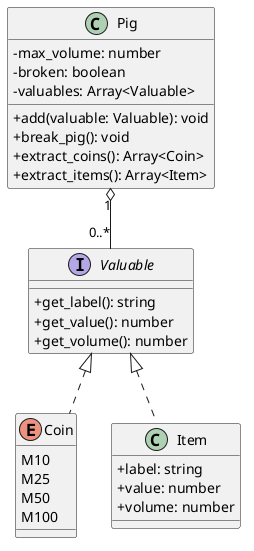

# Cofre — polimorfismo por contrato de valor

<toc-table />


## Intro

Um cofrinho guarda moedas e itens. Os dois tipos têm valor, volume e uma
descrição comum, mas continuam sendo conceitos diferentes. A atividade usa
esse contrato para praticar polimorfismo sem criar uma hierarquia artificial.

O objetivo principal é modelar uma coleção heterogênea por meio de um contrato
comum. Como objetivo secundário, a atividade reforça invariantes de estado:
somente um cofre intacto recebe valores e somente um cofre quebrado permite
extração.

## Regras

- `Coin` possui os valores `M10`, `M25`, `M50` e `M100`, com volume próprio.
- `Item` possui `label`, `value` e `volume`.
- `Coin` e `Item` atendem ao contrato `Valuable` (`get_label`, `get_value`, `get_volume`).
- O cofre não aceita um valor que ultrapasse sua capacidade.
- Um cofre quebrado não recebe novos valores.
- Quebrar o cofre zera o volume exibido, mas não apaga os valores guardados.
- Extrações só podem ocorrer depois da quebra e removem apenas o tipo pedido.
- O valor total é a soma dos valores que ainda estão guardados.

## Diagrama



## Guide

1. Defina o protocolo `Valuable` com os três métodos de consulta que o cofre
   precisa. Não coloque nele operações específicas de moedas ou itens.
2. Modele `Coin` com `Enum` e `Item` como valor imutável. Ambos devem poder ser
   inseridos na mesma lista sem o `Pig` conhecer seus detalhes de construção.
3. Faça o `Pig` controlar capacidade, estado quebrado e soma dos valores. A
   classe é a dona das invariantes porque também possui a coleção.
4. Implemente as extrações filtrando a coleção e substituindo-a pelo restante.
   Verifique que extrair moedas não remove itens e vice-versa.
5. Mantenha o `Shell` responsável por converter comandos e apresentar erros;
   as regras e os cálculos devem permanecer testáveis sem entrada do terminal.

O contrato comum reduz o acoplamento: o cofre depende das propriedades que usa,
não de uma classe concreta. O custo é exigir que cada novo valor forneça esse
contrato. A extensão natural é adicionar outra classe valiosa sem alterar a
capacidade, a soma ou o fluxo do cofre.

## Verificação

Execute `python3 -m unittest discover src/py` e confira capacidade cheia,
tentativa de inserção após quebra, extração antes da quebra, extrações parciais
e preservação dos valores restantes.

## Shell

```sh
#TEST_CASE basic
$init 5
$addCoin 10
$addItem gold 50.0 3
$show
[M10:0.10:1, gold:50.00:3] : 50.10$ : 4/5 : intact
$break
$extractItems
[gold:50.00:3]
$extractCoins
[M10:0.10:1]
$end
```
