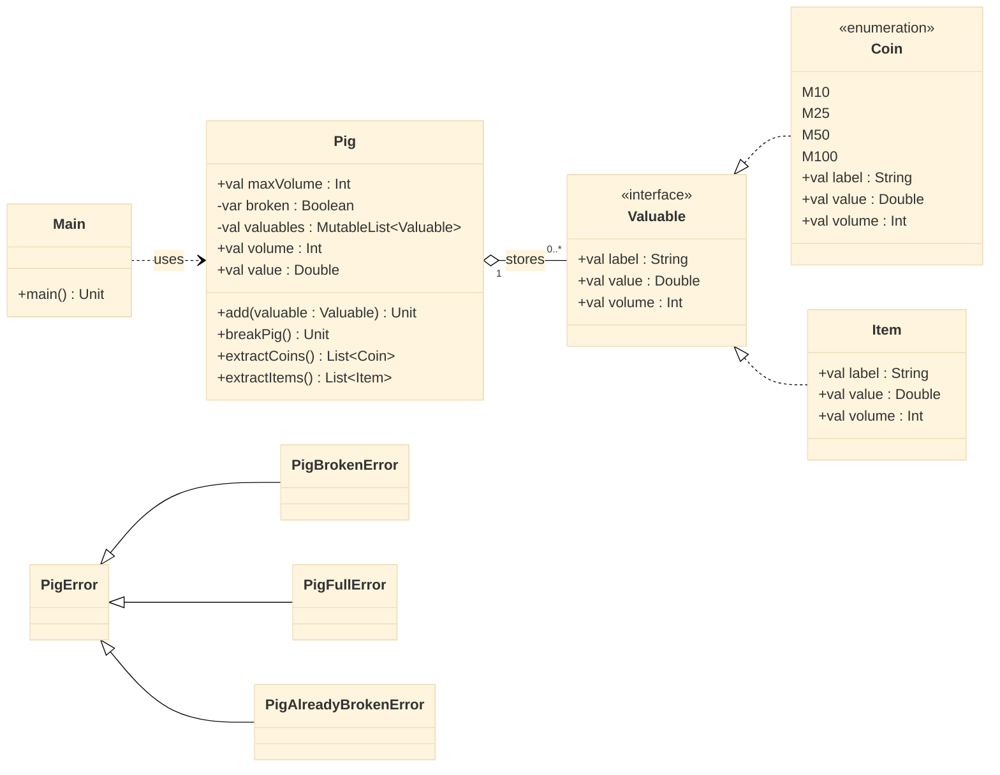

# Cofre — polimorfismo por contrato de valor

<!-- toc-table -->
[Intro](#intro) | [Regras](#regras) | [Diagrama](#diagrama) | [Guide](#guide) | [Verificação](#verificação) | [Shell](#shell)
-- | -- | -- | -- | -- | --
<!-- end -->


## Intro

Um cofrinho guarda moedas e itens. Os dois tipos têm valor, volume e uma
descrição comum, mas continuam sendo conceitos diferentes. A atividade usa
esse contrato para praticar polimorfismo sem criar uma hierarquia artificial.

O objetivo principal é modelar uma coleção heterogênea por meio de um contrato
comum. Como objetivo secundário, a atividade reforça invariantes de estado:
somente um cofre intacto recebe valores e somente um cofre quebrado permite
extração.

## Regras

- `Valuable` exige `label : String`, `value : Double` e `volume : Int`.
- `Coin` é um enum com valores `M10`, `M25`, `M50` e `M100`, cada qual com valor e volume próprios.
- `Item` é imutável e possui `label`, `value` e `volume`.
- `Pig` recebe uma capacidade `maxVolume : Int` e guarda `MutableList<Valuable>`.
- `add(valuable : Valuable)` rejeita valores que excedem a capacidade e cofres quebrados, lançando `PigFullError` ou `PigBrokenError`.
- `breakPig()` muda o estado para quebrado; repetir a operação lança `PigAlreadyBrokenError`.
- Depois da quebra, `volume` exibido passa a `0`, mas `value` e os valores guardados permanecem.
- `extractCoins() : List<Coin>` e `extractItems() : List<Item>` só funcionam após a quebra e removem apenas o tipo solicitado.
- Os erros preservam as mensagens `fail: the pig is broken`, `fail: the pig is full`, `fail: the pig is already broken` e `fail: you must break the pig first`.

## Diagrama


```mermaid
%%{init: {"theme": "base", "themeVariables": {"fontFamily": "monospace"}}}%%
classDiagram
    direction LR

    class Valuable {
        <<interface>>
        +val label : String
        +val value : Double
        +val volume : Int
    }

    class Coin {
        <<enumeration>>
        M10
        M25
        M50
        M100
        +val label : String
        +val value : Double
        +val volume : Int
    }

    class Item {
        +val label : String
        +val value : Double
        +val volume : Int
    }

    class Pig {
        +val maxVolume : Int
        -var broken : Boolean
        -val valuables : MutableList~Valuable~
        +val volume : Int
        +val value : Double
        +add(valuable : Valuable) Unit
        +breakPig() Unit
        +extractCoins() List~Coin~
        +extractItems() List~Item~
    }

    class Main {
        +main() Unit
    }

    class PigError
    class PigBrokenError
    class PigFullError
    class PigAlreadyBrokenError

    Valuable <|.. Coin
    Valuable <|.. Item
    PigError <|-- PigBrokenError
    PigError <|-- PigFullError
    PigError <|-- PigAlreadyBrokenError
    Pig "1" o-- "0..*" Valuable : stores
    Main ..> Pig : uses
```

## Guide

1. Defina a interface `Valuable` com as propriedades `label : String`,
   `value : Double` e `volume : Int`. Não coloque nela operações específicas de
   moedas ou itens.
2. Modele `Coin` como `enum class` e `Item` como `data class` imutável. Ambos
   devem poder ser inseridos na mesma lista sem o `Pig` conhecer seus detalhes
   de construção.
3. Faça o `Pig` controlar capacidade, estado quebrado e soma dos valores. A
   classe é a dona das invariantes porque também possui a coleção.
4. Implemente as extrações filtrando a coleção por tipo e removendo apenas os
   elementos extraídos. Verifique que extrair moedas não remove itens e vice-versa.
5. Mantenha o `Shell` responsável por converter comandos e apresentar erros;
   as regras e os cálculos devem permanecer testáveis sem entrada do terminal.

O contrato comum reduz o acoplamento: o cofre depende das propriedades que usa,
não de uma classe concreta. O custo é exigir que cada novo valor forneça esse
contrato. A extensão natural é adicionar outra classe valiosa sem alterar a
capacidade, a soma ou o fluxo do cofre.

## Verificação

Execute `tko run . -l kt` e confira capacidade cheia, tentativa de inserção
após quebra, extração antes da quebra, extrações parciais e preservação dos
valores restantes.

## Shell

```sh
#TEST_CASE basic
$init 5
$addCoin 10
$addItem gold 50.0 3
$show
[M10:0.10:1, gold:50.00:3] : 50.10$ : 4/5 : intact
$break
$extractItems
[gold:50.00:3]
$extractCoins
[M10:0.10:1]
$end
```

<!-- KOTLIN -->
