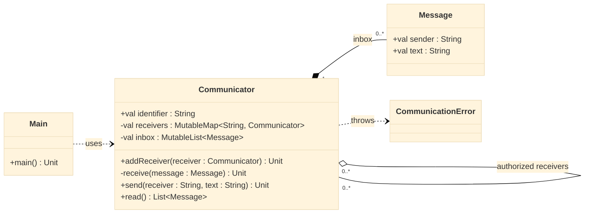

# Comunicador — envio autorizado por composição

<!-- toc-table -->
[Intro](#intro) | [Regras](#regras) | [Diagrama](#diagrama) | [Guide](#guide) | [Verificação](#verificação)
-- | -- | -- | -- | --
<!-- toc-table -->

## Intro

Pacientes e médicos precisam trocar mensagens, mas somente com pessoas que
possuem vínculo. O objetivo é extrair o inbox e o envio para um componente
`Communicator`, mantendo os destinatários autorizados explícitos. A autorização
é direcional: cada comunicador controla para quem pode enviar.

## Regras

- `Message(sender : String, text : String)` é um valor imutável.
- `Communicator(identifier : String)` mantém os destinatários permitidos e o inbox privado.
- `addReceiver(receiver : Communicator)` autoriza um destinatário pelo identifier; adicionar o mesmo destinatário novamente não duplica a entrada.
- `send(receiver : String, text : String)` entrega uma mensagem somente se o destinatário estiver autorizado. Caso contrário, lança `CommunicationError` com `fail:{identifier} nao conhece {receiver}`.
- `read() : List<Message>` retorna as mensagens na ordem de chegada e esvazia o inbox.
- Para permitir resposta, o destinatário também precisa autorizar o remetente.

O domínio não lê comandos nem imprime mensagens. `Communicator` verifica a
autorização antes de entregar; o comunicador destinatário é quem armazena a
mensagem.

## Diagrama



## Guide

1. Crie `Message` como uma `data class` imutável, com remetente e texto.
2. Encapsule o inbox em `Communicator`. `receive` guarda a mensagem e `read`
   devolve uma cópia em ordem, limpando a fila.
3. Armazene os destinatários autorizados por identifier. `addReceiver` modifica
   essa autorização em um só lugar.
4. Em `send`, procure o destinatário antes de criar e entregar a mensagem. Uma
   falha não pode alterar nenhum inbox.
5. Componha comunicadores nos objetos do hospital: a lista de destinatários vem
   do vínculo médico-paciente e não deve ser duplicada no Shell.

O vínculo entre comunicadores é uma referência, não uma parte de sua posse; cada
comunicador e seu inbox têm ciclos de vida próprios. A composição permite usar
o mesmo componente em diferentes papéis, ao custo de manter a autorização
sincronizada com o vínculo do domínio que a concede.

## Verificação

Execute `tko run . -l kt`. A demonstração envia uma mensagem de `doctor` para
`patient`, mostra o conteúdo lido, rejeita uma resposta não autorizada e mostra
o inbox vazio após a leitura.

Saída esperada:

```text
doctor:hello
fail:patient nao conhece doctor
- empty -
```

Confira também que autorizar `patient` em `doctor` não autoriza automaticamente
o caminho inverso e que mensagens sucessivas são lidas na ordem de chegada.

<!-- KOTLIN -->
