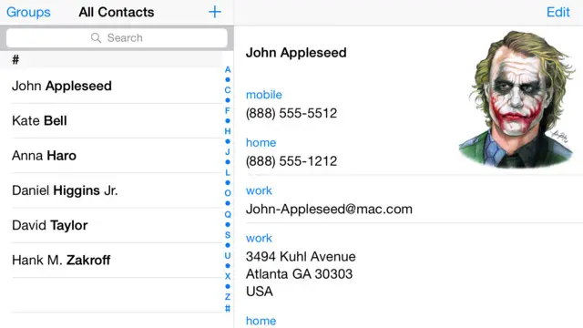
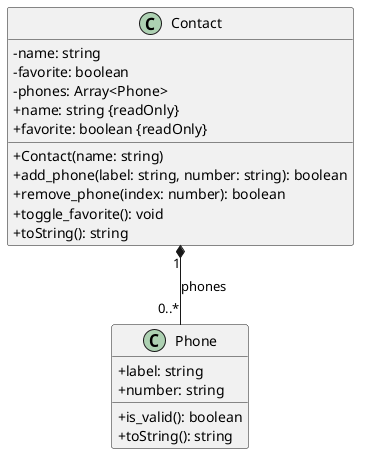

# Contato: encapsulamento de uma coleção de telefones

<!-- toc-table -->
[Intro](#intro) | [Regras](#regras) | [Diagrama](#diagrama) | [Guide](#guide) | [Shell](#shell) | [Draft](#draft)
-- | -- | -- | -- | -- | --
<!-- toc-table -->



## Intro

O objetivo desta atividade é encapsular uma coleção de telefones dentro de um único contato. O contato controla inserções e remoções, impedindo que a lista seja alterada livremente por outras partes do programa.

Como conhecimento prévio, você precisará saber criar classes simples e manipular listas, como foi praticado em `@array` e na leitura `@+listas`.

`Phone` representa um telefone e conhece a regra de validade do seu número. `Contact` guarda o nome, o estado de favorito e sua coleção privada de telefones. O `Shell` apenas converte comandos, invoca esses comportamentos e apresenta seus resultados.

## Regras

### Telefone

- `Phone` possui os campos públicos `label: str` e `number: str`.
- Um telefone é exibido no formato `label:number`, por exemplo, `home:3434`.
- `is_valid()` retorna `true` somente quando o número:
  - não é vazio;
  - contém apenas caracteres de `0123456789()-.`.

### Contato

- `Contact` recebe o nome no construtor.
- Um novo contato começa sem telefones e não favoritado.
- A coleção de telefones pertence ao contato e não é exposta para alteração externa.
- `add_phone(label, number) -> bool`
  - Cria e adiciona o telefone ao final quando o número é válido, retornando `true`.
  - Retorna `false` e preserva a coleção quando o número é inválido.
  - Labels podem se repetir.
- `remove_phone(index) -> bool`
  - Remove o telefone da posição indicada e retorna `true`.
  - Retorna `false` e preserva a coleção quando o índice é negativo ou não existe.
- `toggle_favorite() -> None`
  - Alterna o estado de favorito.
- O contato é exibido como `- name [phones]` quando não é favorito e como `@ name [phones]` quando é favorito.
  - Sem telefones: `- ana []`.
  - Com telefones: `@ ana [home:3434, mobile:(85)9.9999-0000]`.

### Comandos

- `init name`: substitui o contato atual por um novo contato vazio e não favoritado.
- `addPhone label number`: tenta adicionar um telefone; exibe `fail: invalid number` se o número for inválido.
- `removePhone index`: tenta remover por índice; exibe `fail: invalid index` se o argumento não for um inteiro ou a posição não existir.
- `toggleFavorite`: alterna o favorito sem produzir saída.
- `show`: exibe o contato.
- `end`: encerra o programa.
- Qualquer outro comando exibe `fail: invalid command`.

Mutações bem-sucedidas são silenciosas. As mensagens de falha pertencem ao `Shell`; as classes de domínio não imprimem.

## Diagrama

`Contact` possui seus telefones: eles são criados para entrar nessa coleção e não possuem ciclo de vida independente neste problema. A composição também deixa visível que somente o contato altera a lista.



## Guide

Implemente a atividade em incrementos pequenos e execute os casos correspondentes da seção [Shell](#shell) ao final de cada etapa.

### 1. Modele e valide um telefone

- Crie a `dataclass Phone` com `label` e `number`.
- Implemente sua representação textual.
- Faça `is_valid` conferir se o texto não está vazio e se todos os caracteres pertencem ao conjunto permitido.

Verificação: confira diretamente que `Phone("home", "85-99").is_valid()` é verdadeiro e que um número vazio ou contendo letras é falso.

### 2. Encapsule a coleção

- Crie `Contact` com nome, favorito falso e uma lista privada vazia.
- Implemente a exibição percorrendo os telefones na ordem em que foram inseridos.
- Não crie um getter que devolva a lista interna: clientes devem pedir operações ao contato.

Antes dessa divisão, qualquer parte do programa poderia inserir um telefone inválido ou remover uma posição inexistente. Agora `Contact` concentra a regra da coleção, enquanto `Phone` concentra a validade do número.

### 3. Adicione apenas telefones válidos

- Crie o telefone recebido por `add_phone` e delegue a validação a ele.
- Adicione-o somente quando for válido.
- Retorne um booleano para que o `Shell` decida se deve mostrar a mensagem de falha.

Verificação: após uma tentativa inválida, use `show` e confirme que os telefones anteriores permanecem iguais.

### 4. Remova por posição

- Confira os dois limites do índice antes de alterar a lista.
- Remova e retorne `true` apenas quando a posição existir.
- Trate a conversão textual do índice no `Shell`, pois ela pertence à interface.

### 5. Revise estado simples e conecte o Shell

- Implemente `toggle_favorite` como uma alternância do booleano atual.
- Use `match/case` diretamente sobre `line.split()` para interpretar os comandos.
- Mantenha mensagens e impressão fora do domínio.

Perguntas de reflexão:

- Qual invariante ficaria vulnerável se a lista interna fosse devolvida diretamente?
- Por que `Phone` valida o número, mas `Contact` decide se ele entra na coleção?
- A divisão em duas classes acrescenta algum custo? Que mudança futura torna esse custo justificável?

Na atividade `@agenda`, este modelo será colocado dentro de outra coleção e receberá uma busca por seus campos.

## Shell

### Estado inicial

```bash
#TEST_CASE initial
$init david
$show
- david []
$end
```

### Ordem e labels repetidos

```bash
#TEST_CASE add_phones
$init david
$addPhone mobile 88
$addPhone home 99
$addPhone mobile 98
$show
- david [mobile:88, home:99, mobile:98]
$end
```

### Caracteres permitidos

```bash
#TEST_CASE formatted_numbers
$init ana
$addPhone home (85)3232-1010
$addPhone mobile 9.9999-0000
$show
- ana [home:(85)3232-1010, mobile:9.9999-0000]
$end
```

### Número inválido preserva o estado

```bash
#TEST_CASE invalid_number
$init ana
$addPhone home 3434
$addPhone mobile 9a99
fail: invalid number
$show
- ana [home:3434]
$end
```

### Remoção por índice

```bash
#TEST_CASE remove_phone
$init david
$addPhone oi 88
$addPhone tim 99
$addPhone vivo 83
$removePhone 1
$show
- david [oi:88, vivo:83]
$removePhone 0
$show
- david [vivo:83]
$end
```

### Índices inválidos preservam o estado

```bash
#TEST_CASE invalid_indices
$init david
$addPhone oi 88
$removePhone -1
fail: invalid index
$removePhone 1
fail: invalid index
$removePhone first
fail: invalid index
$show
- david [oi:88]
$end
```

### Favoritar e desfavoritar

```bash
#TEST_CASE favorite
$init david
$addPhone oi 88
$toggleFavorite
$show
@ david [oi:88]
$toggleFavorite
$show
- david [oi:88]
$end
```

### Reinicialização

```bash
#TEST_CASE reinitialize
$init david
$addPhone oi 88
$toggleFavorite
$init ana
$show
- ana []
$end
```

### Comando inválido

```bash
#TEST_CASE invalid_command
$init ana
$clear
fail: invalid command
$show
- ana []
$end
```

## Draft

<!-- links .cache/starter -->
<!-- links -->
