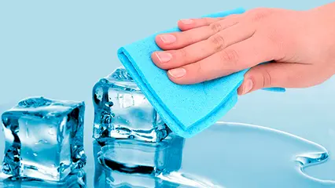
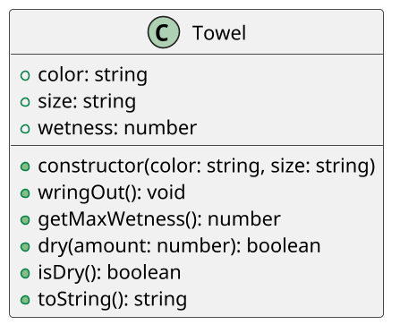

# Toalha com testes

<!-- toc-table -->
<!-- toc-table -->



## Intro

O objetivo dessa atividade é praticar uma classe de domínio que controla a umidade de uma toalha e retorna o resultado de cada operação.

## Regras

- A classe `Towel` possui cor `color`, tamanho `size` e umidade `wetness`.
- O construtor recebe cor e tamanho e inicia `wetness` com `0`.
- `wringOut()` zera a umidade.
- `getMaxWetness()` retorna `10` para `P`, `20` para `M` e `30` para `G`.
- `dry(amount)` aumenta a umidade sem ultrapassar o limite; retorna `true` quando absorve tudo e `false` quando absorve apenas o possível.
- `isDry()` retorna `true` quando a umidade é `0`.
- `Towel` não deve ler entrada nem imprimir dados; o `Shell` interpreta os retornos e apresenta as mensagens.
- A classe permanece única porque suas regras formam um comportamento coeso. Não crie classes separadas para cor, tamanho ou umidade nesta etapa.

## Diagrama

O diagrama representa uma classe simples e coesa. A atividade trabalha KISS, responsabilidade única, separação entre domínio e interface e testabilidade, sem antecipar modificadores de acesso do próximo bloco.



## Guide

`Towel` concentra apenas o estado e as regras de umidade. O `Shell` lê comandos e decide o que apresentar. Nesta etapa, a solução trabalha KISS, responsabilidade única, separação entre domínio e interface e testabilidade; o controle de acesso será estudado no próximo bloco.

[](https://youtu.be/S956ep2PSzI?si=q9IYxafhWjaDVHTp)


## Shell

```bash
#TEST_CASE criação pequena
$criar azul P
$mostrar
Cor: azul, Tamanho: P, Umidade: 0

#TEST_CASE esta_seca
$seca
sim

#TEST_CASE enxugar
$enxugar 5
$mostrar
Cor: azul, Tamanho: P, Umidade: 5

#TEST_CASE nao esta seca
$seca
nao

#TEST_CASE toalha encharcada
$enxugar 6
fail: toalha nao conseguiu enxugar tudo

#TEST_CASE umidade maxima alcançada
$mostrar
Cor: azul, Tamanho: P, Umidade: 10

$enxugar 5
fail: toalha nao conseguiu enxugar tudo

$mostrar
Cor: azul, Tamanho: P, Umidade: 10

#TEST_CASE torcer
$torcer
$mostrar
Cor: azul, Tamanho: P, Umidade: 0

$end

```

---

```bash

#TEST_CASE criação grande
$criar verde G

$mostrar
Cor: verde, Tamanho: G, Umidade: 0

#TEST_CASE limite de 30 e encharcada

$enxugar 30
$mostrar
Cor: verde, Tamanho: G, Umidade: 30

#TEST_CASE não passa do limite
$enxugar 1
fail: toalha nao conseguiu enxugar tudo
$mostrar
Cor: verde, Tamanho: G, Umidade: 30
$end
```

## Draft

<!-- links .cache/starter -->
<!-- links -->
