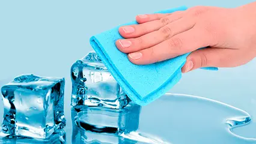
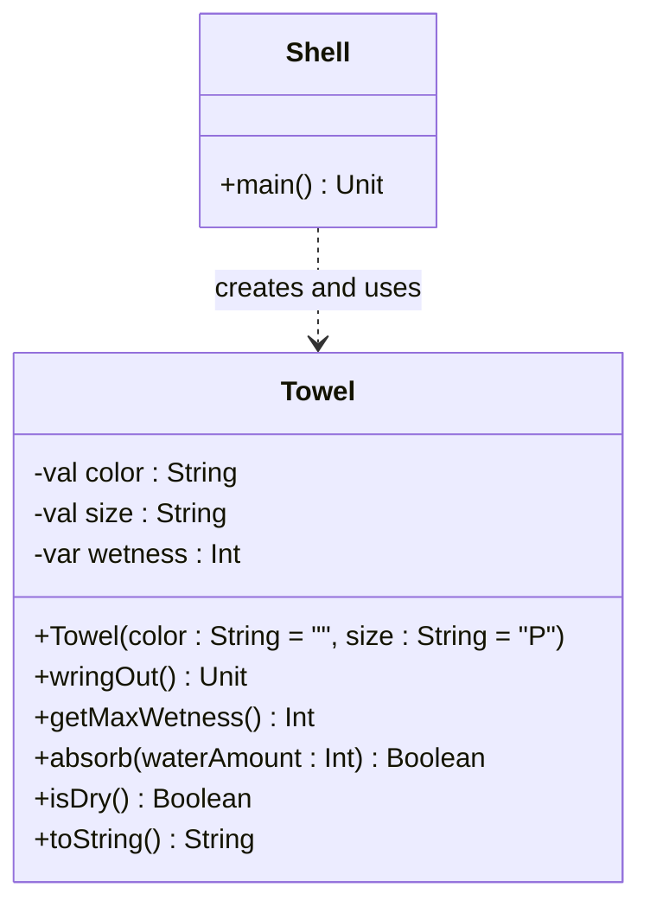

# [TRAIN] Enxugar: Toalha com testes

<!-- toc-table -->
[Intro](#intro) | [Regras](#regras) | [Diagrama](#diagrama) | [Guide](#guide) | [Shell](#shell) | [Draft](#draft)
-- | -- | -- | -- | -- | --
<!-- toc-table -->



## Intro

O objetivo dessa atividade é praticar uma classe de domínio que controla a umidade de uma toalha e retorna o resultado de cada operação.

Esta versão acrescenta um `Shell` para testar o comportamento observável sem mover as regras de umidade para a entrada e saída.

## Regras

- A classe `Towel` possui cor `color: String`, tamanho `size: String` e umidade `wetness: Int`.
- O construtor `Towel(color: String = "", size: String = "P")` inicia `wetness` com `0`.
- `wringOut(): Unit` zera a umidade.
- `getMaxWetness(): Int` retorna `10` para `P`, `20` para `M` e `30` para `G`.
- `absorb(waterAmount: Int): Boolean` aumenta a umidade sem ultrapassar o limite; retorna `true` quando absorve tudo e `false` quando absorve apenas o possível.
- `isDry(): Boolean` retorna `true` quando a umidade é `0`.
- `toString(): String` retorna `Color: {color}, Size: {size}, Wetness: {wetness}`.
- `Towel` não deve ler entrada nem imprimir dados; o `Shell` interpreta os retornos e apresenta as mensagens.
- Se `absorb(waterAmount)` retornar `false`, o `Shell` deve imprimir `fail: towel is soaked`.
- A classe permanece única porque suas regras formam um comportamento coeso. Não crie classes separadas para cor, tamanho ou umidade nesta etapa.

## Diagrama

`Towel` mantém seus atributos protegidos e concentra as regras de umidade. O `Shell` apenas interpreta comandos, chama o domínio e apresenta `fail: towel is soaked` quando a absorção ultrapassa a capacidade.


```mermaid
%%{init: { "fontFamily": "monospace" } }%%
classDiagram
    direction TB

    class Towel {
        -val color : String
        -val size : String
        -var wetness : Int
        +Towel(color : String = "", size : String = "P")
        +wringOut() Unit
        +getMaxWetness() Int
        +absorb(waterAmount : Int) Boolean
        +isDry() Boolean
        +toString() String
    }

    class Shell {
        +main() Unit
    }

    Shell ..> Towel : creates and uses
```

## Guide

`Towel` concentra apenas o estado e as regras de umidade. O `Shell` lê comandos e decide o que apresentar.


- Comece pelo construtor e por `toString()`, usando `$create` e `$show`.
- Implemente `getMaxWetness()`, porque `absorb` depende desse limite.
- Faça `absorb` retornar `false` quando a toalha não conseguir absorver toda a quantidade.
- No `Shell`, transforme esse `false` em `fail: towel is soaked`.

Pergunta de reflexão: por que o limite de umidade pertence à `Towel` e não ao `Shell`?

## Shell

```bash
#TEST_CASE small creation
$create azul P
$show
Color: azul, Size: P, Wetness: 0

#TEST_CASE is dry
$is_dry
yes

#TEST_CASE dry
$dry 5
$show
Color: azul, Size: P, Wetness: 5

#TEST_CASE is not dry
$is_dry
no

#TEST_CASE soaked towel
$dry 6
fail: towel is soaked

#TEST_CASE max wetness reached
$show
Color: azul, Size: P, Wetness: 10

$dry 5
fail: towel is soaked

$show
Color: azul, Size: P, Wetness: 10

#TEST_CASE wring out
$wring_out
$show
Color: azul, Size: P, Wetness: 0

$end

```

---

```bash

#TEST_CASE large creation
$create verde G

$show
Color: verde, Size: G, Wetness: 0

#TEST_CASE limit 30 and soaked

$dry 30
$show
Color: verde, Size: G, Wetness: 30

#TEST_CASE does not pass limit
$dry 1
fail: towel is soaked
$show
Color: verde, Size: G, Wetness: 30
$end
```

## Draft

<!-- links .cache/starter -->
<!-- links -->

<!-- MERMAID -->
