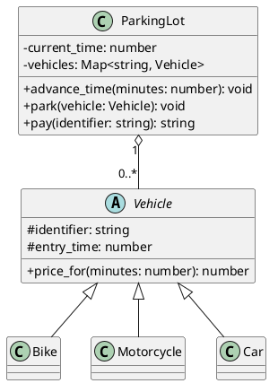

# Estacionamento — polimorfismo por tipo de veículo

<toc-table />

## Intro

Um estacionamento recebe veículos de tipos diferentes e precisa cobrar cada um
de acordo com a sua regra. A atividade retoma herança e método abstrato para
mostrar que uma operação comum pode variar sem transformar o estacionamento em
uma sequência de condicionais.

O objetivo principal é praticar polimorfismo: o estacionamento coordena a
entrada, o tempo e a saída, enquanto cada veículo conhece sua própria tarifa.
Como objetivo secundário, a atividade exercita composição e encapsulamento do
estado da coleção de veículos.

## Regras

- A entrada recebe um tipo (`bike`, `moto` ou `carro`) e um identifier.
- O veículo guarda o momento em que entrou; uma nova entrada usa o tempo atual.
- Não podem existir dois veículos com o mesmo identifier.
- `Bike` custa sempre `R$ 3.00`.
- `Motorcycle` custa `minutes / 20`.
- `Car` custa `minutes / 10`, com valor mínimo de `R$ 5.00`.
- Pagar imprime o recibo e remove o veículo do estacionamento.
- Um identifier inexistente não pode ser pago.
- O tempo avançado não pode ser negativo.

O domínio não imprime nem interpreta comandos. `ParkingLot` coordena o estado,
e `Vehicle.price_for` é o ponto de variação que cada tipo implementa. Assim, a
regra de preço fica coesa com os dados e o comportamento do veículo, enquanto
a classe coordenadora não precisa conhecer a fórmula de cada tipo.

## Diagrama

## Guide

1. Modele `Vehicle` com o identifier, o horário de entrada e um método abstrato
   para calcular o preço. Pergunte: qual comportamento é comum e qual varia?
2. Crie `Bike`, `Motorcycle` e `Car`, implementando apenas a tarifa de cada
   tipo. O mesmo código de saída deve poder chamar `price_for` sem testar a
   classe concreta: esse é o polimorfismo em ação.
3. Crie `ParkingLot` com o relógio e uma coleção indexada pelo identifier.
   Coloque nele as regras de duplicidade, entrada, passagem do tempo e busca.
4. Faça `pay` localizar o veículo, calcular o preço, gerar o recibo e removê-lo
   apenas quando a operação for válida. Teste que uma falha não apaga o estado.
5. Escreva o `Shell` como uma camada fina: converter argumentos, invocar o
   domínio e apresentar mensagens. As exceções nomeadas distinguem falhas de
   domínio sem espalhar mensagens pela modelagem.

A divisão não existe para aumentar o número de classes. Ela acompanha duas
   responsabilidades reais: os veículos possuem fórmulas substituíveis, e o
   estacionamento possui a ocupação e o relógio. O custo é manter uma classe
   base e uma implementação para cada tarifa; o benefício é adicionar um novo
   tipo sem alterar o fluxo de entrada e pagamento.

## Verificação

Execute os testes com `python3 -m unittest discover src/py` e verifique também:

- a entrada de cada tipo e o registro do horário;
- as fórmulas, incluindo o preço mínimo do carro;
- identifier duplicado e pagamento inexistente;
- remoção depois de um pagamento válido;
- rejeição de tempo negativo e separação do domínio em relação ao `Shell`.
