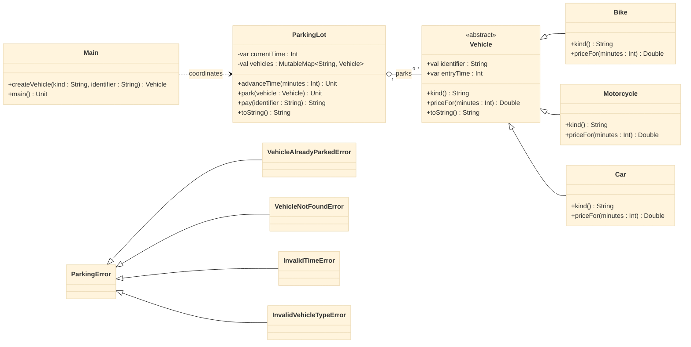

# Estacionamento — polimorfismo por tipo de veículo

<!-- toc-table -->
[Intro](#intro) | [Regras](#regras) | [Diagrama](#diagrama) | [Guide](#guide) | [Shell](#shell) | [Verificação](#verificação)
-- | -- | -- | -- | -- | --
<!-- end -->

## Intro

Um estacionamento recebe veículos de tipos diferentes e precisa cobrar cada um
de acordo com a sua regra. A atividade retoma herança e método abstrato para
mostrar que uma operação comum pode variar sem transformar o estacionamento em
uma sequência de condicionais.

O objetivo principal é praticar polimorfismo: o estacionamento coordena a
entrada, o tempo e a saída, enquanto cada veículo conhece sua própria tarifa.
Como objetivo secundário, a atividade exercita composição e encapsulamento do
estado da coleção de veículos.

## Regras

- `Vehicle` é abstrata e possui `identifier : String`, `entryTime : Int`, `kind() : String` e `priceFor(minutes : Int) : Double`.
- `Bike` custa sempre `3.0`; `Motorcycle` custa `minutes / 20.0`; `Car` custa `minutes / 10.0`, com valor mínimo de `5.0`.
- `ParkingLot` inicia com `currentTime = 0`, armazena veículos por identifier e conserva a ordem de entrada.
- `advanceTime(minutes : Int)` soma minutos ao relógio; valores negativos lançam `InvalidTimeError` e não alteram o relógio.
- `park(vehicle : Vehicle)` registra o horário atual no veículo. Um identifier repetido lança `VehicleAlreadyParkedError`.
- `pay(identifier : String) : String` calcula o recibo e remove o veículo estacionado. Um identifier inexistente lança `VehicleNotFoundError`.
- A criação com tipo diferente de `bike`, `moto` ou `carro` lança `InvalidVehicleTypeError`.
- Os comandos são `estacionar {bike|moto|carro} {identifier}`, `tempo {minutes}`, `pagar {identifier}`, `show`, `init` e `end`.
- Um recibo tem o formato `{kind} chegou {entryTime} saiu {currentTime}. Pagar R$ {price com duas casas}`.
- O programa de entrada traduz erros do domínio para as mensagens `fail: invalid time`, `fail: vehicle already parked or invalid type` e `fail: vehicle not found`.

O domínio não imprime nem interpreta comandos. `ParkingLot` coordena o estado,
e `Vehicle.priceFor` é o ponto de variação que cada tipo implementa. Assim, a
regra de preço fica coesa com os dados e o comportamento do veículo, enquanto
a classe coordenadora não precisa conhecer a fórmula de cada tipo.

## Diagrama


```mermaid
%%{init: {"theme": "base", "themeVariables": {"fontFamily": "monospace"}}}%%
classDiagram
    direction LR

    class Vehicle {
        <<abstract>>
        +val identifier : String
        +var entryTime : Int
        +kind() String
        +priceFor(minutes : Int) Double
        +toString() String
    }

    class Bike {
        +kind() String
        +priceFor(minutes : Int) Double
    }

    class Motorcycle {
        +kind() String
        +priceFor(minutes : Int) Double
    }

    class Car {
        +kind() String
        +priceFor(minutes : Int) Double
    }

    class ParkingLot {
        -var currentTime : Int
        -val vehicles : MutableMap~String, Vehicle~
        +advanceTime(minutes : Int) Unit
        +park(vehicle : Vehicle) Unit
        +pay(identifier : String) String
        +toString() String
    }

    class Main {
        +createVehicle(kind : String, identifier : String) Vehicle
        +main() Unit
    }

    class ParkingError
    class VehicleAlreadyParkedError
    class VehicleNotFoundError
    class InvalidTimeError
    class InvalidVehicleTypeError

    Vehicle <|-- Bike
    Vehicle <|-- Motorcycle
    Vehicle <|-- Car
    ParkingError <|-- VehicleAlreadyParkedError
    ParkingError <|-- VehicleNotFoundError
    ParkingError <|-- InvalidTimeError
    ParkingError <|-- InvalidVehicleTypeError
    ParkingLot "1" o-- "0..*" Vehicle : parks
    Main ..> ParkingLot : coordinates
```

## Guide

1. Modele `Vehicle` com `identifier : String`, `entryTime : Int`, `kind() : String` e o método abstrato `priceFor(minutes : Int) : Double`. Identifique o que é comum e o que varia.
2. Crie `Bike`, `Motorcycle` e `Car`, implementando apenas a tarifa de cada
   tipo. O mesmo código de saída deve poder chamar `priceFor` sem testar a
   classe concreta: esse é o polimorfismo em ação.
3. Crie `ParkingLot` com o relógio e uma coleção indexada pelo identifier.
   Coloque nele as regras de duplicidade, entrada, passagem do tempo e busca.
4. Faça `pay` localizar o veículo, calcular o preço, gerar o recibo e removê-lo
   apenas quando a operação for válida. Teste que uma falha não apaga o estado.
5. Escreva o `Shell` como uma camada fina: converter argumentos, invocar o
   domínio e apresentar mensagens. As exceções nomeadas distinguem falhas de
   domínio sem espalhar mensagens pela modelagem.

A divisão não existe para aumentar o número de classes. Ela acompanha duas
responsabilidades reais: os veículos possuem fórmulas substituíveis, e o
estacionamento possui a ocupação e o relógio. Os veículos têm ciclo de vida
independente e o estacionamento apenas os agrega. O custo é manter uma classe
base e uma implementação para cada tarifa; o benefício é adicionar um novo
tipo sem alterar o fluxo de entrada e pagamento.

## Shell

O `main()` lê comandos até `end`. Por exemplo, estacionar um carro, avançar o
relógio e pagá-lo produz:

```text
estacionar carro abc
tempo 50
pagar abc
Carro chegou 0 saiu 50. Pagar R$ 5.00
```

`show` apresenta os veículos estacionados na ordem em que entraram e o horário
atual. `init` cria um estacionamento novo. Os erros de tempo, tipo/duplicidade
e identifier inexistente são apresentados como `fail: invalid time`,
`fail: vehicle already parked or invalid type` e `fail: vehicle not found`.

## Verificação

Execute `tko run . -l kt` e interaja com os comandos `estacionar`, `tempo`,
`pagar`, `show` e `init`. Confira também:

- a entrada de cada tipo e o registro do horário;
- as fórmulas, incluindo o preço mínimo do carro;
- identifier duplicado e pagamento inexistente;
- remoção depois de um pagamento válido;
- rejeição de tempo negativo e separação do domínio em relação ao `Shell`.

<!-- KOTLIN -->
