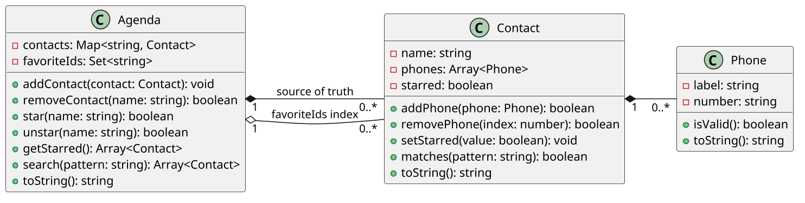

# [TRAIN] Favoritos: índice secundário e consistência

<!-- toc-table -->
[Intro](#intro) | [Regras](#regras) | [Diagrama](#diagrama) | [Guide](#guide) | [Shell](#shell) | [Draft](#draft)
-- | -- | -- | -- | -- | --
<!-- toc-table -->


## Intro

Esta atividade continua [`agenda`](../agenda/README.md) e introduz uma mudança deliberada na forma de consultar favoritos. Em `agenda`, favoritos são um atributo de `Contact` e uma consulta percorre o mapa principal. Aqui a agenda também mantém um índice secundário com as chaves dos contatos favoritos.

O objetivo principal é compreender como uma estrutura derivada pode acelerar uma consulta, mas cria uma obrigação de consistência. Como objetivos secundários, a atividade trabalha fonte de verdade, redundância intencional, integridade referencial e invalidação de índice.

### Progressão pedagógica

- `contato` encapsula os telefones e o estado de um único contato.
- `agenda` coloca contatos em um `dict[str, Contact]`, usando o nome como identidade única, e calcula favoritos sob demanda.
- `favoritos` mantém `favorite_ids: set[str]` como índice secundário persistente sobre o mapa de contatos.

O mapa `contacts` continua sendo a fonte de verdade dos objetos. O conjunto de identificadores não duplica contatos: ele armazena apenas chaves que apontam para objetos existentes no mapa. A redundância está na relação entre `Contact.starred` e a presença do nome em `favorite_ids`.

## Regras

### Modelo

- `Phone` mantém `label` e `number`, aceita números não vazios com pelo menos um dígito e usa somente `0123456789()-.`.
- `Contact` mantém nome, telefones privados e o estado `starred`.
- `Agenda` mantém `contacts: dict[str, Contact]` e `favorite_ids: set[str]`.
- Adicionar um contato com nome já existente incorpora seus telefones ao contato existente.
- Telefones inválidos são ignorados e produzem `fail: invalid number`.

### Índice de favoritos

- `star name` marca o contato como favorito e adiciona `name` ao conjunto de índices.
- `unstar name` desmarca o contato e remove `name` do conjunto.
- Repetir `star` ou `unstar` não duplica nem corrompe o índice.
- Remover um contato também remove sua chave de `favorite_ids`.
- `starred` resolve as chaves no mapa, descarta qualquer chave inexistente e exibe os contatos em ordem alfabética.
- O estado deve preservar a invariante `contact.starred == (contact.name in favorite_ids)`.

### Comandos

- `add name label:number ...`: cria um contato ou incorpora telefones ao contato existente.
- `rm name`: remove o contato e sua entrada no índice.
- `star name`: favorita o contato ou exibe `fail: contact not found`.
- `unstar name`: desfavorita o contato ou exibe `fail: contact not found`.
- `starred`: exibe somente os favoritos, ordenados pelo nome.
- `search pattern`: busca no nome, label e número, em ordem alfabética.
- `show`: exibe todos os contatos, em ordem alfabética.
- `init`: reinicia mapa e índice.
- `end`: encerra o programa.
- Qualquer outro comando exibe `fail: invalid command`.

Mutações bem-sucedidas e consultas sem resultados são silenciosas.

## Diagrama



`contacts` é a fonte de verdade. `favorite_ids` é um índice secundário derivado: ele melhora o acesso aos favoritos, mas precisa ser atualizado em toda operação que altera a relação entre contato e favorito.

## Guide


### 1. Reutilize o modelo de `agenda`

Comece com `Phone` e `Contact` de `agenda`. Preserve a regra de validade do telefone, a coleção privada e a representação textual. A nova atividade deve mudar a coordenação da agenda, não reescrever regras que já pertencem ao contato.

### 2. Adicione o índice secundário

Crie um `set[str]` privado para guardar os nomes favoritados. Um conjunto evita duplicação de chaves e expressa diretamente que a ordem não faz parte do índice. Ao listar, recupere os contatos pelo mapa e ordene somente o resultado apresentado.

### 3. Preserve a consistência

Faça `star`, `unstar` e `remove_contact` atualizarem o atributo do contato e o conjunto. Pergunte, após cada operação: o contato existe no mapa? O nome está ou não está no índice? O atributo e o índice contam a mesma história?

### 4. Observe o custo da decisão

O índice reduz a necessidade de filtrar todos os contatos para uma consulta de favoritos, mas aumenta o número de estados que precisam permanecer sincronizados. Esse é o custo da redundância intencional. Se o índice ficar desatualizado, ocorre uma falha de consistência ou uma referência órfã.

Perguntas de reflexão:

- Por que `favorite_ids` guarda chaves, e não cópias de `Contact`?
- Por que favoritar o mesmo contato duas vezes não deve criar duas entradas?
- O que precisa acontecer no índice quando um contato favorito é removido?
- Em que volume de contatos o custo de manter o índice poderia compensar sua complexidade?
- Que diferença existe entre uma consulta derivada em `agenda` e um índice persistente em `favoritos`?

## Shell

```bash
#TEST_CASE iniciando agenda
$add eva oi:8585 claro:9999
$add ana tim:3434
$add ana casa:4567 oi:8754
$add bia vivo:5454
$add rui casa:3233
$add zac fixo:3131
$show
- ana [0:tim:3434] [1:casa:4567] [2:oi:8754]
- bia [0:vivo:5454]
- eva [0:oi:8585] [1:claro:9999]
- rui [0:casa:3233]
- zac [0:fixo:3131]

#TEST_CASE favoritando
$star eva
$star ana
$star ana
$star zac
$starred
@ ana [0:tim:3434] [1:casa:4567] [2:oi:8754]
@ eva [0:oi:8585] [1:claro:9999]
@ zac [0:fixo:3131]

#TEST_CASE removendo contato favorito
$rm zac
$starred
@ ana [0:tim:3434] [1:casa:4567] [2:oi:8754]
@ eva [0:oi:8585] [1:claro:9999]

#TEST_CASE desfavoritando
$unstar ana
$starred
@ eva [0:oi:8585] [1:claro:9999]

#TEST_CASE operações inválidas
$star rita
fail: contact not found
$unstar rita
fail: contact not found
$rm rita
fail: contact not found
$end
```

```bash
#TEST_CASE regras herdadas e busca
$add ana home:-()
fail: invalid number
$add eva home:8585
$search 85
- eva [0:home:8585]
$show
- ana []
- eva [0:home:8585]
$end
```

## Draft

<!-- links .cache/starter -->
<!-- links -->
