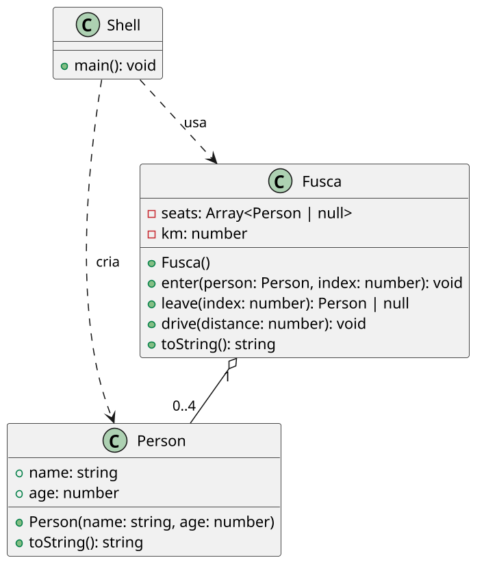

# [TRAIN] Fusca: posições, exceções e direção

<!-- toc-table -->
[Intro](#intro) | [Regras](#regras) | [Exceções](#exceções) | [Diagrama](#diagrama) | [Guide](#guide) | [Shell](#shell) | [Draft](#draft)
-- | -- | -- | -- | -- | -- | --
<!-- toc-table -->


## Intro

Esta atividade é uma evolução de `Carro`. O carro anterior contava pessoas,
mas agora cada pessoa é um objeto e ocupa uma posição específica no Fusca.

O objetivo principal é combinar posições fixas com exceções nomeadas para
expressar regras que podem falhar por motivos diferentes. A atividade também
pratica composição: `Fusca` recebe e armazena objetos `Person` criados pelo
`Shell`.

## Regras

- `Person` é um `dataclass` com apenas `name` e `age`.
- O Fusca possui quatro assentos fixos:
  - índice `0`: motorista;
  - índice `1`: passageiro da frente;
  - índices `2` e `3`: passageiros de trás.
- Um assento ocupado não pode receber outra pessoa.
- O motorista deve ter pelo menos 18 anos.
- O passageiro da frente deve ter pelo menos 10 anos.
- Os passageiros de trás não possuem restrição adicional de idade.
- Índices fora de `0..3` lançam a exceção padrão `IndexError`.
- `leave(index)` retorna a pessoa removida ou `None` quando o assento válido
  está vazio.
- Dirigir exige que exista um motorista e que a distância seja positiva.
- A distância dirigida é acrescentada à quilometragem.
- Não há gasolina nesta versão: a remoção dessa regra permite concentrar a
  atividade nas posições e no tratamento de falhas.
- O domínio não lê entrada nem imprime mensagens. O `Shell` captura as
  exceções e traduz seus tipos para mensagens observáveis.

## Exceções

As exceções próprias representam regras do domínio:

- `OccupiedSeatError`: o assento já está ocupado;
- `PersonTooYoungError`: a pessoa não possui idade suficiente para o assento;
- `DriverNotSetError`: não há motorista para dirigir;
- `InvalidDistanceError`: a distância não é positiva.

O erro estrutural de índice usa `IndexError`, que já existe na linguagem. Não
é necessário criar uma exceção própria para ele.

## Diagrama



## Guide

Implemente em etapas:

1. Crie `Person` como um `dataclass` com `name` e `age`.
2. Crie a lista de quatro posições do `Fusca`, inicialmente vazia, e o
   acumulador de quilometragem.
3. Implemente `enter(person, index)`. Valide o índice, a ocupação e a idade
   antes de alterar a lista.
4. Implemente `leave(index)`, retornando a pessoa removida ou `None` para um
   assento válido que esteja vazio.
5. Implemente `drive(distance)`, exigindo motorista e distância positiva.
6. No `Shell`, crie `Person` a partir dos argumentos e capture cada exceção
   nomeada. O domínio não deve conhecer as mensagens de saída.

Não é necessário criar uma classe `Seat`: o índice é uma informação do domínio
e as regras dos quatro assentos são pequenas. Também não é necessário manter
uma contagem separada de passageiros, pois ela pode ser obtida da lista de
assentos quando for necessária.

Perguntas de reflexão:

- Por que `leave` pode usar `None`, enquanto `enter` precisa distinguir falhas?
- Por que `IndexError` é melhor que uma exceção própria para um índice inválido?
- O que seria perdido se `Fusca` recebesse apenas nome e idade em vez de um
  objeto `Person`?
- Por que a regra de idade pertence a `Fusca`, e não a `Person`?

## Shell

```bash
#TEST_CASE initial state and enter
$show
seats: [0:(empty), 1:(empty), 2:(empty), 3:(empty)], km: 0
$enter joao 18 0
$enter ana 10 1
$enter bia 8 2
$enter caio 30 3
$show
seats: [0:joao:18, 1:ana:10, 2:bia:8, 3:caio:30], km: 0
$end
```

```bash
#TEST_CASE occupied and invalid seats
$enter joao 25 0
$enter joao 25 0
fail: occupied seat
$enter dora 20 4
fail: invalid seat
$enter dora 20 -1
fail: invalid seat
$show
seats: [0:joao:25, 1:(empty), 2:(empty), 3:(empty)], km: 0
$end
```

```bash
#TEST_CASE age restrictions
$enter driver 17 0
fail: person is too young for this seat
$enter front 9 1
fail: person is too young for this seat
$enter driver 18 0
$enter front 10 1
$show
seats: [0:driver:18, 1:front:10, 2:(empty), 3:(empty)], km: 0
$end
```

```bash
#TEST_CASE leave returns person or none
$enter joao 25 0
$enter bia 8 2
$leave 2
bia:8
$leave 2
$leave 3
$show
seats: [0:joao:25, 1:(empty), 2:(empty), 3:(empty)], km: 0
$end
```

```bash
#TEST_CASE drive
$drive 10
fail: driver is not set
$enter joao 25 0
$drive 0
fail: distance must be positive
$drive -5
fail: distance must be positive
$drive 15
$drive 5
$show
seats: [0:joao:25, 1:(empty), 2:(empty), 3:(empty)], km: 20
$end
```

## Draft

<!-- links .cache/starter -->
<!-- links -->
