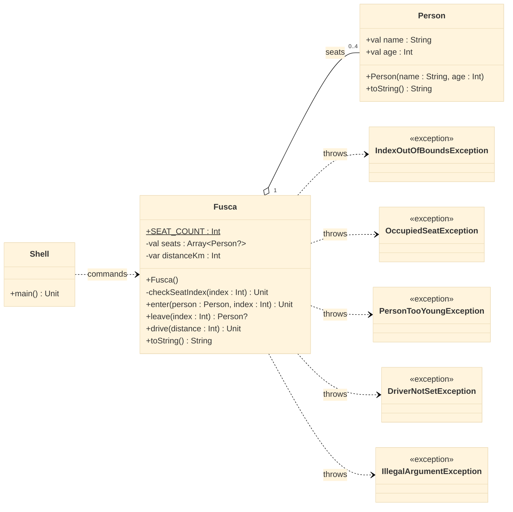

# [TRAIN] Fusca: posições, exceções e direção

<!-- toc-table -->
[Intro](#intro) | [Regras](#regras) | [Exceções](#exceções) | [Diagrama](#diagrama) | [Guide](#guide) | [Shell](#shell) | [Draft](#draft)
-- | -- | -- | -- | -- | -- | --
<!-- toc-table -->


## Intro

Esta atividade é uma evolução de `Carro`. Agora cada pessoa é um objeto e
ocupa uma posição específica no Fusca.

O objetivo principal é combinar posições fixas com exceções nomeadas para
expressar regras que podem falhar por motivos diferentes. A atividade também
pratica composição: `Fusca` recebe e armazena objetos `Person` criados pelo
`Shell`.

## Regras

- `Person` é uma `data class` Kotlin com `name: String` e `age: Int`.
- O Fusca possui quatro assentos fixos:
  - índice `0`: motorista;
  - índice `1`: passageiro da frente;
  - índices `2` e `3`: passageiros de trás.
- Um assento ocupado não pode receber outra pessoa.
- O motorista deve ter pelo menos 18 anos.
- O passageiro da frente deve ter pelo menos 10 anos.
- Os passageiros de trás não possuem restrição adicional de idade.
- Índices fora de `0..3` lançam a exceção padrão `IndexOutOfBoundsException`.
- `leave(index: Int): Person?` retorna a pessoa removida ou `null` quando o assento válido
  está vazio.
- `enter(person: Person, index: Int): Unit` exige assento vazio e idade mínima de 18 para motorista ou 10 para passageiro da frente.
- `drive(distance: Int): Unit` exige que exista um motorista e que a distância seja positiva.
- A distância dirigida é acrescentada à quilometragem.
- Não há gasolina nesta versão: a remoção dessa regra permite concentrar a
  atividade nas posições e no tratamento de falhas.
- O domínio não lê entrada nem imprime mensagens. O `Shell` captura as
  exceções e traduz seus tipos para mensagens observáveis.

## Exceções

As exceções próprias representam regras do domínio:

- `OccupiedSeatException`: o assento já está ocupado;
- `PersonTooYoungException`: a pessoa não possui idade suficiente para o assento;
- `DriverNotSetException`: não há motorista para dirigir.

O erro estrutural de índice usa `IndexOutOfBoundsException`, que já existe no
Kotlin. Não é necessário criar uma exceção própria para ele.

`drive` usa a exceção padrão `IllegalArgumentException` para uma distância não
positiva. As exceções próprias ficam para regras específicas do domínio:
ocupação, idade mínima e presença do motorista.

## Diagrama


```mermaid
%%{init: {'theme': 'base', 'fontFamily': 'monospace'}}%%
classDiagram
    direction LR

    class IndexOutOfBoundsException {
        <<exception>>
    }

    class Person {
        +val name : String
        +val age : Int
        +Person(name : String, age : Int)
        +toString() String
    }

    class OccupiedSeatException {
        <<exception>>
    }

    class PersonTooYoungException {
        <<exception>>
    }

    class DriverNotSetException {
        <<exception>>
    }

    class IllegalArgumentException {
        <<exception>>
    }

    class Fusca {
        +SEAT_COUNT : Int$
        -val seats : Array~Person?~
        -var distanceKm : Int
        +Fusca()
        -checkSeatIndex(index : Int) Unit
        +enter(person : Person, index : Int) Unit
        +leave(index : Int) Person?
        +drive(distance : Int) Unit
        +toString() String
    }

    class Shell {
        +main() Unit
    }

    Fusca "1" o-- "0..4" Person : seats
    Fusca ..> IndexOutOfBoundsException : throws
    Fusca ..> OccupiedSeatException : throws
    Fusca ..> PersonTooYoungException : throws
    Fusca ..> DriverNotSetException : throws
    Fusca ..> IllegalArgumentException : throws
    Shell ..> Fusca : commands
```

## Guide

Implemente em etapas:

1. Crie `Person` como uma `data class` com propriedades `val name: String` e `val age: Int`; sobrescreva `toString()` para produzir `name:age`.
2. Crie quatro posições `Array<Person?>`, inicialmente `null`, e o acumulador `distanceKm`.
3. Implemente `checkSeatIndex(index: Int)` e use `IndexOutOfBoundsException` para índices inválidos.
4. Implemente `enter(person: Person, index: Int)`. Valide o índice, a ocupação e a idade antes de alterar o vetor; lance a exceção específica para cada regra.
5. Implemente `leave(index: Int)`, retornando a pessoa removida ou `null` quando o assento válido estiver vazio.
6. Implemente `drive(distance: Int)`, exigindo motorista e usando `require(distance > 0)` antes de atualizar a quilometragem. Essa condição lança `IllegalArgumentException`.
7. No Shell, crie `Person` a partir dos argumentos e capture cada exceção para exibir a mensagem correspondente. O domínio não deve conhecer as mensagens de saída.

Não é necessário criar uma classe `Seat`: o índice é uma informação do domínio
e as regras dos quatro assentos são pequenas. Também não é necessário manter
uma contagem separada de passageiros, pois ela pode ser obtida da lista de
assentos quando for necessária.

Perguntas de reflexão:

- Por que `leave` pode usar `null`, enquanto `enter` precisa distinguir falhas?
- Por que `IndexOutOfBoundsException` é melhor que uma exceção própria para um índice inválido?
- O que seria perdido se `Fusca` recebesse apenas nome e idade em vez de um
  objeto `Person`?
- Por que a regra de idade pertence a `Fusca`, e não a `Person`?

## Shell

```bash
#TEST_CASE initial state and enter
$show
seats: [0:(empty), 1:(empty), 2:(empty), 3:(empty)], km: 0
$enter joao 18 0
$enter ana 10 1
$enter bia 8 2
$enter caio 30 3
$show
seats: [0:joao:18, 1:ana:10, 2:bia:8, 3:caio:30], km: 0
$end
```

```bash
#TEST_CASE occupied and invalid seats
$enter joao 25 0
$enter joao 25 0
fail: occupied seat
$enter dora 20 4
fail: invalid seat
$enter dora 20 -1
fail: invalid seat
$show
seats: [0:joao:25, 1:(empty), 2:(empty), 3:(empty)], km: 0
$end
```

```bash
#TEST_CASE age restrictions
$enter driver 17 0
fail: person is too young for this seat
$enter front 9 1
fail: person is too young for this seat
$enter driver 18 0
$enter front 10 1
$show
seats: [0:driver:18, 1:front:10, 2:(empty), 3:(empty)], km: 0
$end
```

```bash
#TEST_CASE leave returns person or none
$enter joao 25 0
$enter bia 8 2
$leave 2
bia:8
$leave 2
$leave 3
$show
seats: [0:joao:25, 1:(empty), 2:(empty), 3:(empty)], km: 0
$end
```

```bash
#TEST_CASE drive
$drive 10
fail: driver is not set
$enter joao 25 0
$drive 0
fail: distance must be positive
$drive -5
fail: distance must be positive
$drive 15
$drive 5
$show
seats: [0:joao:25, 1:(empty), 2:(empty), 3:(empty)], km: 20
$end
```

## Draft

<!-- links .cache/starter -->
<!-- links -->
<!-- MERMAID -->
<!-- KOTLIN -->
