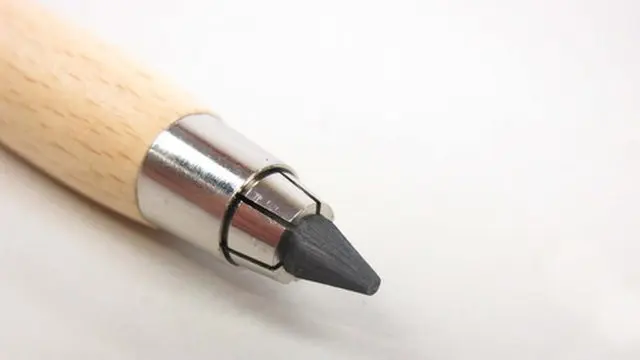
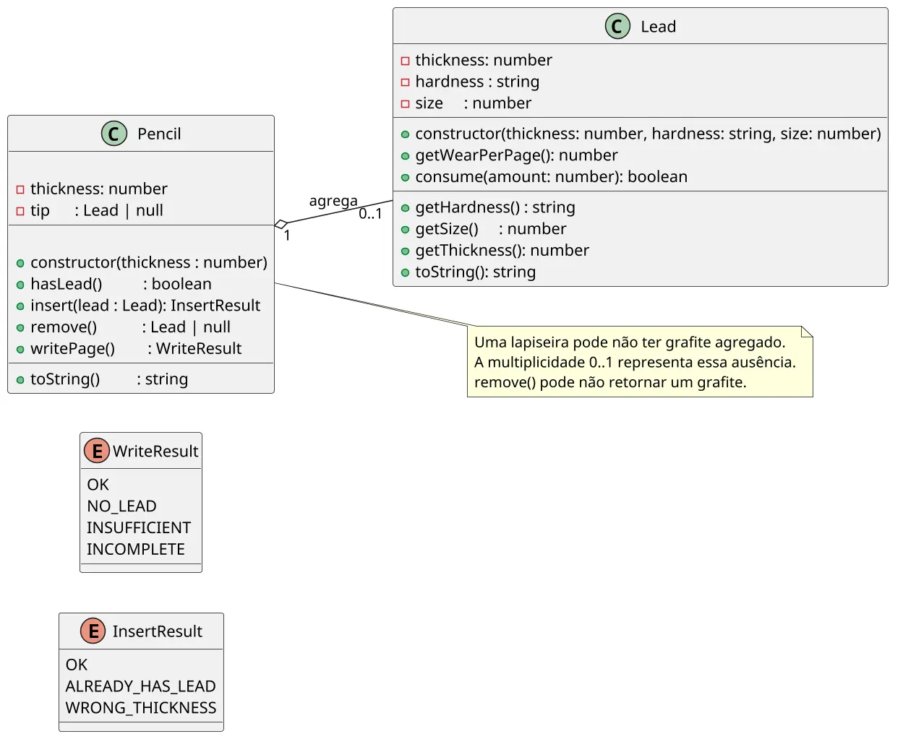

# Grafite: agregação opcional e delegação

<!-- toc-table -->
[Intro](#intro) | [Regras](#regras) | [Diagrama](#diagrama) | [Guide](#guide) | [Shell](#shell) | [Draft](#draft)
-- | -- | -- | -- | -- | --
<!-- toc-table -->



## Intro

O objetivo dessa atividade é implementar uma lapiseira que permite inserir, remover grafite e escrever em uma folha, considerando a dureza e tamanho do grafite.

O foco é praticar agregação e delegação: o grafite conhece seu próprio desgaste, e a lapiseira coordena inserção, remoção e escrita. Os resultados das operações são valores do domínio; o `Shell` é responsável por convertê-los em mensagens.

## Regras

- Descrição
  - A lapiseira é capaz de iniciar, inserir e remover grafite, além de escrever em uma folha.
  - Para inserir um grafite, é necessário especificar o calibre (float), a dureza (string) e o tamanho em mm (int).
  - A remoção do grafite só é possível se houver algum na lapiseira.
  - A escrita na folha só é possível se houver grafite suficiente e se o tamanho do grafite for superior a 10mm.
  - A quantidade de grafite gasto varia de acordo com a dureza do grafite. Quanto mais macio, mais ele se desgasta.
  - Quando o tamanho do grafite atinge 10mm, não é mais possível escrever.
  - Se não houver grafite suficiente para terminar a escrita na folha, é emitido um aviso de texto incompleto.

- Responsabilidades
  - A classe Grafite `Lead` é responsável por armazenar as informações do grafite.
    - `thickness` é a espessura e terá valores como 0.3, 0.5, 0.7.
    - `hardness` é a dureza e poderá ter os seguintes valores: `HB, 2B, 4B, 6B`.
    - O método `getWearPerPage` retorna a quantidade de grafite gasta por folha.
      - Um grafite `HB` gasta `1mm` por folha.
      - Um grafite `2B` gasta `2mm` por folha.
      - Um grafite `4B` gasta `4mm` por folha.
      - Um grafite `6B` gasta `6mm` por folha.
    - `size` representa o tamanho do grafite em `milímetros`.
    - O método `consume(amount)` reduz o tamanho sem permitir que ele fique abaixo de `10mm` e informa se o consumo completo foi possível.
  - A classe `Pencil` é responsável por gerenciar as operações de inserção, remoção de grafite e escrita na folha.
    - Ela agrega no máximo um objeto `Lead`, criado fora da lapiseira.
    - E também possui um indicador de espessura `thickness`.
- Comandos
  - Todos os comandos seguem o modelo `$comando arg1 arg2 ...`.
  - `$init thickness` - Inicializa a lapiseira com uma determinada espessura.
    - erros:
      - `fail: wrong thickness` - Se a espessura do grafite for diferente da espessura da lapiseira.
      - `fail: already has lead` - Se já houver um grafite na lapiseira.
  - `$remove` - Remove o grafite da lapiseira, se houver.
    - erros:
      - `fail: no lead` - Se não houver grafite na lapiseira.
  - `$write` - Escreve na folha, considerando o grafite presente na lapiseira.
    - O grafite é gasto de acordo com a dureza.
    - erros:
      - `fail: no lead` - Se não houver grafite na lapiseira.
      - `fail: insufficient size` - Se o tamanho do grafite for insuficiente para começar a escrita.
      - `fail: incomplete page` - Se o grafite não for suficiente para terminar a escrita.

- A classe de domínio não deve ler entrada nem imprimir mensagens. Os métodos devem retornar sucesso, falha ou o grafite removido; o `Shell` deve interpretar esses retornos e cuidar da interface.

## Diagrama



## Guide

- Parte 1: Inserir
  - Crie a classe Grafite `Lead` com espessura, dureza e tamanho.
  - Crie a classe Lapiseira `Pencil` com o atributo ponta `tip` inicializado como `null`.
  - Implemente o método `hasLead` que retorna `true` se houver grafite na lapiseira.
  - Crie o `InsertResult` e faça `insert` retornar o resultado específico da inserção, sem imprimir mensagens.
  - Implemente o método `toString` que mostra a lapiseira e o grafite presente.

- Parte 2: Remover Grafite
  - Implemente o método `remove` que retira o grafite da lapiseira, se houver.
  - Verifique se o método `remove` retorna o grafite removido ou `null` se não havia grafite.

- Parte 3: Escrever na Folha
  - Crie o `WriteResult` e implemente `writePage`, retornando o resultado específico sem imprimir mensagens.
  - Implemente o método `getWearPerPage` que retorna a quantidade de grafite gasto por folha.
  - Implemente `consume(amount)` em `Lead`, mantendo o tamanho mínimo de `10mm`.
  - Verifique se a lapiseira consegue escrever na folha.
  - Faça as verificações antes de escrever na folha.
  - Para ver se o grafite será suficiente para escrever na folha, verifique qual o tamanho final que ele teria se fizesse a folha completa.
    - Se esse tamanho for menor que 10mm, ele deve gastar o que for possível e parar a folha pela metade.
  - Defina `MIN_SIZE` em `Lead` para representar o menor tamanho que ainda pode permanecer na lapiseira.

- Parte 4: Comparar Durezas
  - Verifique que `HB` gasta menos grafite que `4B` ao escrever páginas do mesmo tipo.

Perguntas de reflexão: por que o cálculo e o consumo do desgaste pertencem a `Lead`, mas a decisão de escrever ou não pertence a `Pencil`? Por que cada operação possui seu próprio tipo de resultado?

## Shell

```bash

#TEST_CASE inserting leads

$init 0.5
$show
thickness: 0.5, lead: null

#TEST_CASE wrong thickness

$insert 0.7 2B 50
fail: wrong thickness
$insert 0.5 2B 50
$show
thickness: 0.5, lead: [0.5:2B:50]
$end
```

***

```bash

#TEST_CASE inserting

$init 0.3
$insert 0.3 2B 50
$show
thickness: 0.3, lead: [0.3:2B:50]

#TEST_CASE already has lead

$insert 0.3 4B 70
fail: already has lead
$show
thickness: 0.3, lead: [0.3:2B:50]

#TEST_CASE removing

$remove
$show
thickness: 0.3, lead: null

#TEST_CASE inserting after removal

$insert 0.3 4B 70
$show
thickness: 0.3, lead: [0.3:4B:70]
$end
```

***

```bash

#TEST_CASE no lead

$init 0.9
$write
fail: no lead

#TEST_CASE insufficient size

$insert 0.9 4B 14
$write
$write
fail: insufficient size
$show
thickness: 0.9, lead: [0.9:4B:10]
$end
```

***

```bash

#TEST_CASE writing page

$init 0.9
$insert 0.9 4B 16
$write
$show
thickness: 0.9, lead: [0.9:4B:12]

#TEST_CASE incomplete page

$write
fail: incomplete page
$show
thickness: 0.9, lead: [0.9:4B:10]
$end
```

```bash
#TEST_CASE hardness wear
$init 0.5
$insert 0.5 HB 15
$write
$show
thickness: 0.5, lead: [0.5:HB:14]
$remove
$insert 0.5 6B 15
$write
fail: incomplete page
$show
thickness: 0.5, lead: [0.5:6B:10]
$end
```

## Draft

<!-- links .cache/starter -->
<!-- links -->
