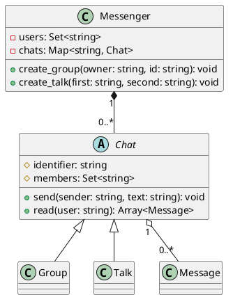

# Grupo — contrato comum para chats

<toc-table />

## Intro

Usuários podem criar grupos e conversas individuais. Ambos enviam e leem
mensagens, mas só grupos permitem convite e saída. A atividade usa uma classe
abstrata para compartilhar o fluxo comum e deixar as capacidades específicas
explícitas.

## Regras

- Usuários têm ids únicos.
- Um grupo começa com seu criador; conversas têm exatamente dois participantes.
- Apenas participantes enviam e leem mensagens.
- Cada participante possui mensagens não lidas próprias; o remetente não recebe sua mensagem.
- Grupo aceita convite e saída; `Talk` rejeita essas operações.
- O id de um talk é os dois nomes ordenados por hífen.

## Diagrama

## Guide

Extraia `Chat` porque grupo e talk têm o mesmo contrato de envio/leitura, mas
políticas diferentes para convite e saída. `Messenger` possui o mapa e cria os
objetos; não coloque essas regras no Shell. O padrão aqui é uma especialização
por herança guiada por comportamento, não por reutilização acidental.

## Verificação

Execute `python3 -m unittest discover src/py` e verifique membros, mensagens
independentes e operações não suportadas em talk.
