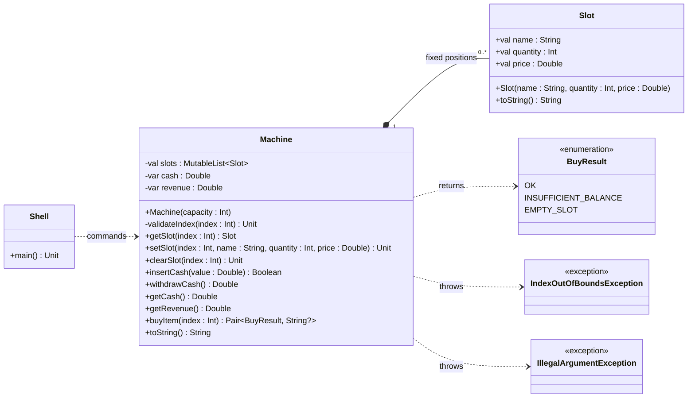

# [ALONE] Junkfood: exceções e objeto vazio

<!-- toc-table -->
[Intro](#intro) | [Regras](#regras) | [Exceções](#exceções) | [Diagrama](#diagrama) | [Guide](#guide) | [Shell](#shell) | [Resolução](#resolução) | [Draft](#draft)
-- | -- | -- | -- | -- | -- | -- | --
<!-- end -->


## Intro

Uma máquina de lanches vende produtos guardados em espirais e rejeita valores de dinheiro inválidos.

O objetivo desta atividade é implementar uma máquina de venda. Ela possui espirais fixas; cada espiral contém uma quantidade de produtos do mesmo tipo e preço. A pessoa insere dinheiro, compra um produto e pode receber o saldo restante como troco.

Esta atividade também usa posições fixas, mas com uma decisão diferente de `cinema` e `budega`: cada posição sempre contém um objeto `Slot`. Quando a espiral está vazia, o próprio `Slot` guarda `empty`, quantidade `0` e preço `0.00`. Assim, o aluno pode comparar duas formas de representar ausência: uma posição com `null` ou um objeto que representa o estado vazio.

- **Descrição**
  - A máquina de vendas é representada pela classe `Machine`, que contém um conjunto de "espirais", cada uma associada a um produto.
  - Os métodos implementados permitem configurar os produtos disponíveis na máquina, inserir dinheiro, solicitar troco, comprar produtos e visualizar o estado atual da máquina.
  - Cada espiral pode conter um produto, representado pela classe `Slot`, que armazena o nome, quantidade e preço do produto.
  - Os métodos fornecidos incluem validações para garantir a integridade das operações, como verificar se o saldo é suficiente para a compra, se há produtos disponíveis, entre outros.

### Objetivos pedagógicos

O objetivo principal é comparar duas formas de representar ausência em posições fixas: uma posição nullable, como em `cinema` e `budega`, e um objeto `Slot` que representa explicitamente a espiral vazia. Como objetivos secundários, a atividade trabalha invariantes de quantidade e saldo e a separação entre regras da máquina e apresentação do Shell.

### Conhecimentos prévios

São necessários objetos, listas, índices, condicionais, laços, métodos, valores numéricos e o uso básico de `try`/`catch`.

### Invariantes e comportamento observável

- a quantidade de espirais permanece fixa até um novo `init`;
- cada posição sempre contém um `Slot` independente;
- a capacidade da máquina e a quantidade do produto não podem ser negativas;
- o saldo só aumenta com dinheiro válido e diminui após uma compra válida;
- o troco zera somente o saldo atual;
- uma compra recusada não altera quantidade, saldo ou arrecadação;
- `arrecadacao` é a soma dos preços das vendas e não representa lucro econômico, pois custos não fazem parte do modelo.

## Regras

- `Machine(capacity: Int)` cria uma lista de tamanho fixo; capacidade negativa lança `IllegalArgumentException`.
- `Slot` é imutável e armazena `name: String`, `quantity: Int` e `price: Double`. Quantidade negativa lança `IllegalArgumentException`.
- `getSlot(index: Int): Slot`, `setSlot(index: Int, name: String, quantity: Int, price: Double): Unit`, `clearSlot(index: Int): Unit` e `buyItem(index: Int)` lançam `IndexOutOfBoundsException` para índices inválidos.
- `setSlot` substitui o objeto da posição; `clearSlot` o substitui por um `Slot` vazio. Falhas preservam o estado anterior.
- `insertCash(value: Double): Boolean` retorna `true` para valores positivos e `false` para zero ou valores negativos.
- `withdrawCash(): Double` devolve o saldo e o zera; a arrecadação acumulada não muda.
- `buyItem(index: Int): Pair<BuyResult, String?>` mantém `INSUFFICIENT_BALANCE` e `EMPTY_SLOT` como resultados esperados. Uma compra válida substitui o `Slot` por uma cópia com uma unidade a menos, atualiza saldo e arrecadação e retorna o nome do produto.
- `getRevenue(): Double` consulta a arrecadação sem alterá-la.
- `toString(): String` mostra o saldo e todas as espirais no formato dos casos de teste.
- As mensagens de falha e sucesso pertencem ao Shell; o domínio não lê nem imprime texto.

## Exceções

- `IndexOutOfBoundsException` comunica índices fora dos limites em operações da máquina.
- `IllegalArgumentException` comunica capacidade ou quantidade negativas. A validação da quantidade pertence a `Slot`, que garante a própria invariante.
- O Shell captura as exceções junto ao comando correspondente e preserva as mensagens existentes. `insertCash` usa `Boolean`, enquanto saldo insuficiente e espiral vazia continuam em `BuyResult` por serem resultados esperados da compra.

## Diagrama

Cada posição de `Machine` contém sempre um `Slot`; o estado vazio é representado por um objeto com `name: "empty"`, quantidade zero e preço zero. `Machine` cria esses objetos e coordena saldo, compras e arrecadação.



## Guide

Implemente em pequenos passos:

1. Crie `Slot` como um `data class` com propriedades `val` e valores padrão para o objeto vazio. Valide `quantity >= 0` no construtor e formate `toString()` com duas casas decimais.
2. Crie `Machine(capacity: Int)`. Valide capacidade não negativa antes de criar a lista e inicialize cada posição com um `Slot` vazio.
3. Implemente `validateIndex` e use-a em `getSlot`, `setSlot`, `clearSlot` e `buyItem`. Lance `IndexOutOfBoundsException` antes de acessar a lista.
4. Em `setSlot`, construa o novo `Slot` antes de substituir a posição. Se a quantidade for inválida, a exceção deixa o estado anterior intacto. Em `clearSlot`, substitua a posição pelo objeto vazio.
5. Faça `insertCash` retornar `false` para valores não positivos e `true` após atualizar o saldo. `withdrawCash` zera somente o saldo disponível, sem apagar a arrecadação.
6. Em `buyItem`, mantenha `INSUFFICIENT_BALANCE` e `EMPTY_SLOT` como resultados. Na compra válida, substitua o `Slot` por `slot.copy(quantity = slot.quantity - 1)`, atualize saldo e arrecadação e retorne o nome do produto.
7. No Shell, capture as exceções junto aos comandos que podem lançá-las e traduza-as para as mensagens documentadas. Converta o Boolean e o par de `buyItem` em saídas sem colocar mensagens no domínio.

`Slot` é necessário porque até uma espiral vazia tem uma posição estável e um estado representável; assim não há posições `null`. Como `Slot` é imutável, o estado só muda quando `Machine` substitui um objeto, e `getSlot` não permite contornar a validação de quantidade. O saldo representa dinheiro disponível para troco, enquanto `revenue` registra vendas passadas. O par `Pair<BuyResult, String?>` devolve o resultado e o nome comprado sem exigir uma classe de resposta.

Os comandos do Shell permanecem em português por fazerem parte do contrato. Os nomes da API e os tipos do diagrama usam Kotlin. Considere como a máquina poderia futuramente oferecer reembolso de uma compra sem apagar o histórico de vendas.

## Shell

```bash
#TEST_CASE init

# init _espirais
$init 3
$show
saldo: 0.00
0 [   empty : 0 U : 0.00 RS]
1 [   empty : 0 U : 0.00 RS]
2 [   empty : 0 U : 0.00 RS]

#TEST_CASE inserindo comida
# set _ind _nome _qtd _valor 
$set 2 todinho 3 2.50
$show
saldo: 0.00
0 [   empty : 0 U : 0.00 RS]
1 [   empty : 0 U : 0.00 RS]
2 [ todinho : 3 U : 2.50 RS]

$set 0 tampico 1 1.50
$set 1 xaverde 3 5.00
$show   
saldo: 0.00
0 [ tampico : 1 U : 1.50 RS]
1 [ xaverde : 3 U : 5.00 RS]
2 [ todinho : 3 U : 2.50 RS]

#TEST_CASE limpando
# limpar _ind
$limpar 2
$show
saldo: 0.00
0 [ tampico : 1 U : 1.50 RS]
1 [ xaverde : 3 U : 5.00 RS]
2 [   empty : 0 U : 0.00 RS]
$set 4 ovo 2 4.30
fail: indice nao existe
$limpar 4
fail: indice nao existe

#TEST_CASE dinheiro
# dinheiro _valor
$dinheiro 5
$dinheiro 4
$show   
saldo: 9.00
0 [ tampico : 1 U : 1.50 RS]
1 [ xaverde : 3 U : 5.00 RS]
2 [   empty : 0 U : 0.00 RS]

#TEST_CASE troco
$troco
voce recebeu 9.00 RS
$show
saldo: 0.00
0 [ tampico : 1 U : 1.50 RS]
1 [ xaverde : 3 U : 5.00 RS]
2 [   empty : 0 U : 0.00 RS]
$dinheiro 8

#TEST_CASE comprar
# comprar _ind
$comprar 1
voce comprou um xaverde

#TEST_CASE comprar sem dinheiro
$comprar 1
fail: saldo insuficiente

#TEST_CASE comprar
$comprar 0
voce comprou um tampico
$show
saldo: 1.50
0 [ tampico : 0 U : 1.50 RS]
1 [ xaverde : 2 U : 5.00 RS]
2 [   empty : 0 U : 0.00 RS]

#TEST_CASE comprar sem produtos
$comprar 0
fail: espiral sem produtos

#TEST_CASE comprar fora do indice
$comprar 4
fail: indice nao existe

$troco
voce recebeu 1.50 RS
$revenue
arrecadacao: 6.50
$end
#__end__
```

### Testes complementares

```bash
#TEST_CASE fronteiras e arrecadacao
$init 1
$set 0 pao 1 2.50
$revenue
arrecadacao: 0.00
$dinheiro 2.50
$comprar 0
voce comprou um pao
$revenue
arrecadacao: 2.50
$troco
voce recebeu 0.00 RS
$comprar 0
fail: saldo insuficiente
$revenue
arrecadacao: 2.50
$set 0 pao 0 2.50
$dinheiro 2.50
$comprar 0
fail: espiral sem produtos
$show
saldo: 2.50
0 [     pao : 0 U : 2.50 RS]
$revenue
arrecadacao: 2.50
$end
```

```bash
#TEST_CASE argumentos invalidos preservam o estado
$init 1
$set 0 pao 2 1.50
$set 0 pao -1 2.00
fail: quantidade invalida
$show
saldo: 0.00
0 [     pao : 2 U : 1.50 RS]
$dinheiro 0
fail: valor invalido
$dinheiro -2
fail: valor invalido
$show
saldo: 0.00
0 [     pao : 2 U : 1.50 RS]
$end
```

```bash
#TEST_CASE capacidade invalida preserva a maquina
$init 1
$set 0 agua 1 2.00
$init -1
fail: capacidade invalida
$show
saldo: 0.00
0 [    agua : 1 U : 2.00 RS]
$end
```

## Resolução


## Draft

<!-- links .cache/starter -->
<!-- end -->
<!-- MERMAID -->
<!-- KOTLIN -->
