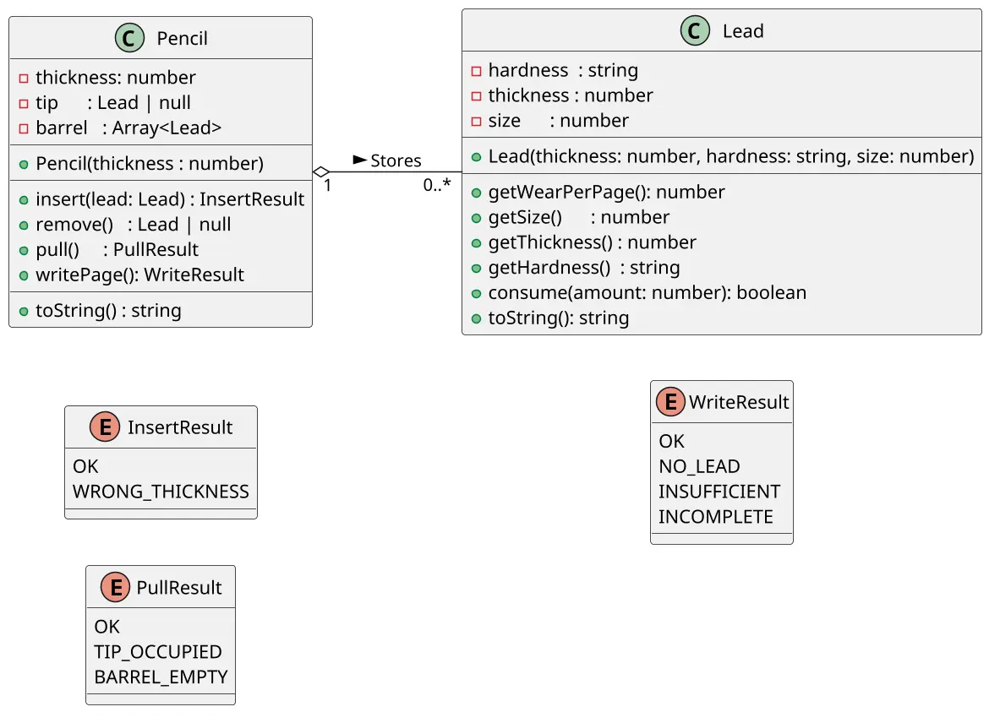

# Lapiseira: extensão do grafite com tambor

<!-- toc-table -->
[Intro](#intro) | [Guide](#guide) | [Shell](#shell) | [Drafts](#drafts)
-- | -- | -- | --
<!-- toc-table -->


Faça o modelo de uma lapiseira que pode conter vários.

## Intro

Esta atividade parte do modelo de `Grafite`. A lapiseira continua tendo um grafite em uso no bico, mas ganha um tambor com grafites reservas: novos grafites entram no fim e o próximo grafite é puxado do começo.

O foco é acrescentar uma coleção linear ao modelo anterior, distinguindo uma lista de muitos elementos de uma referência que pode não apontar para nenhum objeto. As regras de desgaste continuam pertencendo a `Lead`; `Pencil` apenas coordena o tambor e o bico.

- Iniciar lapiseira
  - Inicia uma lapiseira de determinado calibre sem grafite.
  - Lapiseiras possuem um bico e um tambor.
  - O bico guarda o grafite que está em uso.
  - O tambor guarda os grafites reservas.
- Inserir grafite
  - Insere um grafite passando
    - o calibre: number.
    - a dureza: string.
    - o tamanho em mm: number.
  - Não deve aceitar um grafite de calibre não compatível.
  - O grafite é colocado como o ÚLTIMO grafite do tambor.
- Puxar grafite
  - Puxa o grafite do tambor para o bico.
  - Se já tiver um grafite no bico, esse precisa ser removido primeiro.
- Remover grafite
  - Retira o grafite do bico.
- Escrever folha
  - Não é possível escrever se não há grafite no bico.
  - Quanto mais macio o grafite, mais rapidamente ele se acaba. Para simplificar, use a seguinte regra:
    - Grafite HB: 1mm por folha.
    - Grafite 2B: 2mm por folha.
    - Grafite 4B: 4mm por folha.
    - Grafite 6B: 6mm por folha.
  - O último centímetro de um grafite não pode ser aproveitado, quando o grafite estiver com 10mm, não é mais possível escrever e o grafite deve ser retirado.
  - Se não houver grafite suficiente para terminar a folha, avise que o texto ficou incompleto.

As classes de domínio devem retornar resultados das operações e não imprimir mensagens. O `Shell` traduz `InsertResult`, `PullResult` e `WriteResult` para a interface.

## Guide



[](https://youtu.be/82aFfjuITm8?si=dbFx8fWPH4CBL15d)

- Comece reutilizando `Lead` e as regras de desgaste de `Grafite`.
- Adicione `barrel: Array<Lead>` a `Pencil`. `insert` deve colocar o grafite compatível no final do tambor.
- Implemente `pull` para mover o primeiro grafite do tambor para `tip`. A operação deve falhar se o bico estiver ocupado ou se o tambor estiver vazio.
- Mantenha `remove` para retirar o grafite do bico e `writePage` para delegar o consumo a `Lead`.
- Use resultados específicos por operação e deixe o `Shell` imprimir as mensagens.

Pergunta de reflexão: o que foi acrescentado à `Pencil` para representar o tambor, e quais regras continuaram pertencendo a `Lead`?


## Shell

```bash
#TEST_CASE inserindo grafites
$init 0.5
$show
calibre: 0.5, bico: [], tambor: <>
#TEST_CASE calibre errado
$insert 0.7 2B 50
fail: calibre incompatível
#TEST_CASE calibre certo
$insert 0.5 2B 50
$show
calibre: 0.5, bico: [], tambor: <[0.5:2B:50]>
#TEST_CASE mais de um grafite
$insert 0.5 2B 30
$show
calibre: 0.5, bico: [], tambor: <[0.5:2B:50][0.5:2B:30]>
#TEST_CASE puxando grafite
$pull
$show
calibre: 0.5, bico: [0.5:2B:50], tambor: <[0.5:2B:30]>
#TEST_CASE puxando ocupado
$pull
fail: ja existe grafite no bico
#TEST_CASE removendo do bico
$remove
$show
calibre: 0.5, bico: [], tambor: <[0.5:2B:30]>
$end
```

___

```bash
#TEST_CASE escrevendo 
$init 0.9
$insert 0.9 4B 14
$insert 0.9 4B 16

#TEST_CASE sem grafite no bico
$write
fail: nao existe grafite no bico

#TEST_CASE puxando grafite
$pull
$show
calibre: 0.9, bico: [0.9:4B:14], tambor: <[0.9:4B:16]>

#TEST_CASE gastando grafite
$write
$show
calibre: 0.9, bico: [0.9:4B:10], tambor: <[0.9:4B:16]>

#TEST_CASE puxando novo
$remove
$pull
$show
calibre: 0.9, bico: [0.9:4B:16], tambor: <>
$write
$show
calibre: 0.9, bico: [0.9:4B:12], tambor: <>

#TEST_CASE folha incompleta
$write
fail: folha incompleta
$show
calibre: 0.9, bico: [0.9:4B:10], tambor: <>

#TEST_CASE tamanho insuficiente
$write
fail: tamanho insuficiente
$end
```

## Drafts

<!-- links .cache/starter -->
<!-- links -->
