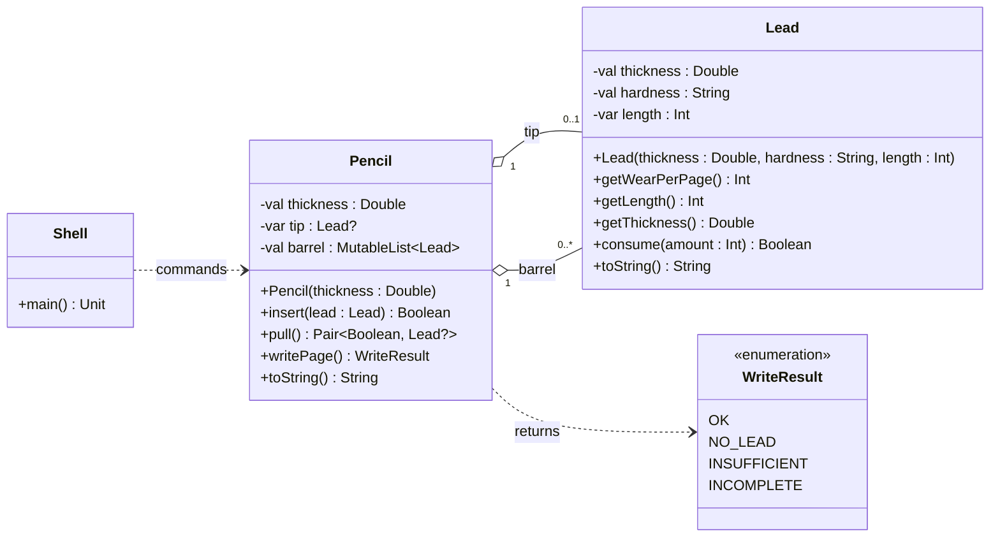

# [ALONE] Lapiseira com tambor de grafites

<!-- toc-table -->
[Intro](#intro) | [Diagrama](#diagrama) | [Guide](#guide) | [Shell](#shell) | [Drafts](#drafts)
-- | -- | -- | -- | --
<!-- toc-table -->


Faça o modelo de uma lapiseira que pode conter vários.

## Intro

Esta atividade parte do modelo de `Grafite`. A lapiseira continua tendo um grafite em uso no bico, mas ganha um tambor com grafites reservas: novos grafites entram no fim e o próximo grafite é puxado do começo.

O foco é acrescentar uma coleção linear ao modelo anterior, distinguindo uma lista de muitos elementos de uma referência que pode não apontar para nenhum objeto. As regras de desgaste continuam pertencendo a `Lead`; `Pencil` apenas coordena o tambor e o bico.

- Iniciar lapiseira
  - Inicia uma lapiseira de determinado calibre sem grafite.
  - Lapiseiras possuem um bico e um tambor.
  - O bico guarda o grafite que está em uso.
  - O tambor guarda os grafites reservas.
- Inserir grafite
  - Insere um grafite passando
    - o calibre: `Double`.
    - a dureza: `String`.
    - o comprimento em mm: `Int`.
  - `insert(lead: Lead): Boolean` retorna `false` se o calibre não for compatível e `true` quando insere o grafite.
  - O grafite é colocado como o ÚLTIMO grafite do tambor.
- Puxar grafite
  - `pull(): Pair<Boolean, Lead?>` combina a retirada do bico e a retirada do tambor.
  - Se houver um grafite no bico, `pull` apenas o remove e retorna `true` com o grafite removido no segundo valor.
  - Se o bico estiver vazio e houver um grafite no tambor, `pull` move o primeiro para o bico e retorna `true` com `null` no segundo valor.
  - Se o bico e o tambor estiverem vazios, `pull` retorna `false` e `null`.
- Escrever folha
  - Não é possível escrever se não há grafite no bico.
  - Quanto mais macio o grafite, mais rapidamente ele se acaba. Para simplificar, use a seguinte regra:
    - Grafite HB: 1mm por folha.
    - Grafite 2B: 2mm por folha.
    - Grafite 4B: 4mm por folha.
    - Grafite 6B: 6mm por folha.
  - O último centímetro de um grafite não pode ser aproveitado, quando o grafite estiver com 10mm, não é mais possível escrever e o grafite deve ser retirado.
  - Se não houver grafite suficiente para terminar a folha, avise que o texto ficou incompleto.

As classes de domínio retornam resultados e não imprimem mensagens. O `Shell` interpreta os valores booleanos, o par retornado por `pull` e o `WriteResult` para apresentar falhas.

## Diagrama

`Pencil` possui um grafite opcional no bico e uma coleção ordenada de grafites reservas no tambor. Os objetos `Lead` são criados fora da lapiseira e podem ser removidos, por isso as relações são agregações.


```mermaid
%%{init: {'fontFamily': 'monospace'}}%%
classDiagram
    direction LR

    class WriteResult {
        <<enumeration>>
        OK
        NO_LEAD
        INSUFFICIENT
        INCOMPLETE
    }

    class Lead {
        -val thickness : Double
        -val hardness : String
        -var length : Int
        +Lead(thickness : Double, hardness : String, length : Int)
        +getWearPerPage() Int
        +getLength() Int
        +getThickness() Double
        +consume(amount : Int) Boolean
        +toString() String
    }

    class Pencil {
        -val thickness : Double
        -var tip : Lead?
        -val barrel : MutableList~Lead~
        +Pencil(thickness : Double)
        +insert(lead : Lead) Boolean
        +pull() Pair~Boolean, Lead?~
        +writePage() WriteResult
        +toString() String
    }

    class Shell {
        +main() Unit
    }

    Pencil "1" o-- "0..1" Lead : tip
    Pencil "1" o-- "0..*" Lead : barrel
    Pencil ..> WriteResult : returns
    Shell ..> Pencil : commands
```

## Guide

- Comece reutilizando `Lead` e as regras de desgaste de `Grafite`.
- Adicione `barrel: MutableList<Lead>` a `Pencil`. `insert` deve colocar o grafite compatível no final do tambor.
- Faça `insert` retornar `false` para calibre incompatível e `true` quando inserir no final do tambor.
- Implemente `pull(): Pair<Boolean, Lead?>`: retire e devolva o grafite do bico quando ocupado; caso contrário, carregue o primeiro grafite do tambor; retorne falha apenas quando ambos estiverem vazios.
- Mantenha `writePage` para delegar o consumo a `Lead`, usando `WriteResult` para os resultados da escrita.
- Deixe o `Shell` imprimir uma falha quando `insert` ou `pull` retornar `false`.

O diagrama usa tipos e assinaturas Kotlin. `length` representa o comprimento restante do grafite, distinguindo-o do calibre `thickness`. Em `pull`, o primeiro valor do `Pair` informa se a operação teve sucesso e o segundo devolve um grafite removido, se houver. Quando o bico está ocupado, `$pull` retira o grafite; quando está vazio, tenta carregar o próximo do tambor.

Pergunta de reflexão: o que foi acrescentado à `Pencil` para representar o tambor, e quais regras continuaram pertencendo a `Lead`?


## Shell

```bash
#TEST_CASE inserindo grafites
$init 0.5
$show
calibre: 0.5, bico: [], tambor: <>
#TEST_CASE calibre errado
$insert 0.7 2B 50
fail: calibre incompatível
#TEST_CASE calibre certo
$insert 0.5 2B 50
$show
calibre: 0.5, bico: [], tambor: <[0.5:2B:50]>
#TEST_CASE mais de um grafite
$insert 0.5 2B 30
$show
calibre: 0.5, bico: [], tambor: <[0.5:2B:50][0.5:2B:30]>
#TEST_CASE puxando grafite
$pull
$show
calibre: 0.5, bico: [0.5:2B:50], tambor: <[0.5:2B:30]>
#TEST_CASE pull removes occupied tip
$pull
$show
calibre: 0.5, bico: [], tambor: <[0.5:2B:30]>
#TEST_CASE pull loads next lead
$pull
$show
calibre: 0.5, bico: [0.5:2B:30], tambor: <>
#TEST_CASE pull removes final occupied lead
$pull
$show
calibre: 0.5, bico: [], tambor: <>
#TEST_CASE pull with empty tip and barrel
$pull
fail: nao existe grafite no barril
$end
```

___

```bash
#TEST_CASE escrevendo 
$init 0.9
$insert 0.9 4B 14
$insert 0.9 4B 16

#TEST_CASE sem grafite no bico
$write
fail: nao existe grafite no bico

#TEST_CASE puxando grafite
$pull
$show
calibre: 0.9, bico: [0.9:4B:14], tambor: <[0.9:4B:16]>

#TEST_CASE gastando grafite
$write
$show
calibre: 0.9, bico: [0.9:4B:10], tambor: <[0.9:4B:16]>

#TEST_CASE puxando novo
$pull
$show
calibre: 0.9, bico: [], tambor: <[0.9:4B:16]>
$pull
$show
calibre: 0.9, bico: [0.9:4B:16], tambor: <>
$write
$show
calibre: 0.9, bico: [0.9:4B:12], tambor: <>

#TEST_CASE folha incompleta
$write
fail: folha incompleta
$show
calibre: 0.9, bico: [0.9:4B:10], tambor: <>

#TEST_CASE tamanho insuficiente
$write
fail: tamanho insuficiente
$pull
$show
calibre: 0.9, bico: [], tambor: <>
$end
```

## Drafts

<!-- links .cache/starter -->
- java
  - [Shell.java](.cache/starter/java/Shell.java)
<!-- links -->
<!-- MERMAID -->
