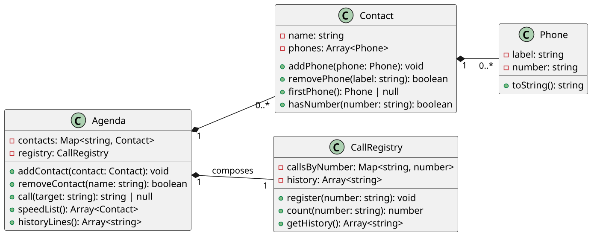

# [TRAIN] Ligação: composição para histórico e ranking

<!-- toc-table -->
[Intro](#intro) | [Regras](#regras) | [Diagrama](#diagrama) | [Guide](#guide) | [Shell](#shell) | [Draft](#draft)
-- | -- | -- | -- | -- | --
<!-- toc-table -->


## Intro

Esta atividade evolui o modelo de `agenda` para registrar ligações. O novo requisito não deve transformar `Agenda` em um objeto que conhece contatos, telefones, contagens, ranking e histórico ao mesmo tempo. Em vez disso, `Agenda` será composta com um `CallRegistry`, responsável pelo conhecimento específico das ligações.

O objetivo principal é praticar composição e delegação: adicionar uma responsabilidade nova por meio de um objeto colaborador, mantendo a classe original coesa. Como objetivos secundários, a atividade trabalha mapas por número, histórico, ordenação por múltiplos critérios e integridade quando os contatos mudam.

### Progressão pedagógica

- `contato` encapsula os telefones de uma pessoa;
- `agenda` organiza contatos por identidade e consulta seus dados;
- `favoritos` mostra como manter um índice secundário e sua consistência;
- `ligacao` acrescenta um componente especializado, sem espalhar a regra de ligações por `Agenda` e `Contact`.

A composição significa que `Agenda` possui um `CallRegistry` e delega a ele o registro e a contagem das ligações. O registro não precisa conhecer a lista de contatos; ele armazena números e quantidades. A agenda resolve a associação entre um número e os contatos atuais quando precisa exibir o ranking ou o histórico.

## Regras

### Modelo existente

- `Phone` mantém `label` e `number`.
- `Contact` mantém seu nome e uma coleção privada de telefones.
- `Agenda` mantém contatos únicos em `dict[str, Contact]` e continua responsável por adicionar/remover contatos e telefones.
- Adicionar um contato com nome já existente incorpora seus telefones ao contato atual.
- `rmFone name label` remove o telefone identificado pelo label.

### CallRegistry

- `CallRegistry` mantém `calls_by_number: dict[str, int]`.
- Cada chamada incrementa a contagem do número e adiciona o número ao histórico, preservando a ordem das chamadas.
- Números desconhecidos também são registrados.
- O registro não armazena cópias de `Contact` e não depende da posição de um contato na agenda.

### Ligações

- `call name` liga para o primeiro telefone do contato, na ordem em que foi cadastrado.
- `call number` liga diretamente para o número informado.
- Se um número pertencer a vários contatos, a mesma contagem é considerada para todos eles.
- Se um contato não possuir telefone, a ligação falha com `fail: contact has no phone`.
- O histórico resolve o contato atual pelo número. Mostra o primeiro contato em ordem alfabética; se não houver contato, mostra somente o número.
- Remover um contato ou telefone não apaga a contagem histórica do número. Apenas muda a associação exibida.

### SpeedList

- Exibe somente contatos com pelo menos uma ligação em seus telefones.
- A contagem de um contato é a soma das contagens de seus números.
- Ordena por maior quantidade de ligações e, em empate, por nome em ordem alfabética.
- A agenda e o histórico permanecem fontes diferentes: o contato fornece os telefones atuais e o registro fornece as contagens.

## Diagrama



`Agenda` e `CallRegistry` possuem ciclos de vida relacionados, mas responsabilidades distintas. A composição permite adicionar histórico e ranking sem fazer `Agenda` absorver as regras próprias de ligações.

## Guide

### 1. Reutilize `Phone`, `Contact` e `Agenda`

Comece com o modelo de `agenda`. Preserve a validação de telefones, o encapsulamento de `Contact` e o mapa de contatos. Não coloque a contagem dentro de `Phone` ou `Contact`: uma mesma ligação deve ser contabilizada pelo número, inclusive quando ele aparece em contatos diferentes.

### 2. Crie o colaborador especializado

Implemente `CallRegistry` com um mapa de contagens e uma lista de números chamados. Ele deve oferecer operações pequenas: registrar uma chamada, consultar a contagem de um número e retornar uma cópia do histórico.

Esse é o ponto em que a composição aparece: `Agenda` contém um `CallRegistry`, mas não reimplementa sua estrutura interna. Cada classe tem uma razão de mudança própria.

### 3. Delegue a ligação

Faça `Agenda.call` resolver o alvo para um número e delegar o registro ao `CallRegistry`. A associação com contatos deve ser consultada depois, para que um número desconhecido possa receber um contato futuramente sem perder suas chamadas.

### 4. Produza ranking e histórico

Calcule o total de um contato somando os números dos seus telefones. Ordene o ranking por contagem decrescente e nome. Para o histórico, percorra os números na ordem registrada e resolva a associação atual somente no momento da consulta.

### 5. Teste a evolução

Depois de cada etapa, execute apenas os casos correspondentes. Verifique que a nova responsabilidade não quebra as operações antigas de adicionar, remover ou consultar contatos.

Perguntas de reflexão:

- O que mudaria se `Agenda` armazenasse diretamente as contagens e o histórico?
- Por que `CallRegistry` deve indexar por número, e não por objeto `Contact`?
- Por que remover um telefone não deve apagar o histórico daquele número?
- Qual é o custo de resolver os contatos no momento da consulta?
- Como a composição facilita substituir o registro em memória por um registro persistente no futuro?

## Shell

### Cadastro e ligações por nome e número

```bash
#TEST_CASE calls
$add eva claro:9999 oi:8585 tim:3434
$add ana casa:4567 oi:8754
$add ivo tim:5454
$add rui vivo:2222 oi:9991
$call ana
ligando ana 4567
$call 8754
ligando ana 8754
$call 8585
ligando eva 8585
$call 5454
ligando ivo 5454
$speedList
- ana {2 call}[casa:4567, oi:8754]
- eva {1 call}[claro:9999, oi:8585, tim:3434]
- ivo {1 call}[tim:5454]
$end
```

### Número desconhecido e histórico

```bash
#TEST_CASE unknown_history
$call 555
ligando 555 555
$call 555
ligando 555 555
$history
:call 555 - 555 {2 call}
:call 555 - 555 {2 call}
$add vei budega:555
$speedList
- vei {2 call}[budega:555]
$history
:call 555 - vei {2 call}
:call 555 - vei {2 call}
$end
```

### Integridade após remoções

```bash
#TEST_CASE removals
$add ana casa:4567 oi:8754
$call 4567
ligando ana 4567
$rmFone ana casa
$speedList
$rm ana
$history
:call 4567 - 4567 {1 call}
$end
```

### Telefones compartilhados e ordem

```bash
#TEST_CASE shared_number
$add zeca celular:5454
$add ana casa:5454
$call 5454
ligando ana 5454
$speedList
- ana {1 call}[casa:5454]
- zeca {1 call}[celular:5454]
$history
:call 5454 - ana {1 call}
$end
```

## Draft

<!-- links .cache/starter -->
<!-- links -->
