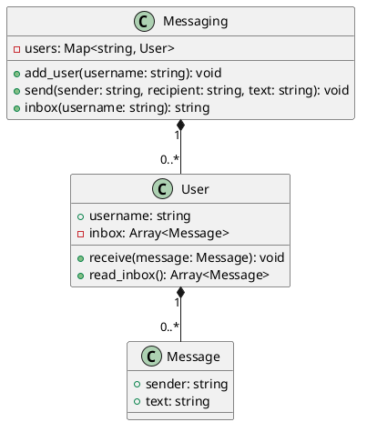

# Mensagem — inbox e leitura destrutiva

<toc-table />


## Intro

Esta atividade apresenta o menor modelo útil para troca de mensagens: usuários
são identificados por username, uma mensagem tem remetente e texto, e cada
usuário mantém seu inbox.

O objetivo principal é separar cadastro, envio e leitura em responsabilidades
pequenas. A regra de negócio central é que ler o inbox devolve as mensagens
pendentes e as remove, simulando uma caixa de entrada consumível.

## Regras

- usernames são únicos.
- Só usuários cadastrados podem enviar ou receber.
- O destinatário recebe a mensagem no próprio inbox.
- A leitura retorna as mensagens na ordem de chegada e limpa o inbox.
- Um inbox vazio é exibido como `- empty -`.

## Diagrama



## Guide

Modele `Message` como valor imutável. Faça `User` possuir a fila de mensagens
e `Messaging` possuir o mapa de usuários. O serviço coordena a busca e a
entrega, mas não manipula o inbox por fora. Teste a leitura duas vezes para
tornar visível o consumo da mensagem.

## Verificação

Execute `python3 -m unittest discover src/py` e verifique usuários inexistentes,
ordem de mensagens e leitura única.

## Shell

```sh
#TEST_CASE basic
$addUser david
$addUser celia
$sendMsg david celia voce esta com fome?
$inbox celia
david:voce esta com fome?
$inbox celia
- empty -
$end
```
