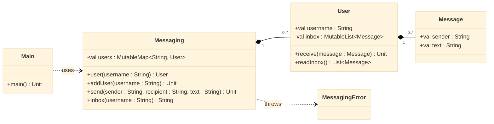

# Mensagem — inbox e leitura destrutiva

<!-- toc-table -->
[Intro](#intro) | [Regras](#regras) | [Diagrama](#diagrama) | [Guide](#guide) | [Verificação](#verificação) | [Shell](#shell)
-- | -- | -- | -- | -- | --
<!-- end -->


## Intro

Esta atividade apresenta o menor modelo útil para troca de mensagens: usuários
são identificados por username, uma mensagem tem remetente e texto, e cada
usuário mantém seu inbox.

O objetivo principal é separar cadastro, envio e leitura em responsabilidades
pequenas. A regra de negócio central é que ler o inbox devolve as mensagens
pendentes e as remove, simulando uma caixa de entrada consumível.

## Regras

- `Message(sender : String, text : String)` é imutável.
- `Messaging` cadastra usernames uma única vez; adicionar um nome repetido não substitui o usuário nem seu inbox.
- `send(sender : String, recipient : String, text : String)` exige que os dois usuários existam e entrega a mensagem ao inbox do destinatário.
- Se um dos usuários não existir, `MessagingError` é lançado com `fail: usuario nao encontrado`; nenhuma mensagem é entregue.
- `User.readInbox() : List<Message>` retorna as mensagens na ordem de chegada e esvazia o inbox.
- `Messaging.inbox(username : String) : String` exibe as mensagens como `sender:text`, uma por linha; um inbox vazio é exibido como `- empty -`.

## Diagrama


```mermaid
%%{init: {"theme": "base", "themeVariables": {"fontFamily": "monospace"}}}%%
classDiagram
    direction LR

    class Message {
        +val sender : String
        +val text : String
    }

    class User {
        +val username : String
        -val inbox : MutableList~Message~
        +receive(message : Message) Unit
        +readInbox() List~Message~
    }

    class Messaging {
        -val users : MutableMap~String, User~
        +user(username : String) User
        +addUser(username : String) Unit
        +send(sender : String, recipient : String, text : String) Unit
        +inbox(username : String) String
    }

    class Main {
        +main() Unit
    }

    class MessagingError

    Messaging "1" *-- "0..*" User
    User "1" *-- "0..*" Message
    Messaging ..> MessagingError : throws
    Main ..> Messaging : uses
```

## Guide

Modele `Message` como uma `data class` imutável. Faça `User` possuir a fila de
mensagens e `Messaging` possuir o mapa de usuários. O serviço coordena a busca
e a entrega, mas não manipula o inbox por fora. Teste a leitura duas vezes para
tornar visível o consumo da mensagem. `Messaging` cria e remove usuários; cada
usuário possui seu inbox e o ciclo de vida das mensagens acompanha esse inbox.
Essa divisão evita que o serviço conheça a estrutura interna da fila, ao custo
de delegar a leitura ao objeto `User`.

## Verificação

Execute `tko run . -l kt` para verificar usuários inexistentes, ordem de
mensagens e leitura única.

## Shell

```sh
#TEST_CASE basic
$addUser david
$addUser celia
$sendMsg david celia voce esta com fome?
$inbox celia
david:voce esta com fome?
$inbox celia
- empty -
$end
```

```sh
#TEST_CASE arrival order
$addUser david
$addUser celia
$sendMsg david celia first
$sendMsg david celia second
$inbox celia
david:first
david:second
$end
```

```sh
#TEST_CASE missing users
$addUser david
$sendMsg nobody david hello
fail: usuario nao encontrado
$sendMsg david nobody hello
fail: usuario nao encontrado
$inbox david
- empty -
$end
```
