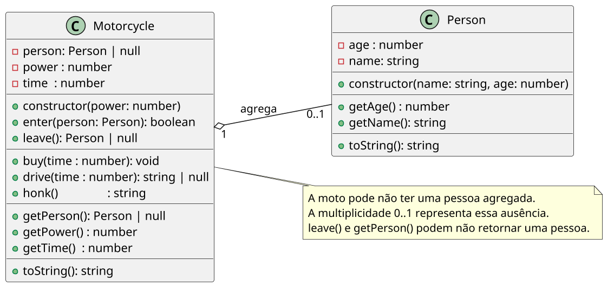

# Crianças andando de motoca

<!-- toc-table -->
[Intro](#intro) | [Regras](#regras) | [Diagrama](#diagrama) | [Guide](#guide) | [Shell](#shell) | [Draft](#draft)
-- | -- | -- | -- | -- | --
<!-- toc-table -->


## Intro

Este é um projeto de modelagem e implementação de uma motoca motorizada em um parque. A ideia é simular o funcionamento dessa motoca através de duas classes principais: `Person` e `Motorcycle`.

O foco é praticar agregação: a pessoa existe fora da motoca, pode entrar, sair e continuar existindo depois de removida.

## Regras

- Descrição
  - A classe `Motorcycle` representa a motoca. Ela possui potência `power`, tempo comprado `time` e a pessoa `person` que está atualmente utilizando-a.
  - A motoca criada no início da simulação inicia com potência 1, sem minutos e sem ninguém.
  - Apenas uma pessoa pode estar na motoca por vez.
  - As funcionalidades principais da motoca incluem subir uma pessoa, descer uma pessoa, comprar tempo, dirigir por um tempo determinado e buzinar.
  - A classe `Person` representa os usuários da motoca. Ela possui nome `name` e idade `age`.
- Comandos
  - Todos os comandos seguem o modelo `$comando arg1 arg2 ...`. Em caso de erro, uma mensagem adequada deve ser impressa.
  - `$show` - Mostra o estado atual da motoca, incluindo potência, tempo e pessoa atualmente na motoca.
    - `power:{power}, time:{time}, person:({person})`
    - Quando não houver pessoa: `power:1, time:0, person:(empty)`
  - `$init power` - Reinicia a motoca com a potência informada, sem minutos e sem ninguém.
  - `$enter` - Permite uma pessoa subir na motoca. Deve ser seguido pelos argumentos `nome` e `idade` da pessoa.
  - `$leave` - Faz a pessoa atualmente na motoca descer.
  - `$buy` - Permite comprar tempo em minutos para utilizar a motoca. O tempo recebido é incrementado ao tempo atual.
  - `$drive` - Permite dirigir a motoca por um tempo determinado.
  - `$honk` - Permite buzinar a motoca.

- A `Motorcycle` agrega uma `Person`: a pessoa é criada pelo `Shell`, pode ser removida e continua existindo depois de sair.
- A classe de domínio não deve ler entrada nem imprimir mensagens. O `Shell` deve interpretar retornos e cuidar da interface.

## Diagrama



## Guide

- Classe `Person`
  - Crie a classe `Person` com os atributos `age` e `name`.
  - Defina os atributos como privados.
  - Crie o construtor da classe que recebe `name` como uma string e `age` como um número.
  - Crie os métodos `getAge()` e `getName()` para retornar a idade e o nome da pessoa, respectivamente.
  - Crie o método `toString()` para retornar uma string no formato "nome:idade".
- Parte 1: Inserir
  - Crie a classe `Motorcycle` com os atributos `power`, `time` e `person`.
  - Inicialize os atributos no construtor, onde `power` vem do parâmetro, `time` inicia com 0 e `person` inicia como `null`.
  - Crie o método `enter(person: Person): boolean` que permite inserir uma pessoa na motoca.
  - Verifique se há uma pessoa na motoca. Se houver, retorne falha e deixe o `Shell` imprimir "fail: busy motorcycle".
  - Caso contrário, insira a pessoa na motoca e retorne verdadeiro.
  - Crie o método `toString()` para mostrar o estado da motoca.
- Parte 2: Remover
  - Crie o método `leave(): Person | null` que permite remover a pessoa da motoca.
  - Verifique se há uma pessoa na motoca. Se não houver, retorne nulo e deixe o `Shell` imprimir "fail: empty motorcycle".
  - Caso contrário, remova a pessoa da motoca e retorne a pessoa removida.
- Parte 3: Comprar Tempo
  - Crie o método `buy(time: number)` que permite comprar tempo em minutos para utilizar a motoca.
  - Incremente o tempo da motoca com o tempo passado como parâmetro.
- Parte 4: Dirigir
  - Crie o método `drive(time: number): string | null` que permite dirigir a motoca por um tempo determinado.
  - Verifique se há tempo disponível na motoca. Se não houver, retorne "fail: buy time first".
  - Verifique se há uma pessoa na motoca. Se não houver, retorne "fail: empty motorcycle".
  - Verifique se a idade da pessoa na motoca é maior que 10 anos. Se for, retorne "fail: too old to drive".
  - Calcule o novo tempo após dirigir. Se o novo tempo for menor ou igual a 0, retorne "fail: time finished after X minutes".
  - Atualize o tempo da motoca.
- Parte 5: Buzinar
  - Crie o método `honk()` que permite buzinar a motoca.
  - Construa a string da buzina, onde o número de "e" é igual à potência da motoca.
  - Retorne a buzina.

Pergunta de reflexão: por que `leave` devolve a pessoa removida em vez de apenas apagar a referência?

## Shell

```bash
#TEST_CASE subindo e buzinando
$show
power:1, time:0, person:(empty)

#TEST_CASE subindo
$enter marcos 4
$show
power:1, time:0, person:(marcos:4)

#TEST_CASE ocupada
$enter marisa 2
fail: busy motorcycle

$show
power:1, time:0, person:(marcos:4)
$end
```

```bash
#TEST_CASE subindo2
$init 5
$show
power:5, time:0, person:(empty)

#TEST_CASE buzinando
$enter marcos 4
$show
power:5, time:0, person:(marcos:4)
$end
```

```bash
#TEST_CASE subindo e trocando
$init 7
$enter heitor 6
$show
power:7, time:0, person:(heitor:6)
$leave
heitor:6

#TEST_CASE empty
$leave
fail: empty motorcycle

#TEST_CASE replace
$enter suzana 8
$show
power:7, time:0, person:(suzana:8)
$end
```

```bash
#TEST_CASE no time
$init 7
$buy 30
$show
power:7, time:30, person:(empty)
$buy 10
$show
power:7, time:40, person:(empty)
$end
```

```bash
#TEST_CASE buy time 
$init 7
$drive 10
fail: buy time first
$buy 50
#TEST_CASE empty
$drive 10
fail: empty motorcycle
$enter suzana 8

#TEST_CASE driving
$drive 30
$show
power:7, time:20, person:(suzana:8)
$end
```

```bash
#TEST_CASE limite de idade
$init 7
$buy 20
$enter andreina 23
$drive 15
fail: too old to drive
$show
power:7, time:20, person:(andreina:23)
$end
```

```bash
#TEST_CASE acabou o tempo
$init 7
$buy 20
$enter andreina 6
$drive 15
$show
power:7, time:5, person:(andreina:6)
$drive 10
fail: time finished after 5 minutes
$show
power:7, time:0, person:(andreina:6)
$end
```

```bash
#TEST_CASE buzinando
$init 1
$honk
Pem
$init 5
$honk
Peeeeem
$end
```

## Draft

<!-- links .cache/starter -->
<!-- links -->
