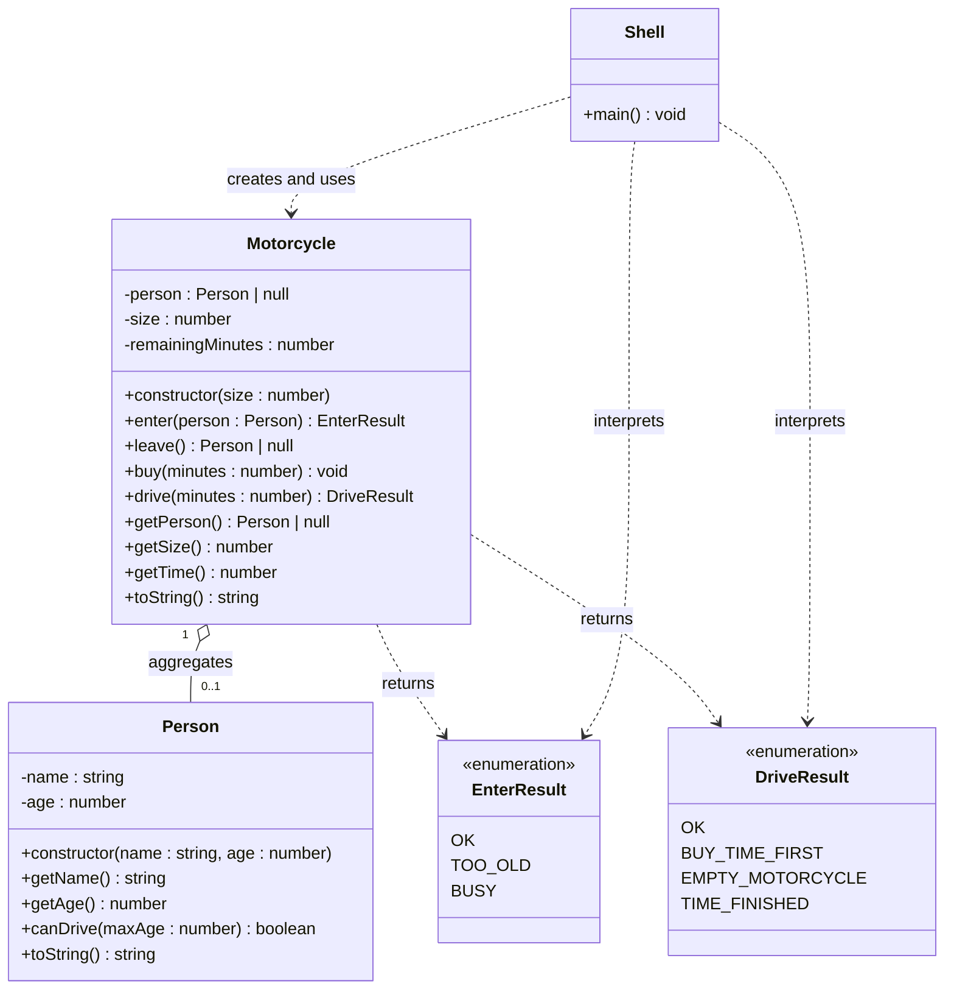

# [GUIDE] Criança andando de Motoca 

<!-- toc-table -->


## Intro

Este é um projeto de modelagem e implementação de uma motoca motorizada em um parque. A ideia é simular o funcionamento dessa motoca através de duas classes principais: `Person` e `Motorcycle`.

O foco é praticar agregação: a pessoa existe fora da motoca, pode entrar, sair e continuar existindo depois de removida.

## Regras

- Descrição
  - A classe `Motorcycle` representa a motoca. Ela possui tamanho `size`, tempo comprado `time` e a pessoa `person` que está atualmente utilizando-a.
  - O tamanho da motoca também representa a idade máxima da pessoa que pode dirigi-la.
  - A motoca criada no início da simulação inicia com tamanho 10, sem minutos e sem ninguém.
  - Apenas uma pessoa pode estar na motoca por vez.
  - As funcionalidades principais da motoca incluem subir uma pessoa, descer uma pessoa, comprar tempo e dirigir por um tempo determinado.
  - A classe `Person` representa os usuários da motoca. Ela possui nome `name` e idade `age`.
- Comandos
  - Todos os comandos seguem o modelo `$command arg1 arg2 ...`. Em caso de erro, uma mensagem adequada deve ser impressa.
  - `$show` - Mostra o estado atual da motoca, incluindo tamanho, tempo e pessoa atualmente na motoca.
    - `size:{size}, time:{time}, person:({person})`
    - Quando não houver pessoa: `size:10, time:0, person:(empty)`
  - `$init size` - Reinicia a motoca com o tamanho informado, sem minutos e sem ninguém.
  - `$enter` - Permite uma pessoa subir na motoca. Deve ser seguido pelos argumentos `name` e `age` da pessoa.
  - `$leave` - Faz a pessoa atualmente na motoca descer.
  - `$buy` - Permite comprar tempo em minutos para utilizar a motoca. O tempo recebido é incrementado ao tempo atual.
  - `$drive` - Permite dirigir a motoca por um tempo determinado.

- A `Motorcycle` agrega uma `Person`: a pessoa é criada pelo `Shell`, pode ser removida e continua existindo depois de sair.
- A classe de domínio não deve ler entrada nem imprimir mensagens. O `Shell` deve interpretar retornos e cuidar da interface.

## Diagrama

`Motorcycle` agrega no máximo uma `Person`, que tem ciclo de vida independente. `Person` decide se pode dirigir; `Motorcycle` coordena tempo, ocupação e resultados da corrida; `Shell` interpreta os enums e apresenta as mensagens.


```mermaid
%%{init: { "fontFamily": "monospace" } }%%
classDiagram
    direction TB

    class EnterResult {
        <<enumeration>>
        OK
        TOO_OLD
        BUSY
    }

    class DriveResult {
        <<enumeration>>
        OK
        BUY_TIME_FIRST
        EMPTY_MOTORCYCLE
        TIME_FINISHED
    }

    class Person {
        -name : string
        -age : number
        +constructor(name : string, age : number)
        +getName() string
        +getAge() number
        +canDrive(maxAge : number) boolean
        +toString() string
    }

    class Motorcycle {
        -person : Person | null
        -size : number
        -remainingMinutes : number
        +constructor(size : number)
        +enter(person : Person) EnterResult
        +leave() Person | null
        +buy(minutes : number) void
        +drive(minutes : number) DriveResult
        +getPerson() Person | null
        +getSize() number
        +getTime() number
        +toString() string
    }

    class Shell {
        +main() void
    }

    Motorcycle "1" o-- "0..1" Person : aggregates
    Motorcycle ..> EnterResult : returns
    Motorcycle ..> DriveResult : returns
    Shell ..> Motorcycle : creates and uses
    Shell ..> EnterResult : interprets
    Shell ..> DriveResult : interprets
```

## Guide

- Classe `Person`
  - Crie a classe `Person` com os atributos `age` e `name`.
  - Defina os atributos como privados.
  - Crie o construtor da classe que recebe `name` como uma string e `age` como um número.
  - Crie o método `can_drive(max_age: number): boolean` para informar se a idade da pessoa está dentro do limite recebido.
  - Crie os métodos `get_age()` e `get_name()` para retornar a idade e o nome da pessoa, respectivamente.
  - Crie o método `toString()` para retornar uma string no formato `name:age`.
- Parte 1: Inserir
  - Crie a classe `Motorcycle` com os atributos `size`, `time` e `person`.
  - Inicialize os atributos no construtor, onde `size` vem do parâmetro, `time` inicia com 0 e `person` inicia como `null`.
  - Crie o método `enter(person: Person): EnterResult` que permite inserir uma pessoa na motoca.
  - Verifique se há uma pessoa na motoca. Se houver, retorne `BUSY` e deixe o `Shell` imprimir "fail: busy motorcycle".
  - Verifique se a pessoa pode dirigir, passando o tamanho da motoca como idade máxima. Se não puder, retorne `TOO_OLD` e deixe o `Shell` imprimir "fail: too old to drive".
  - Caso contrário, insira a pessoa na motoca e retorne `OK`.
  - Crie o método `toString()` para mostrar o estado da motoca.
- Parte 2: Remover
  - Crie o método `leave(): Person | null` que permite remover a pessoa da motoca.
  - Verifique se há uma pessoa na motoca. Se não houver, retorne nulo e deixe o `Shell` imprimir "fail: empty motorcycle".
  - Caso contrário, remova a pessoa da motoca e retorne a pessoa removida.
- Parte 3: Comprar Tempo
  - Crie o método `buy(minutes: number)` que permite comprar tempo em minutos para utilizar a motoca.
  - Incremente os minutos restantes da motoca com o valor passado como parâmetro.
- Parte 4: Dirigir
  - Crie uma enum `DriveResult` para representar o resultado da tentativa de dirigir.
  - Crie o método `drive(minutes: number): DriveResult` que permite dirigir a motoca por um tempo determinado.
  - Verifique se há tempo disponível na motoca. Se não houver, retorne `BUY_TIME_FIRST`.
  - Verifique se há uma pessoa na motoca. Se não houver, retorne `EMPTY_MOTORCYCLE`.
  - Se o tempo disponível for menor que o tempo solicitado, zere o tempo da motoca e retorne `TIME_FINISHED`.
  - Atualize os minutos restantes da motoca.
  - Se a viagem for realizada normalmente, retorne `OK`.
Pergunta de reflexão: por que `leave` devolve a pessoa removida em vez de apenas apagar a referência?

## Shell

```bash
#TEST_CASE initial state
$show
size:10, time:0, person:(empty)

#TEST_CASE enter
$enter marcos 4
$show
size:10, time:0, person:(marcos:4)

#TEST_CASE busy motorcycle
$enter marisa 2
fail: busy motorcycle

$show
size:10, time:0, person:(marcos:4)
$end
```

```bash
#TEST_CASE busy motorcycle
$enter marisa 12
fail: too old to drive

$show
size:10, time:0, person:(marcos:4)
$end
```

```bash
#TEST_CASE init
$init 5
$show
size:5, time:0, person:(empty)

#TEST_CASE enter after init
$enter marcos 4
$show
size:5, time:0, person:(marcos:4)
$end
```

```bash
#TEST_CASE leave
$init 10
$enter heitor 6
$show
size:10, time:0, person:(heitor:6)
$leave
heitor:6

#TEST_CASE empty
$leave
fail: empty motorcycle

#TEST_CASE replace
$enter suzana 8
$show
size:10, time:0, person:(suzana:8)
$end
```

```bash
#TEST_CASE buy time
$init 10
$buy 30
$show
size:10, time:30, person:(empty)
$buy 10
$show
size:10, time:40, person:(empty)
$end
```

```bash
#TEST_CASE drive without time
$init 10
$drive 10
fail: buy time first
$buy 50

#TEST_CASE drive empty motorcycle
$drive 10
fail: empty motorcycle
$enter suzana 8

#TEST_CASE driving
$drive 30
$show
size:10, time:20, person:(suzana:8)
$end
```

```bash
#TEST_CASE too old to drive
$init 10
$buy 20
$enter andreina 23
fail: too old to drive
$drive 15
fail: empty motorcycle
$show
size:10, time:20, person:(empty)
$end
```

```bash
#TEST_CASE time finishes
$init 10
$buy 20
$enter andreina 6
$drive 15
$show
size:10, time:5, person:(andreina:6)
$drive 10
fail: time finished
$show
size:10, time:0, person:(andreina:6)
$end
```

```bash
#TEST_CASE larger motorcycle
$init 20
$buy 15
$enter andreina 15
$drive 10
$show
size:20, time:5, person:(andreina:15)
$end
```

## Draft

<!-- links .cache/starter -->
<!-- links -->
