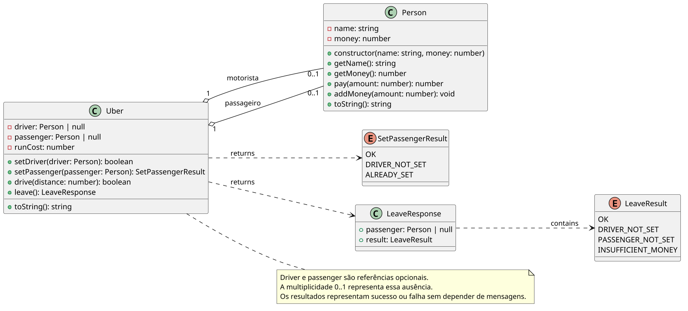

# MotoUber: colaboração entre objetos e transferência de recurso

<!-- toc-table -->
[Intro](#intro) | [Regras](#regras) | [Diagrama](#diagrama) | [Guide](#guide) | [Shell](#shell) | [Draft](#draft)
-- | -- | -- | -- | -- | --
<!-- toc-table -->


## Intro

Você vai gerenciar um objeto que faz corridas com motorista e passageiro.

O foco é praticar colaboração entre objetos: `Uber` coordena a corrida, enquanto `Person` guarda nome e dinheiro.

## Regras

- A classe `Uber` agrega um motorista e um passageiro, ambos objetos `Person` criados pela interface.
- O passageiro é removido ao final da corrida e continua existindo depois de sair.
- O motorista permanece agregado ao `Uber` até o fim da simulação.
- A classe de domínio não deve ler entrada nem imprimir mensagens. O `Shell` deve interpretar os retornos e cuidar da interface.
- A moto pode ter um motorista e pode ter um passageiro.
- A moto deve registrar o custo atual da corrida.
- O passageiro deve pagar o motorista quando descer da moto.
- Motorista e Passageiro são pessoas que têm nome e dinheiro.
- O passageiro não pode subir na moto se não tiver motorista.
- Quando o passageiro entra na moto, começa a contagem do custo da corrida.
- Cada km percorrido aumenta o custo da corrida em 1 real.
- Na hora de desembarcar, o passageiro paga o motorista de acordo com o que foi percorrido.
- Se não tiver dinheiro suficiente, o passageiro dá tudo que tem.
- O motorista sempre recebe o valor completo da corrida, porque o Uber paga o que falta.
- `$setDriver nome dinheiro` define o motorista.
  - Se já houver motorista, o `Shell` deve imprimir `fail: driver is already set`.
- `$setPass nome dinheiro` define o passageiro.
  - Se não houver motorista, o `Shell` deve imprimir `fail: driver is not set`.
  - Se já houver passageiro, o `Shell` deve imprimir `fail: passenger is already set`.
- `$drive distancia` aumenta o custo da corrida quando há passageiro.
- `$leavePass` remove o passageiro e realiza o pagamento.
  - Se não houver motorista, o resultado deve indicar `DRIVER_NOT_SET`.
  - Se não houver passageiro, o resultado deve indicar `PASSENGER_NOT_SET`.
  - O passageiro sai mesmo quando não consegue pagar o custo integral. O resultado deve indicar `INSUFFICIENT_MONEY`.
  - Nesse caso, o `Shell` deve imprimir `fail: passenger does not have enough money` antes de mostrar o passageiro saindo com o dinheiro restante.

## Diagrama

[](assets/diagrama.png)

## Guide

- Crie a classe `Person` com os atributos nome e dinheiro.
- Faça `Person` concentrar as operações sobre seu dinheiro, como pagar e receber.
- Crie a classe `Uber` com os atributos custo, motorista e passageiro.
- Ambas as classes devem ter atributos privados.
- Faça `setPassenger` recusar passageiro quando não houver motorista.
- Faça `drive` aumentar o custo apenas quando houver passageiro.
- Crie resultados de domínio para as operações, sem retornar mensagens diretamente.
- Use `boolean` para os métodos que possuem apenas uma falha possível e `SetPassengerResult` para `setPassenger`, que possui duas falhas possíveis.
- Faça `leave` devolver o passageiro removido junto com um `LeaveResult`.
- O `Shell` deve mostrar a falha antes de `{passageiro} left` quando o pagamento for parcial.

Perguntas de reflexão: por que `Uber` coordena a corrida, mas `Person` mantém o próprio dinheiro? Por que o `Shell` converte o resultado de `setPassenger` em mensagem?

## Shell

```bash
#TEST_CASE initial state
$show
Cost: 0, Driver: None, Passenger: None

#TEST_CASE set driver
$setDriver Tobias 50
$show
Cost: 0, Driver: Tobias:50, Passenger: None

#TEST_CASE set passenger
$setPass Ana 20
$show
Cost: 0, Driver: Tobias:50, Passenger: Ana:20

#TEST_CASE drive with passenger
$drive 10
$show
Cost: 10, Driver: Tobias:50, Passenger: Ana:20

#TEST_CASE leave passenger
$leavePass
Ana:10 left

$show
Cost: 0, Driver: Tobias:60, Passenger: None

$end
```

```bash
#TEST_CASE invalid driver setup
$setDriver Tobias 50
$setDriver Ana 20
fail: driver is already set
$setPass Bruno 10
$setPass Carla 30
fail: passenger is already set
$show
Cost: 0, Driver: Tobias:50, Passenger: Bruno:10
$end
```

```bash
#TEST_CASE passenger without driver
$setPass Ana 20
fail: driver is not set
$drive 10
fail: driver is not set
$leavePass
fail: driver is not set
$end
```

```bash
#TEST_CASE drive without passenger
$setDriver Tobias 50
$drive 10
$show
Cost: 0, Driver: Tobias:50, Passenger: None
$leavePass
fail: passenger is not set
$end
```

---

```bash
#TEST_CASE initial state
$show
Cost: 0, Driver: None, Passenger: None
$setDriver Tobias 20
$show
Cost: 0, Driver: Tobias:20, Passenger: None

$setPass Ana 10
$show
Cost: 0, Driver: Tobias:20, Passenger: Ana:10

#TEST_CASE drive twice

$drive 20
$show
Cost: 20, Driver: Tobias:20, Passenger: Ana:10

$drive 10
$show
Cost: 30, Driver: Tobias:20, Passenger: Ana:10

#TEST_CASE passenger cannot pay full cost

$leavePass
fail: passenger does not have enough money
Ana:0 left

$show
Cost: 0, Driver: Tobias:50, Passenger: None

$end
```

## Draft

<!-- links .cache/starter -->
<!-- links -->
