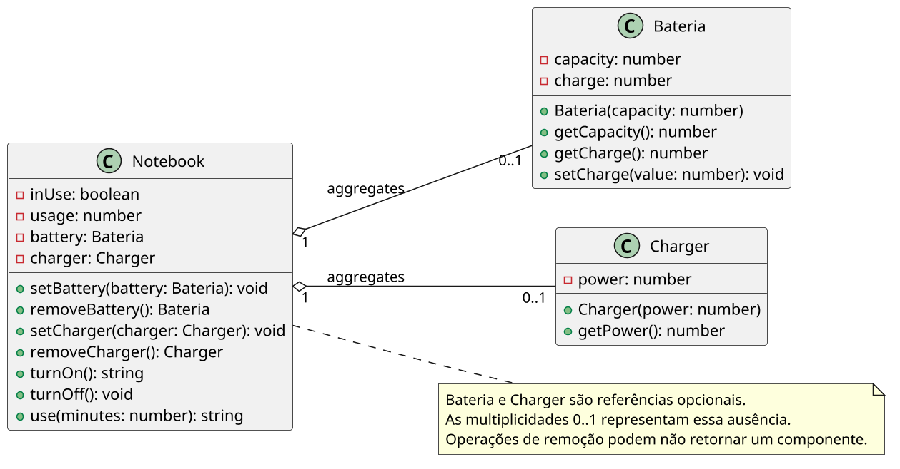

# Notebook: múltiplos componentes agregados + coordenação

<!-- toc-table -->
[Intro](#intro) | [Regras](#regras) | [Diagrama](#diagrama) | [Guide](#guide)
-- | -- | -- | --
<!-- toc-table -->


## Intro

Esta atividade apresenta a **agregação** de componentes: o `Notebook` usa uma `Bateria` e um `Carregador`, mas esses objetos são criados fora dele e podem continuar existindo quando forem removidos.

A divisão em classes diferentes existe porque cada elemento tem uma responsabilidade própria. O `Notebook` coordena o uso, liga, desliga e conecta componentes. A `Bateria` guarda carga e capacidade, garantindo que a carga permaneça dentro de um intervalo válido. O `Carregador` guarda apenas sua potência, porque neste momento isso basta para representar seu papel na simulação.

## Regras

- `Notebook` agrega no máximo uma `Bateria` e um `Carregador`.
- A bateria e o carregador têm ciclos de vida independentes do notebook.
- O notebook deve acessar os componentes por métodos públicos, mantendo seus atributos privados.
- A lógica de cada componente deve permanecer na própria classe; o notebook apenas coordena o uso.
- O `Carregador` não deve ganhar novas métricas nesta atividade, como tensão, corrente, eficiência ou desgaste. A lógica do notebook já combina vários estados, então a potência é a única informação necessária para o objetivo atual.

## Diagrama

[](assets/diagrama.png)

## Guide

### Parte 1 - Apenas o notebook

- Vamos modelar um notebook que pode ser ligado e desligado.
- Crie a classe Notebook com os métodos `ligar` e `desligar`.
- Crie o método `mostrar` que exibe o status do notebook.
- Crie um atributo `ligado` que indica se o notebook está ligado ou desligado.
- Coloque os atributos como privados e crie métodos para acessá-los e modificá-los.
- Crie o método `usar(tempo)` que exibe uma mensagem de uso do notebook por um tempo.
- Crie um código de teste como o teste abaixo.

```python

class Notebook:
    def __init__(self): # isso é o construtor em python
        self.__ligado: bool = False # ligado é atributo privado e inicializa com false
    # preencha com os métodos necessários

notebook = Notebook() # criando notebook
notebook.mostrar()    # Status: Desligado
notebook.usar(10)     # erro: ligue o notebook primeiro
notebook.ligar()      # notebook ligado
notebook.mostrar()    # Status: Ligado
notebook.usar(10)     # Usando por 10 minutos
notebook.desligar()   # notebook desligado
```

### Parte 2 - Notebook com bateria

- Nosso notebook vai ser modificado para ter um atributo `bateria`.
- Esse atributo pode conter uma instância de uma bateria ou `null` se não houver bateria.
- A classe Bateria deve ter um atributo `carga` que indica a quantidade de carga.
- A classe Bateria deve ter um atributo `capacidade` que indica a quantidade máxima de carga.
- Coloque os atributos como privados e crie métodos para acessá-los e modificá-los.
- Ao criar uma bateria, passe a capacidade como parâmetro e inicialize a carga com a capacidade.
- Para ligar o notebook, ele deve ter uma bateria e a carga da bateria deve ser maior que 0.
- Ao usar o notebook, a carga da bateria deve diminuir.
- Se a carga da bateria for 0, o notebook deve desligar.
- Crie um código de teste como o teste abaixo.

```python
class Bateria:
    def __init__(self, capacidade):
        self.__capacidade: int = capacidade # capacidade é privado
        self.__carga: int = capacidade      # carga é privado e inicia com capacidade
    # preencha com os métodos necessários

class Notebook:
    def __init__(self):
        self.__ligado: bool = False           # inicializa desligado
        self.__bateria: Bateria | None = None # inicializa sem bateria
    # preencha com os métodos necessários

notebook = Notebook() # criando notebook
notebook.mostrar()    # Status: Desligado, Bateria: Nenhuma
notebook.usar(10)     # erro: ligue o notebook primeiro
notebook.ligar()      # não foi possível ligar
notebook.mostrar()    # Status: Desligado, Bateria: Nenhuma
bateria = Bateria(50) # criando bateria que suporta 50 minutos e começa carregada
bateria.mostrar()     # (50/50)
notebook.setBateria(bateria) # coloca a bateria no notebook
notebook.mostrar()    # Status: Desligado, Bateria: (50/50)
notebook.usar(10)     # notebook desligado
notebook.ligar()      # notebook ligado
notebook.mostrar()    # Status: Ligado, Bateria: (50/50)
notebook.usar(30)     # Usando por 30 minutos
notebook.mostrar()    # Status: Ligado, Bateria: (20/50)
notebook.usar(30)     # Usando por 20 minutos, notebook descarregou
notebook.mostrar()    # Status: Desligado, Bateria: (0/50)
notebook.ligar()      # não foi possível ligar
bateria = notebook.rmBateria() # bateria removida
bateria.mostrar()     # (0/50)
```

### Parte 3 - Notebook com carregador e bateria

- Vamos modelar um notebook que pode ter ou não tanto carregador quanto bateria.
- Terá que reescrever os métodos `usar <tempo>`, `ligar`.
- Só poderá `ligar` se tiver carga na bateria ou carregador.
- Enquanto em uso
  - se tiver apenas na bateria, a carga da bateria deve diminuir.
  - se estiver na bateria e no carregador, a carga deve aumentar.
- O carregador possui uma potência que implica na quantidade de carga carregada por unidade de tempo.
- A bateria possui uma carga e uma capacidade que representam a carga atual e o máximo possível de carga.
- Para simplificar, vamos utilizar minutos como a unidade de tempo e de carga.
- Uma bateria `15/50` significa que possui ainda 15 minutos de carga e suporta no máximo 50.
- Um carregador com 3 de potência consegue em um minuto de uso, adicionar 3 minutos de carga na bateria.
- O carregador fica simples de propósito. O objetivo aqui é praticar agregação e coordenação entre objetos, não simular todos os detalhes elétricos de um carregador real.
- Para facilitar, você pode imaginar o notebook sendo utilizado da seguinte forma.
- Adapte a implementação para sua linguagem. Complete com os métodos necessários.

```python
class Bateria:
    def __init__(self, capacidade):
        self.__capacidade: int = capacidade
        self.__carga: int = capacidade
    # preencha com os métodos necessários
  
class Carregador:
    def __init__(self, potencia):
        self.__potencia: int = potencia
    # preencha com os métodos necessários

class Notebook:
    def __init__(self):
        self.__ligado: bool = False           # inicializa desligado
        self.__bateria: Bateria | None = None # inicializa sem bateria
        self.__carregador: Carregador | None = None # inicializa sem carregador
    # preencha com os métodos necessários


notebook = Notebook() # criando notebook
notebook.mostrar()    # Status: Desligado, Bateria: Nenhuma, Carregador: Desconectado
notebook.ligar()      # não foi possível ligar
notebook.usar(10)     # notebook desligado

bateria = Bateria(50) # criando bateria que suporta 50 minutos e começa carregada
bateria.mostrar()     # (50/50)
notebook.setBateria(bateria) # coloca a bateria no notebook

notebook.mostrar() # Status: Desligado, Bateria: (50/50), Carregador: Desconectado
notebook.ligar()   # notebook ligado
notebook.mostrar() # Status: Ligado, Bateria: (50/50), Carregador: Desconectado
notebook.usar(30)  # Usando por 30 minutos
notebook.mostrar() # Status: Ligado, Bateria: (20/50), Carregador: Desconectado
notebook.usar(30)  # Usando por 20 minutos, notebook descarregou
notebook.mostrar() # Status: Desligado, Bateria: (0/50), Carregador: Desconectado

bateria = notebook.rmBateria() # bateria removida
bateria.mostrar()  # (0/50)
notebook.mostrar() # Status: Desligado, Bateria: Nenhuma, Carregador: Desconectado

carregador = Carregador(2) # criando carregador com 2 de potencia
carregador.mostrar() # (Potência 2)

notebook.setCarregador(carregador) # adicionando carregador no notebook
notebook.mostrar() # Status: Desligado, Bateria: Nenhuma, Carregador: (Potência 2)
notebook.ligar()   # notebook ligado
notebook.mostrar() # Status: Ligado, Bateria: Nenhuma, Carregador: (Potência 2)

notebook.setBateria(bateria)
notebook.mostrar() # Status: Ligado, Bateria: (0/50), Carregador: (Potência 2)
notebook.usar(10)  # Notebook utilizado com sucesso
notebook.mostrar() # Status: Ligado, Bateria: (20/50), Carregador: (Potência 2)
```

Pergunta de reflexão: qual regra pertence à `Bateria` e qual regra pertence ao `Notebook`?
