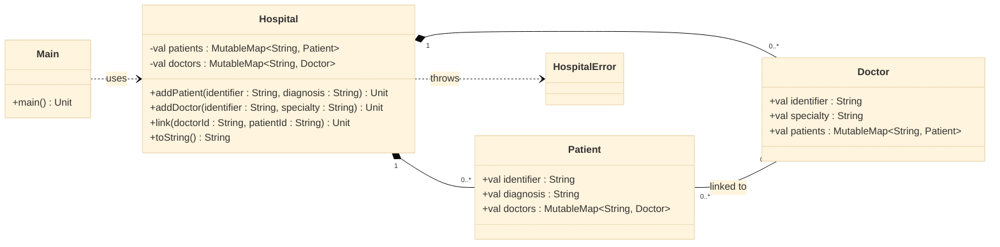

# Paciente — vínculos bidirecionais no hospital

<!-- toc-table -->
[Intro](#intro) | [Regras](#regras) | [Diagrama](#diagrama) | [Guide](#guide) | [Verificação](#verificação)
-- | -- | -- | -- | --
<!-- end -->

## Intro

Cadastre pacientes e médicos e vincule-os. Um paciente não pode ter dois
médicos da mesma especialidade. O objetivo é praticar relações bidirecionais,
mantendo a consistência nos dois objetos.

## Regras

- `Patient` possui `identifier : String`, `diagnosis : String` e os médicos relacionados.
- `Doctor` possui `identifier : String`, `specialty : String` e os pacientes relacionados.
- `Hospital` cadastra `Patient` e `Doctor` por ID; um ID existente mantém o objeto já cadastrado.
- `link(doctorId : String, patientId : String)` exige que os dois objetos existam.
- Um paciente não pode se relacionar com dois médicos da mesma especialidade. A tentativa lança `HospitalError` com `fail: ja existe outro medico da especialidade {specialty}`.
- Se o vínculo for válido, os dois mapas são atualizados: o paciente referencia o médico e o médico referencia o paciente.
- `Hospital.toString()` lista pacientes e médicos em ordem alfabética por identifier, com os vínculos de cada objeto.

## Diagrama



## Guide

1. Modele `Patient` e `Doctor` com mapas de objetos relacionados, indexados por
   ID. Os dois mapas guardam referências às mesmas instâncias.
2. Faça `Hospital` manter os mapas globais e criar cada pessoa somente se seu
   ID ainda não estiver cadastrado.
3. Em `link`, localize médico e paciente e valide a especialidade antes de
   alterar qualquer mapa. Assim uma exceção deixa os dois lados inalterados.
4. Depois da validação, atualize tanto `patient.doctors` quanto
   `doctor.patients`. Uma relação fica completa somente quando ambos concordam.

O hospital possui as pessoas cadastradas; os vínculos são referências entre
objetos e não determinam seus ciclos de vida. Essa divisão mantém a regra da
especialidade junto à coordenação que conhece os dois mapas, ao custo de
atualizar duas coleções para cada novo vínculo.

## Verificação

Execute `tko run . -l kt`. A demonstração cadastra um paciente, relaciona dois
médicos de especialidades diferentes e rejeita um segundo médico da primeira
especialidade. Confira que a relação inválida não aparece em nenhum dos mapas.

Saída esperada:

```text
fail: ja existe outro medico da especialidade clinica
Pac: ana:flu        Meds: [dr_a, dr_b]
Med: dr_a:clinica Pacs: [ana]
Med: dr_b:cardio Pacs: [ana]
Med: dr_c:clinica Pacs: []
```

<!-- KOTLIN -->
