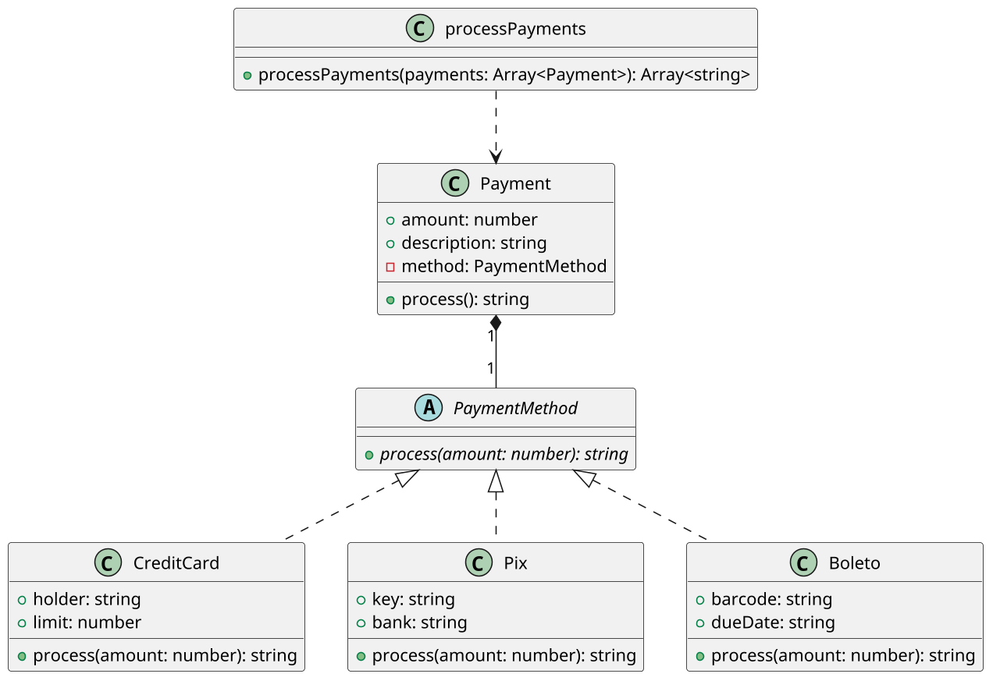

# [TRAIN] Pagamento: composição de métodos de pagamento

<!-- toc-table -->
[Intro](#intro) | [Regras](#regras) | [Diagrama](#diagrama) | [Guide](#guide) | [Verificação](#verificação) | [Draft](#draft)
-- | -- | -- | -- | -- | --
<!-- toc-table -->

## Intro

Um marketplace precisa processar pagamentos por cartão, Pix e boleto. O
pagamento possui dados comuns, mas a forma de processamento varia.

O objetivo principal é aplicar polimorfismo por composição: `Payment` delega o
processamento para um objeto que implementa `PaymentMethod`. O pagamento não
precisa conhecer o tipo concreto do método.

## Regras

- `Payment` possui valor, descrição e um `PaymentMethod`.
- O valor deve ser positivo; caso contrário, `Payment.process()` lança
  `InvalidAmountError`.
- `PaymentMethod` é uma classe abstrata com `process(amount)`.
- `CreditCard` desconta o valor do limite e lança `InsufficientLimitError` se
  não houver limite suficiente.
- `Pix` confirma o envio usando banco e chave.
- `Boleto` informa que foi gerado e aguarda pagamento.
- `process_payments` deve receber `list[Payment]` e processar todos os itens
  sem testar seus tipos concretos.
- Uma falha em um pagamento não deve impedir o processamento dos seguintes.
- As classes não imprimem mensagens; retornam textos ou lançam exceções de
  domínio.

## Diagrama



## Guide

1. Crie `PaymentMethod` como uma abstração com `process(amount)`.
2. Implemente `CreditCard`, `Pix` e `Boleto`, cada um com sua regra concreta.
3. Crie `Payment` com composição: ele recebe um método pronto no construtor.
4. Faça `Payment.process()` validar o valor e delegar o restante ao método.
5. Crie `process_payments` para percorrer uma lista de pagamentos sem
   `isinstance` ou condicionais por tipo.
6. Trate as exceções em `process_payments`, registre o erro e continue para o
   próximo pagamento.

Esta atividade usa composição porque o método de pagamento é um comportamento
que pode variar independentemente dos dados do pedido. Não é necessário criar
subclasses de `Payment`: um novo método de pagamento pode implementar
`PaymentMethod` sem alterar a classe coordenadora.

Perguntas de reflexão:

- Por que `Payment` não precisa saber se está usando Pix ou cartão?
- O que ficaria mais acoplado se cada método fosse uma subclasse de `Payment`?
- Por que o limite pertence a `CreditCard`?
- Por que uma falha em um pagamento não deve interromper a lista inteira?

## Verificação

```bash
python3 -m unittest discover -s src/py -p 'test_*.py'
```

## Draft

<!-- links .cache/starter -->
<!-- links -->
