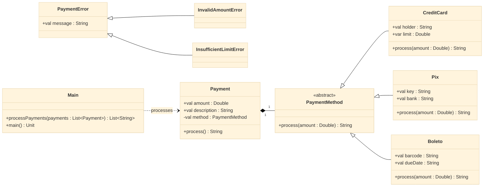

# [TRAIN] Pagamento: composição de métodos de pagamento

<!-- toc-table -->
[Intro](#intro) | [Regras](#regras) | [Diagrama](#diagrama) | [Guide](#guide) | [Verificação](#verificação) | [Draft](#draft)
-- | -- | -- | -- | -- | --
<!-- end -->

## Intro

Um marketplace precisa processar pagamentos por cartão, Pix e boleto. O
pagamento possui dados comuns, mas a forma de processamento varia.

O objetivo principal é aplicar polimorfismo por composição: `Payment` delega o
processamento para um objeto que implementa `PaymentMethod`. O pagamento não
precisa conhecer o tipo concreto do método.

## Regras

- `Payment` possui `amount : Double`, `description : String` e um `PaymentMethod`.
- O valor deve ser positivo; caso contrário, `Payment.process()` lança
  `InvalidAmountError`.
- `PaymentMethod` é uma classe abstrata com `process(amount : Double) : String`.
- `CreditCard` desconta o valor do limite e lança `InsufficientLimitError` se
  não houver limite suficiente. A falha preserva o limite.
- `Pix` confirma o envio usando banco e chave.
- `Boleto` informa que foi gerado e aguarda pagamento.
- `processPayments(payments : List<Payment>) : List<String>` deve processar todos os itens
  sem testar seus tipos concretos.
- Uma falha em um pagamento não deve impedir o processamento dos seguintes.
- As classes não imprimem mensagens; retornam textos ou lançam exceções de
  domínio.

## Diagrama


```mermaid
%%{init: {"theme": "base", "themeVariables": {"fontFamily": "monospace"}}}%%
classDiagram
    direction LR

    class PaymentError {
        +val message : String
    }

    class InvalidAmountError
    class InsufficientLimitError

    class PaymentMethod {
        <<abstract>>
        +process(amount : Double) String
    }

    class CreditCard {
        +val holder : String
        +var limit : Double
        +process(amount : Double) String
    }

    class Pix {
        +val key : String
        +val bank : String
        +process(amount : Double) String
    }

    class Boleto {
        +val barcode : String
        +val dueDate : String
        +process(amount : Double) String
    }

    class Payment {
        +val amount : Double
        +val description : String
        -val method : PaymentMethod
        +process() String
    }

    class Main {
        +processPayments(payments : List~Payment~) List~String~
        +main() Unit
    }

    PaymentError <|-- InvalidAmountError
    PaymentError <|-- InsufficientLimitError
    PaymentMethod <|-- CreditCard
    PaymentMethod <|-- Pix
    PaymentMethod <|-- Boleto
    Payment "1" *-- "1" PaymentMethod
    Main ..> Payment : processes
```

## Guide

1. Crie `PaymentMethod` como uma classe abstrata com `process(amount : Double) : String`.
2. Implemente `CreditCard`, `Pix` e `Boleto`, cada um com sua regra concreta.
3. Crie `Payment` com composição: ele recebe um método pronto no construtor.
4. Faça `Payment.process()` validar o valor e delegar o restante ao método.
5. Crie `processPayments` para percorrer uma `List<Payment>` sem verificar a
   classe concreta nem usar condicionais por tipo.
6. Trate as exceções em `processPayments`, registre o erro e continue para o
   próximo pagamento.

Esta atividade usa composição porque o método de pagamento é um comportamento
que pode variar independentemente dos dados do pedido. Não é necessário criar
subclasses de `Payment`: um novo método de pagamento pode implementar
`PaymentMethod` sem alterar a classe coordenadora.

Perguntas de reflexão:

- Por que `Payment` não precisa saber se está usando Pix ou cartão?
- O que ficaria mais acoplado se cada método fosse uma subclasse de `Payment`?
- Por que o limite pertence a `CreditCard`?
- Por que uma falha em um pagamento não deve interromper a lista inteira?

## Verificação

```bash
tko run . -l kt
```

O programa demonstra pagamentos por Pix, cartão e boleto, uma falha por limite
insuficiente seguida de uma nova cobrança no mesmo cartão, além de continuar
após um valor inválido. O resultado inclui:

```text
Payment of R$ 150.00: Sports shirt
PIX sent through XPTO using key email@example.com
Payment of R$ 400.00: Sports shoes
Payment approved for Client X. Remaining limit: 100.00
Payment of R$ 89.90: Kotlin book
Boleto generated. Waiting for payment...
Error: insufficient credit limit
Payment of R$ 700.00: Client Y notebook
Payment approved for Client Y. Remaining limit: 0.00
Payment of R$ 25.00: Coffee
PIX sent through Bank using key key
Error: invalid amount
```

## Draft

<!-- links .cache/starter -->
<!-- end -->

<!-- KOTLIN -->
