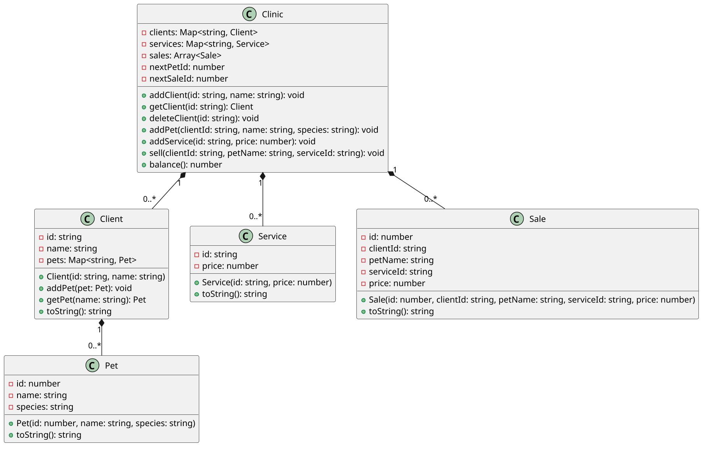

# Meu Petshop

<!-- toc-table -->
<!-- toc-table -->


Uma clínica veterinária precisa cadastrar clientes, seus animais, os serviços
oferecidos e as vendas realizadas. O sistema deve localizar cada informação
pela identidade que faz sentido para aquela parte do domínio.

## Objetivo pedagógico

O objetivo principal é escolher mapas quando as entidades são localizadas por
chaves únicas. Como objetivo secundário, a atividade mostra como relacionar
objetos já existentes e preservar um histórico de vendas.

Conceitos e técnicas trabalhados:

- mapa de clientes por id e mapa de animais por nome dentro de cada cliente;
- fonte única de verdade, composição e multiplicidade;
- validação de relações entre cliente, animal e serviço;
- exceções de domínio tratadas pelo `Shell`;
- histórico em lista e valor da venda registrado no momento da operação.

## Regras

- O id do cliente é único na clínica e seu nome pode conter várias palavras.
- Cada cliente possui no máximo um animal com determinado nome.
- O id do animal é gerado pela clínica, começando em `1`; o nome identifica o
  animal dentro do cliente.
- Um serviço possui id único e preço decimal.
- O id da venda é gerado pela clínica, começando em `0`.
- Uma venda só é criada se o cliente, o animal e o serviço existirem.
- A venda registra o preço do serviço no momento da venda. Alterações futuras
  no cadastro do serviço não devem modificar o histórico.
- Excluir um cliente remove seu cadastro e seus animais, mas não apaga vendas
  já realizadas.
- O domínio não imprime mensagens. As falhas são lançadas como `ClinicError` e
  convertidas pelo `Shell` para mensagens `fail: ...`.

## Diagrama



## Guide

Implemente e verifique uma etapa por vez:

1. Crie `Pet` como um registro imutável e `Client` com um mapa de animais.
   Faça o cliente garantir que não existam dois animais com o mesmo nome.
2. Crie `Service` e mantenha os serviços em um mapa da `Clinic`, pois o id é a
   chave usada para encontrá-los.
3. Faça `Clinic` manter os clientes em um mapa e gerar ids de animais. Não
   crie um repositório separado: a clínica é a coordenadora desta atividade.
4. Crie `Sale` como um registro do fato ocorrido. Guarde o preço na venda para
   que o histórico não dependa do estado futuro do serviço.
5. Implemente `sell` validando as três relações antes de alterar o histórico.
   Depois liste as vendas e calcule o faturamento somando seus preços.

A divisão usa cinco classes porque cada uma representa um conceito com dados
ou ciclo de vida próprio. `Client` protege seus animais; `Clinic` coordena os
cadastros e as vendas; `Sale` preserva o histórico. Não há necessidade de
classes de repositório, serviço de faturamento ou uma classe para cada tipo de
erro.

Perguntas de reflexão:

- Por que os clientes e serviços usam mapas, mas o histórico de vendas usa uma
  lista?
- Por que o nome do animal é uma chave dentro do cliente, mas não precisa ser
  único na clínica inteira?
- O que ficaria errado se `balance()` consultasse o preço atual do serviço?
- Por que a validação da duplicidade de animais pertence a `Client`?

## Shell

```bash
#TEST_CASE clients
$addcli luke luke skywalker
$addcli lea princesa lea
$addcli vader darth vader
$addcli lea fracileia moreira
fail: cliente lea ja cadastrado.
$getcli lea
lea:princesa lea
$show
luke:luke skywalker
lea:princesa lea
vader:darth vader
$delcli luke
$show
lea:princesa lea
vader:darth vader
$end
```

```bash
#TEST_CASE pets
$addcli vader darth vader
$addpet vader rex gato
$addpet vader chaninha urubu
$addpet vader rex dino
fail: animal rex ja existe
$addpet luke xuxu gato
fail: cliente luke nao existe
$getcli vader
vader:darth vader[1:rex:gato][2:chaninha:urubu]
$end
```

```bash
#TEST_CASE services
$addser tosa 30.0
$addser banho 15.0
$addser tingimento 150.0
$addser banho 20.0
fail: servico banho ja cadastrado.
$listser
tosa:30.0
banho:15.0
tingimento:150.0
$end
```

```bash
#TEST_CASE sales and errors
$addcli vader darth vader
$addpet vader rex gato
$addpet vader chaninha urubu
$addser banho 15.0
$addser tingimento 150.0
$sell vader rex banho
$sell vader chaninha tingimento
$sell luke rex banho
fail: cliente luke nao existe
$sell vader xuxu banho
fail: animal xuxu nao existe
$sell vader rex castracao
fail: servico castracao nao existe
$listsell
0:vader:rex:banho
1:vader:chaninha:tingimento
$balance
165.0
$end
```

```bash
#TEST_CASE sales survive client deletion
$addcli ana ana silva
$addpet ana toto cachorro
$addser consulta 40.0
$sell ana toto consulta
$delcli ana
$listsell
0:ana:toto:consulta
$balance
40.0
$end
```

## Draft

<!-- links .cache/starter -->
<!-- links -->
