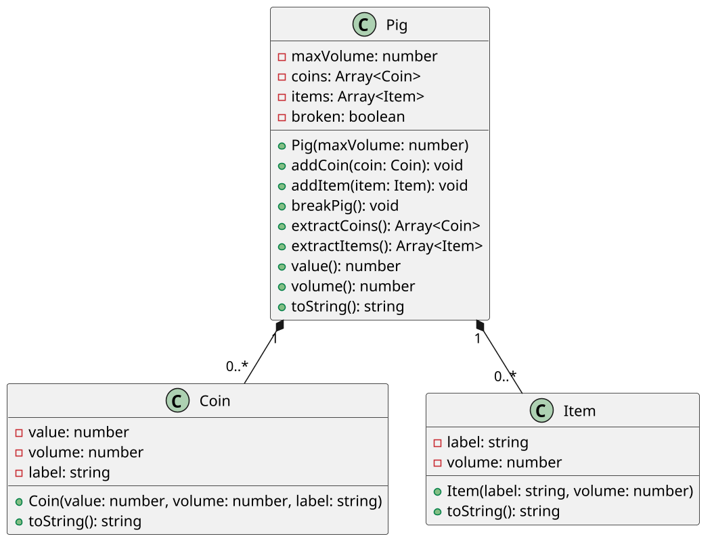

# Guardando moedas e itens em um cofrinho

<!-- toc-table -->
<!-- toc-table -->


## Objetivo pedagógico

Esta atividade modela um porquinho com capacidade limitada que deixa de ser
utilizável quando é quebrado. O objetivo principal é proteger invariantes de
capacidade e de estado. Como objetivo secundário, a atividade pratica a
composição de objetos e a imutabilidade de valores armazenados.

## Regras

- `Coin` representa uma moeda com valor, volume e rótulo. As moedas disponíveis
  são `C10`, `C25`, `C50` e `C100`.
- `Item` representa um objeto identificado por rótulo e volume.
- Moedas e itens são imutáveis depois de criados. Não há setters, pois alterar
  um objeto já guardado poderia quebrar a capacidade do porquinho.
- `Pig` começa intacto e vazio. Seu volume ocupado nunca ultrapassa a capacidade.
- Uma adição que não cabe ou ocorre depois da quebra falha sem alterar o estado.
- Quebrar o porquinho é uma transição terminal para as operações de adição.
- Antes da quebra, não é possível extrair moedas ou itens.
- Depois da quebra, a extração devolve os objetos e esvazia apenas a coleção
  extraída. A lista devolvida é uma cópia.
- Depois da quebra, o volume ocupado é `0`, pois o porquinho deixou de funcionar
  como recipiente. O valor continua representando as moedas ainda guardadas.
- As classes de domínio não imprimem mensagens. Elas lançam `PigError`; o
  `Shell` converte as falhas para o texto observável.

## Diagrama



## Guide

Implemente em incrementos pequenos:

1. Crie `Coin` e `Item` como registros imutáveis, com suas representações
   textuais. O `Shell` pode selecionar as moedas predefinidas pelo código
   recebido.
2. Crie `Pig` com capacidade, coleções vazias e estado intacto. Implemente
   `add_coin`, `add_item` e `volume`, verificando a capacidade antes da mutação.
3. Implemente `value` e `__str__`. O cálculo do volume deve considerar moedas e
   itens enquanto o porquinho estiver intacto.
4. Implemente `break_pig` e bloqueie novas adições. Uma segunda quebra deve
   falhar sem apagar o conteúdo.
5. Implemente as extrações. Elas só podem ocorrer depois da quebra, devem
   retornar os objetos e devem limpar apenas a coleção correspondente.
6. Faça o `Shell` interpretar comandos e traduzir `PigError`; nenhuma classe de
   domínio deve conhecer entrada ou saída.

A atividade usa somente três classes. `Coin` e `Item` representam objetos que
   podem ser guardados; `Pig` possui esses objetos e protege as invariantes do
   recipiente. Não há necessidade de uma classe para catálogo de moedas, um
   gerenciador de itens ou getters e setters para todos os atributos.

Perguntas de reflexão:

- Por que a capacidade deve ser verificada antes de adicionar o objeto?
- O que poderia ficar inconsistente se `Item` tivesse `setVolume`?
- Por que o valor continua disponível depois da quebra, mas o volume passa a ser
  zero?
- Por que extrair moedas não deve extrair os itens automaticamente?

## Shell

```bash
#TEST_CASE init and coins
$init 20
$show
state=intact : coins=[] : items=[] : value=0.00 : volume=0/20
$addCoin 10
$addCoin 50
$show
state=intact : coins=[0.10:1, 0.50:3] : items=[] : value=0.60 : volume=4/20
$end
```

```bash
#TEST_CASE items and capacity
$init 5
$addCoin 10
$addCoin 25
$addItem ouro 1
$show
state=intact : coins=[0.10:1, 0.25:2] : items=[ouro:1] : value=0.35 : volume=4/5
$addCoin 50
fail: the pig is full
$addItem pirulito 2
fail: the pig is full
$show
state=intact : coins=[0.10:1, 0.25:2] : items=[ouro:1] : value=0.35 : volume=4/5
$end
```

```bash
#TEST_CASE extraction before breaking
$init 10
$addCoin 10
$addItem bilhete 2
$extractItems
fail: you must break the pig first
$extractCoins
fail: you must break the pig first
$show
state=intact : coins=[0.10:1] : items=[bilhete:2] : value=0.10 : volume=3/10
$end
```

```bash
#TEST_CASE break and extraction
$init 20
$addCoin 10
$addCoin 50
$addItem ouro 3
$break
$show
state=broken : coins=[0.10:1, 0.50:3] : items=[ouro:3] : value=0.60 : volume=0/20
$addItem bilhete 1
fail: the pig is broken
$break
fail: the pig is already broken
$extractItems
[ouro:3]
$show
state=broken : coins=[0.10:1, 0.50:3] : items=[] : value=0.60 : volume=0/20
$extractCoins
[0.10:1, 0.50:3]
$show
state=broken : coins=[] : items=[] : value=0.00 : volume=0/20
$end
```

```bash
#TEST_CASE independent extraction
$init 10
$addCoin 100
$addItem passport 2
$break
$extractItems
[passport:2]
$show
state=broken : coins=[1.00:4] : items=[] : value=1.00 : volume=0/10
$extractCoins
[1.00:4]
$show
state=broken : coins=[] : items=[] : value=0.00 : volume=0/10
$end
```

## Draft

<!-- links .cache/starter -->
<!-- links -->
