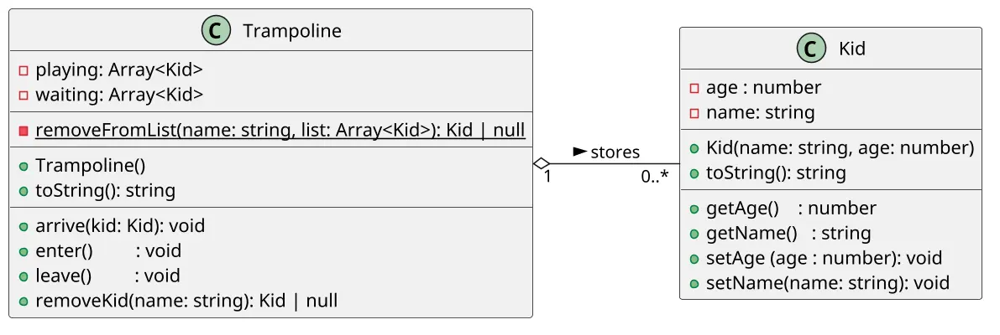

# [TRAIN] Pula-pula: filas e movimentação de crianças

<!-- toc-table -->
[Intro](#intro) | [Draft](#draft) | [Guide](#guide) | [Shell](#shell)
-- | -- | -- | --
<!-- toc-table -->


Nosso objetivo no trabalho é modelar um gestor de pula pulas em um parquinho, controlando as pessoas que entram e saem do pula pula, além de coordenar as pessoas que estão na fila de espera.

## Intro

Esta atividade trabalha coleções lineares de objetos. O pula pula possui duas listas: uma fila de espera e uma lista de crianças brincando. As operações movem crianças entre essas listas sem criar uma posição fixa para cada criança.

- Inserir crianças na fila de espera do pula pula.
- Mover a primeira criança da fila de espera para dentro do pula pula.
- Mover a primeira criança que entrou no pula pula para o final da fila de espera.
- Buscar uma criança pelo nome para removê-la, esteja ela esperando ou brincando.

O foco é perceber que a posição na lista muda conforme as operações acontecem. Aqui a posição indica ordem de chegada ou de saída, não uma cadeira, caixa ou slot permanente.

***

## Draft

<!-- links .cache/starter -->
<!-- links -->

## Guide



[](https://youtu.be/Uu94DgZYa_M?si=AzLR2so6o5CLiZTz)

## Shell

```bash
#TEST_CASE unico
# $chegou _nome _idade
# insere uma criança na fila de entrada do brinquedo
$arrive mario 5
$arrive livia 4
$arrive luana 3

# show
# mostra a fila de entrada e o pula pula
$show
[luana:3, livia:4, mario:5] => []

#TEST_CASE entrando
# entrar
# tira a primeira criança da fila de entrada e insere no pula pula

$enter
$show
[luana:3, livia:4] => [mario:5]

#TEST_CASE segunda pessoa
$enter
$show
[luana:3] => [livia:4, mario:5]

#TEST_CASE saindo
$leave
$show
[mario:5, luana:3] => [livia:4]

#TEST_CASE remove
$remove luana

$show
[mario:5] => [livia:4]
$remove livia
$show
[mario:5] => []
$end
```

***

```bash
#TEST_CASE 2
$show
[] => []
$arrive mario 5
$show
[mario:5] => []

#TEST_CASE empty enter
$enter
$show
[] => [mario:5]

#TEST_CASE empty leave
$leave
$show
[mario:5] => []
$leave
$show
[mario:5] => []

#TEST_CASE remove from waiting
$remove mario
$show
[] => []

#TEST_CASE remove empty
$remove rebeca
fail: rebeca nao esta no pula-pula

$show
[] => []
$end
```
