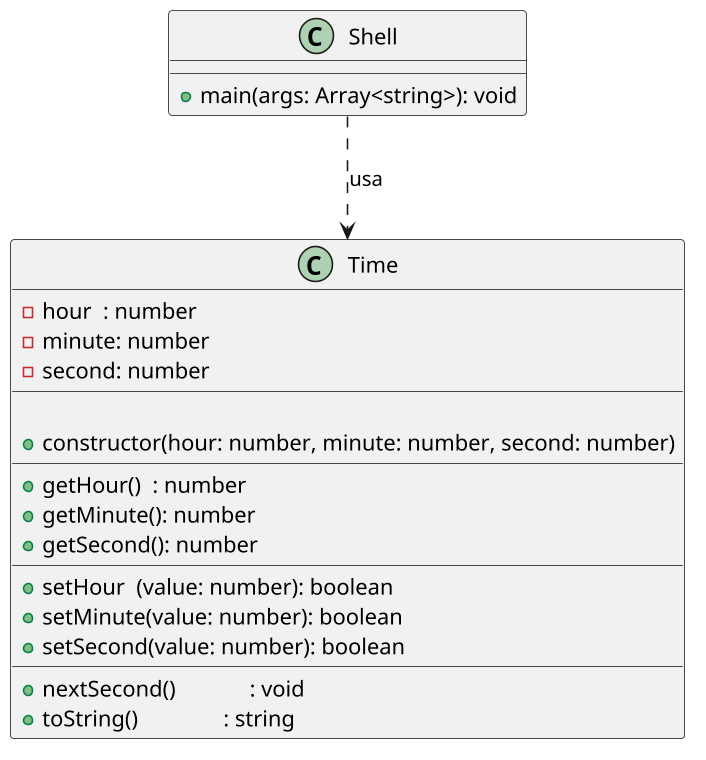

# Garante uma hora válida no relógio

<!-- toc-table -->
<!-- toc-table -->


## Intro

Seu objetivo é construir uma classe Relógio `Time` que garanta que a hora, minuto e segundo sejam válidos.

Nesta atividade você vai consolidar **encapsulamento**, **modificadores de acesso**, **getters**, **setters validadores**, **invariantes de estado** e **separação entre domínio e interface**. O relógio protege seus atributos; o `Shell` interpreta comandos e imprime mensagens.

## Regras

- Construtor
  - O construtor deve receber 3 parâmetros, hora, minuto e segundo.
  - Para fazer a inicialização dos 3 parâmetros, utilize os métodos set.
- Crie os métodos getters e setters para cada atributo.
  - Os métodos set devem garantir que o valor atribuído sempre seja válido, ou não realizar nenhuma mudança.
  - Os setters devem retornar sucesso ou falha sem imprimir mensagens.
  - No comando `$set`, cada campo válido deve ser atualizado mesmo que outro campo do mesmo comando seja inválido.
- `toString`
  - Crie um método que retorne a hora no formato HH:MM:SS.
  - Você precisará pesquisar como formatar números menores que 10 com 2 dígitos (ex: 01, 02, 03).
- Nos métodos set, realize a validação dos valores.
  - Hora deve ser entre 0 e 23.
  - Minuto e segundo devem ser entre 0 e 59.
  - Quando um valor for inválido, o campo correspondente deve manter o valor anterior.
- Próximo Segundo `nextSecond`
  - Crie um método nextSecond que incrementa o segundo em 1.
  - Se o segundo for 59, ele deve ser zerado e o minuto incrementado.
  - Se o minuto for 59, ele deve ser zerado e a hora incrementada.
  - Se a hora for 23, ela deve ser zerada.
- A classe `Time` não deve ler entrada nem imprimir mensagens. O `Shell` deve interpretar os retornos dos setters e imprimir as falhas.

## Diagrama



## Guide

[Vídeo de apoio](https://youtu.be/7vD5le9DeZE?si=uA_wG0fD8HBN_At5)

Para formatar com 2 dígitos utilize a seguinte estratégia:

```java
//java
public String toString() {
  return String.format("%02d:%02d:%02d", hora, minuto, segundo);
}
```

Implemente em partes: primeiro os setters com validação, depois o construtor usando esses setters, depois `toString` e por último `nextSecond`.

Pergunta de reflexão: por que `nextSecond` pode alterar os três campos sem usar o `Shell`?

## Shell

```bash
#TEST_CASE set
$show
00:00:00

#TEST_CASE set

$set 10 02 30
$show
10:02:30

#TEST_CASE set2
$set 15 50 59
$show
15:50:59

#TEST_CASE error

$set 25 10 30
fail: hora invalida

$show
15:10:30

#TEST_CASE error2
$set 1 70 50
fail: minuto invalido
$show
01:10:50

#TEST_CASE error3
$set 23 59 70
fail: segundo invalido
$show
23:59:50

#TEST_CASE next
$set 15 59 59
$show
15:59:59

#TEST_CASE next2

$next
$show
16:00:00

$end
```

***

```bash
#TEST_CASE set
$set 23 59 59
$show
23:59:59

#TEST_CASE next3

$next
$show
00:00:00

$end
```

***

```bash
#TEST_CASE init
$init 10 20 30
$show
10:20:30

#TEST_CASE init2

$init 90 20 30
fail: hora invalida

$show
00:20:30

#TEST_CASE init3
$init 90 100 60
fail: hora invalida
fail: minuto invalido
fail: segundo invalido

$show
00:00:00

$end
```

## Draft

<!-- links .cache/starter -->
<!-- links -->
