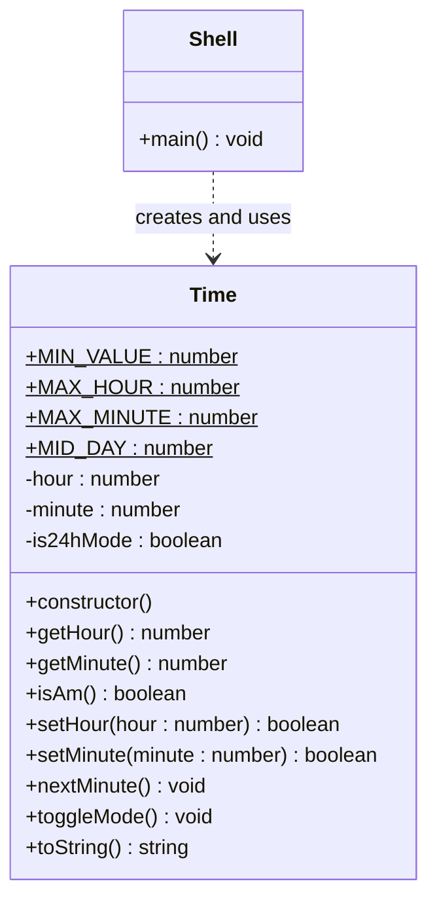

# [ALONE] Hora 24h ou AM/PM

<!-- toc-table -->


## Intro

Seu objetivo é construir uma classe `Time` que garanta que hora e minuto permaneçam válidos.

Nesta atividade você vai consolidar **encapsulamento**, consultas, setters validadores, invariantes de estado e separação entre domínio e interface. O relógio protege seus atributos; o `Shell` interpreta comandos e imprime mensagens.

O modelo usa notação TypeScript: atributos são escritos como `name: type` e métodos como `method(params): returnType`. Os tipos usados são `number`, `boolean`, `string` e `void`.

### Mensagens do programa

As explicações da atividade estão em português, mas o texto produzido pelo programa deve ficar em inglês:

- `fail: invalid hour`
- `fail: invalid minute`
- `fail: invalid command`

## Regras

- Construtor
  - `new Time()` não recebe parâmetros e inicializa `hour: number` e `minute: number` com `0`, no modo 24h.
- Crie as consultas `getHour(): number`, `getMinute(): number` e `isAm(): boolean`.
  - `getHour(): number` retorna a hora interna no modo 24h. No modo 12h, retorna uma hora entre `1` e `12`.
  - `isAm(): boolean` retorna se a hora interna é anterior a `12`.
  - O estado booleano `is24hMode: boolean` não precisa de getter ou setter: `toggleMode(): void` é a operação responsável por alterná-lo.
- Crie os setters `setHour(hour: number): boolean` e `setMinute(minute: number): boolean`.
  - Os métodos set devem garantir que o valor atribuído sempre seja válido, ou não realizar nenhuma mudança.
  - Os setters devem retornar sucesso ou falha sem imprimir mensagens.
  - No comando `$set`, cada campo válido deve ser atualizado mesmo que outro campo do mesmo comando seja inválido.
- `toString(): string`
  - Retorne a hora mostrando também o modo de exibição.
  - No modo 24h, use o formato `24h -> HH:MM`.
  - No modo 12h, use o formato `12h -> HH:MM AM` ou `12h -> HH:MM PM`.
  - Formate números menores que `10` com dois dígitos, como `01`, `02` e `03`.
- Nos métodos set, realize a validação dos valores.
  - Hora deve ser entre 0 e 23.
  - Minuto deve ser entre 0 e 59.
  - Quando um valor for inválido, o campo correspondente deve manter o valor anterior.
- Próximo minuto `nextMinute(): void`
  - Incremente o minuto em `1`.
  - Se o minuto for 59, ele deve ser zerado e a hora incrementada.
  - Se a hora for 23, ela deve ser zerada.
- Modo de exibição
  - O relógio deve iniciar em modo 24h.
  - O comando `$mode` deve alternar entre o modo 24h e o modo 12h.
  - A hora interna continua sendo guardada em 24h. O modo 12h muda apenas a forma de exibir a hora.
- A classe `Time` não deve ler entrada nem imprimir mensagens. O `Shell` deve interpretar os retornos `boolean` dos setters e imprimir as falhas.
- O comando `$init hour minute` não imprime mensagens de falha. Ele cria um novo relógio e tenta aplicar cada campo com os setters; cada valor inválido permanece em `0`.

## Diagrama

As constantes `MIN_VALUE`, `MAX_HOUR`, `MAX_MINUTE` e `MID_DAY` definem os limites do domínio. Os setters retornam `boolean` e concentram a validação de cada campo; `nextMinute(): void` coordena a passagem de minuto e hora sem depender do `Shell`. O modo de exibição, armazenado em `is24hMode: boolean` (no Python, `is_24h_mode`), muda apenas a representação textual da hora.


```mermaid
%%{init: { "fontFamily": "monospace" } }%%
classDiagram
    direction TB

    class Time {
        +MIN_VALUE : number$
        +MAX_HOUR : number$
        +MAX_MINUTE : number$
        +MID_DAY : number$
        -hour : number
        -minute : number
        -is24hMode : boolean
        +constructor()
        +getHour() number
        +getMinute() number
        +isAm() boolean
        +setHour(hour : number) boolean
        +setMinute(minute : number) boolean
        +nextMinute() void
        +toggleMode() void
        +toString() string
    }

    class Shell {
        +main() void
    }

    Shell ..> Time : creates and uses
```

## Guide

[Vídeo de apoio](https://youtu.be/7vD5le9DeZE?si=uA_wG0fD8HBN_At5)

Para formatar com 2 dígitos utilize a seguinte estratégia:

```ts
// typescript
toString(): string {
    return `24h -> ${this.hour.toString().padStart(2, "0")}:${this.minute.toString().padStart(2, "0")}`;
}
```

```java
// java
public String toString() {
    return `24h -> ${String.format("%02d", this.hour)}:${String.format("%02d", this.minute)}`;
}
```

```py
# python
def __str__(self) -> str:
    return f"24h -> {self.hour:02d}:{self.minute:02d}"
```

Implemente em partes: primeiro os setters com validação, depois o construtor, as consultas, `toString(): string`, `nextMinute(): void` e por último a alternância de modo.

Pergunta de reflexão: por que `nextMinute(): void` pode alterar dois campos sem usar o `Shell`?

## Shell

```bash
#TEST_CASE initial state
$show
24h -> 00:00

#TEST_CASE set valid time
$set 10 02
$show
24h -> 10:02

#TEST_CASE set valid boundary
$set 15 59
$show
24h -> 15:59

#TEST_CASE invalid hour still updates valid minute
$set 25 10
fail: invalid hour

$show
24h -> 15:10

#TEST_CASE invalid minute still updates valid hour
$set 1 70
fail: invalid minute
$show
24h -> 01:10

#TEST_CASE both invalid fields preserve time
$set -1 60
fail: invalid hour
fail: invalid minute
$show
24h -> 01:10

#TEST_CASE next rolls hour
$set 15 59
$show
24h -> 15:59

$next
$show
24h -> 16:00

#TEST_CASE invalid command
$invalid
fail: invalid command

$end
```

***

```bash
#TEST_CASE next rolls day
$set 23 59
$show
24h -> 23:59

$next
$show
24h -> 00:00

$end
```

***

```bash
#TEST_CASE init valid time
$init 10 20
$show
24h -> 10:20

#TEST_CASE init invalid hour
$init 90 20

$show
24h -> 00:20

#TEST_CASE init invalid values
$init 90 100

$show
24h -> 00:00

$end
```

***

```bash
#TEST_CASE mode toggles to am pm
$show
24h -> 00:00

$mode
$show
12h -> 12:00 AM

#TEST_CASE pm display
$set 13 05
$show
12h -> 01:05 PM

#TEST_CASE midnight and noon display
$set 00 00
$show
12h -> 12:00 AM

$set 12 00
$show
12h -> 12:00 PM

#TEST_CASE mode toggles back to 24h
$mode
$show
24h -> 12:00

$end
```

## Draft

<!-- links .cache/starter -->
<!-- links -->

<!-- MERMAID -->
