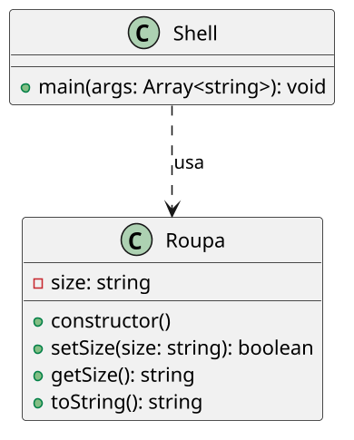

# Roupa com testes

<!-- toc-table -->
<!-- toc-table -->


## Intro

O objetivo dessa atividade é implementar uma classe que controle os tamanhos válidos de uma roupa.

Nesta atividade você vai consolidar **encapsulamento**, **modificador de acesso privado**, **getter**, **setter validador** e **invariante de estado**. A classe `Roupa` protege seu tamanho; o `Shell` cuida da interação com o usuário.

## Regras

- Vamos implementar uma classe que controla os possíveis valores de tamanho para uma roupa.
- Os tamanhos serão identificados como uma variável tipo texto, e os valores válidos são "PP", "P", "M" e "G", "GG" e "XG".
- Faça o objeto roupa iniciar o tamanho como uma string vazia, para expressar que nenhum tamanho foi atribuído.
- Crie um construtor que não recebe parâmetros e inicializa o tamanho como uma string vazia.
- Crie o método `setSize` que apenas aceita os valores válidos de tamanho.
- Coloque o atributo `size` como privado e crie um método `getSize` para acessá-lo e `setSize` para alterá-lo.
- Caso o valor seja válido, `setSize` deve alterar o tamanho e retornar `true`.
- Caso o valor seja inválido, `setSize` deve retornar `false` sem alterar o tamanho anterior.
- O setter não deve imprimir mensagens. A impressão da falha pertence ao `Shell`, aplicando a separação entre domínio e interface.

## Diagrama

O diagrama mostra `Roupa` com o tamanho privado. O `Shell` conhece apenas os métodos públicos e transforma o retorno `false` em mensagem de erro.



## Guide

[Vídeo de apoio](https://youtu.be/27-PmhwFHYY?si=gAScW7a_CyxVNnTv)

- Implemente a classe `Roupa` e mantenha seu atributo de tamanho privado.
- Comece pelo estado vazio e implemente `getSize` e `setSize`.
- Faça `setSize` retornar `true` quando alterar o estado e `false` quando rejeitar o valor.
- Depois confira os casos de tamanho inválido, válido e estado preservado após uma falha.

Pergunta de reflexão: qual invariante seria quebrada se `size` fosse público?

## Shell

```bash
#TEST_CASE inicial
$show
size: ()

$size F
fail: Valor inválido, tente PP, P, M, G, GG ou XG

$show
size: ()

$size PP
$show
size: (PP)

$end

```

## Draft

<!-- links .cache/starter -->
<!-- links -->
