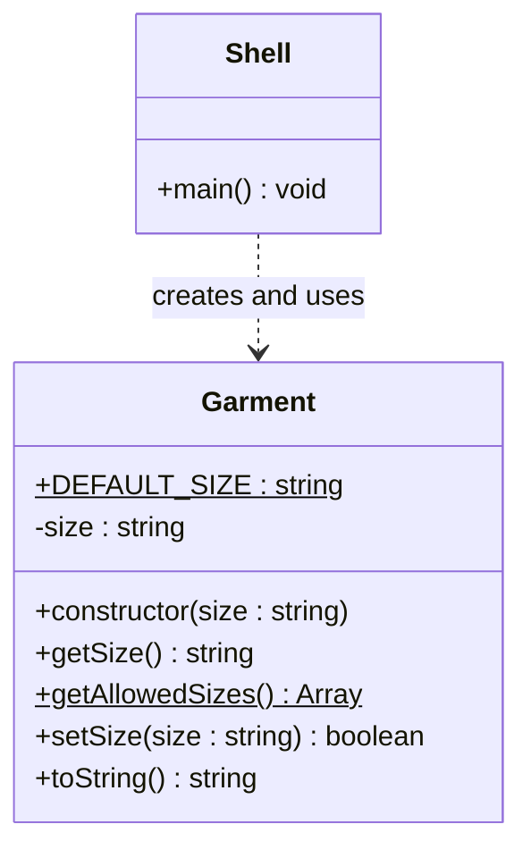

# [TRAIN] Roupa: camisa com testes

<!-- toc-table -->


## Intro

O objetivo dessa atividade é transformar a modelagem de `Shirt`, vista em Camisa, em uma versão testável com `Shell`.

Nesta atividade você vai consolidar **encapsulamento**, **getter**, **setter validador** e **invariante de estado**. A classe `Garment` protege seu `size`; o `Shell` cuida da interação com o usuário e transforma falhas em mensagens.

### Mensagens do programa

As explicações da atividade estão em português, mas o texto produzido pelo programa deve ficar em inglês:

- `fail: invalid size`
- `fail: invalid command`

## Regras

- Os tamanhos válidos são `PP`, `P`, `M`, `G`, `GG` e `XG`.
- Faça o objeto `Garment` iniciar com um tamanho padrão válido.
- O construtor deve primeiro inicializar o atributo privado com esse tamanho padrão e depois chamar `set_size()` para tentar aplicar o tamanho recebido.
- Crie o método estático `get_allowed_sizes()` para retornar uma nova lista com os tamanhos permitidos.
- Crie o método `set_size()` que apenas aceita os valores válidos de tamanho.
- Coloque o atributo `size` como privado e crie `get_size()` para consultar o estado.
- Caso o valor seja válido, `set_size()` deve alterar o tamanho e retornar `true`.
- Caso o valor seja inválido, `set_size()` deve retornar `false` sem alterar o tamanho anterior.
- O setter não deve imprimir mensagens. A impressão da falha pertence ao `Shell`, aplicando a separação entre domínio e interface.

## Diagrama

O diagrama mostra `Garment` com o atributo privado `size`. A constante indica o tamanho padrão e `get_allowed_sizes()` concentra o conjunto permitido sem expor uma lista interna compartilhada. O `Shell` conhece apenas os métodos públicos e transforma o retorno `false` em mensagem de erro.


```mermaid
%%{init: { "fontFamily": "monospace" } }%%
classDiagram
    direction TB

    class Garment {
        +DEFAULT_SIZE : string$
        -size : string
        +constructor(size : string)
        +getSize() string
        +getAllowedSizes() Array<string>$
        +setSize(size : string) boolean
        +toString() string
    }

    class Shell {
        +main() void
    }

    Shell ..> Garment : creates and uses
```

## Guide

- Implemente `Garment` mantendo `size` privado.
- Comece pelo construtor: inicialize `size` com `DEFAULT_SIZE` e depois chame `set_size()` com o valor recebido.
- Implemente `get_allowed_sizes()` retornando uma nova lista com os tamanhos permitidos.
- Faça `set_size()` retornar `true` quando alterar o estado e `false` quando rejeitar o valor.
- Implemente o `Shell` apenas para interpretar comandos, chamar o domínio e imprimir resultados.
- Confira nos testes os casos de tamanho inválido, tamanho válido e estado preservado após uma falha.

Perguntas de reflexão
- qual invariante seria quebrada se `size` fosse público?
- é melhor iniciar no construtor com uma string vazia ou com o tamanho padrão? Por quê?

Verifique os casos de tamanho inválido, tamanho válido e estado preservado após uma falha. Também confirme que `get_allowed_sizes()` devolve uma nova lista a cada chamada.


## Shell

```bash
#TEST_CASE initial state
$show
size: (P)

#TEST_CASE invalid size preserves state
$size F
fail: invalid size

$show
size: (P)

#TEST_CASE valid size
$size PP
$show
size: (PP)

#TEST_CASE invalid size after valid size
$size XGG
fail: invalid size

$show
size: (PP)

$end

```

## Draft

<!-- links .cache/starter -->
<!-- links -->

<!-- MERMAID -->
