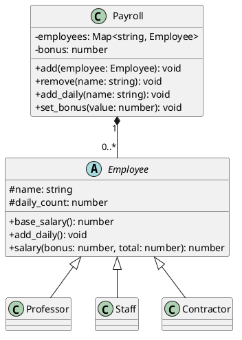

# Salário — regras de cálculo polimórficas

<toc-table />


## Intro

Uma folha de pagamento reúne professores, servidores técnico-administrativos e
terceirizados. Todos são funcionários, mas cada categoria calcula o salário
base de forma diferente e possui limite próprio para diárias.

O objetivo principal é usar uma abstração comum para substituir regras de
cálculo sem condicionais na folha. Como objetivo secundário, a atividade mostra
que um valor compartilhado, como bônus, deve ser calculado na coordenação e
aplicado a todos os funcionários.

## Regras

- O nome do funcionário é único.
- Professor: A=`3000`, B=`5000`, C=`7000`, D=`9000`, E=`11000`.
- Servidor: `3000 + 300 * nível`.
- Terceirizado: `4 * horas`, mais `500` quando insalubre.
- Professor recebe no máximo 2 diárias; servidor, 1; terceirizado, nenhuma.
- Cada diária acrescenta `100` ao salário.
- O bônus definido pela folha é dividido igualmente entre os funcionários.
- Remover funcionário reduz o grupo que divide um novo bônus.

## Diagrama



## Guide

1. Modele `Employee` com o comportamento comum e deixe o salário base e o
   limite de diárias abstratos. A classe não deve conhecer o tipo concreto.
2. Implemente as três fórmulas nas subclasses. Mantenha os dados necessários
   junto da regra que os usa.
3. Faça `Payroll` possuir o mapa de funcionários, controlar o bônus e delegar
   diárias ao funcionário localizado.
4. Calcule o bônus no momento da consulta. Assim alterar o bônus ou remover
   alguém não exige reescrever salários armazenados.
5. Trate limites de diárias como falhas de domínio e deixe o `Shell` apenas
   converter argumentos e apresentar mensagens.

A herança é adequada aqui porque todas as categorias compartilham a identidade
de funcionário e o contrato de salário, mas substituem uma regra central. O
custo é manter subclasses com políticas distintas; o benefício é adicionar uma
categoria sem espalhar testes de tipo pela folha.

## Verificação

Execute `python3 -m unittest discover src/py` e verifique fórmulas, limites de
diárias, bônus dividido e remoção.

## Shell

```sh
#TEST_CASE basic
$addProf david C
$addSta ana 3
$addDiaria david
$setBonus 200
$showAll
prof:david:C:7200
sta:ana:3:4000
$end
```
