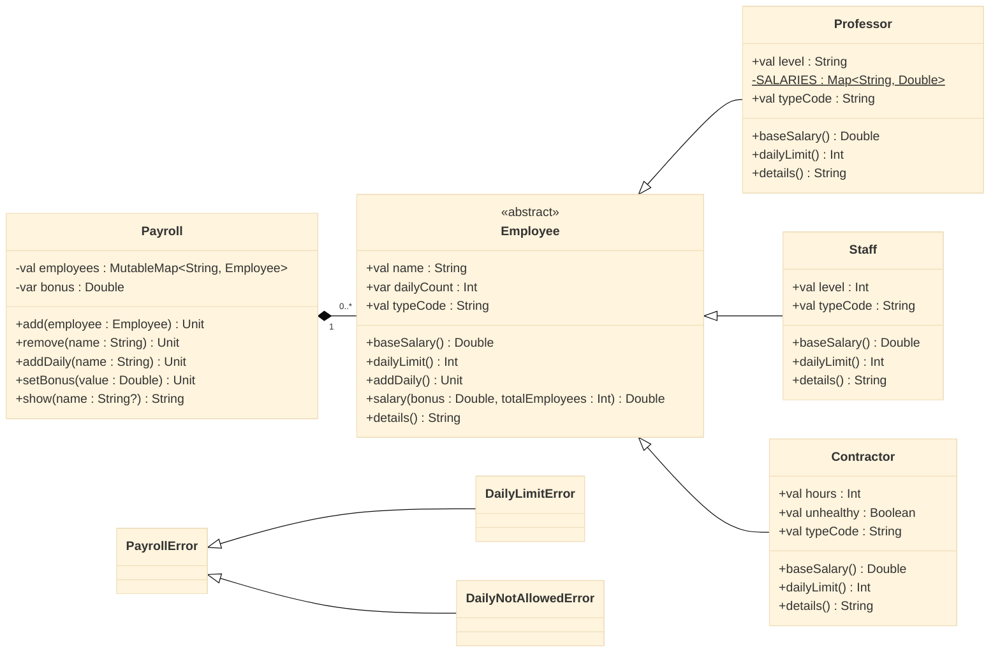

# Salário — regras de cálculo polimórficas

<!-- toc-table -->
[Intro](#intro) | [Regras](#regras) | [Diagrama](#diagrama) | [Guide](#guide) | [Verificação](#verificação) | [Shell](#shell)
-- | -- | -- | -- | -- | --
<!-- end -->


## Intro

Uma folha de pagamento reúne professores, servidores técnico-administrativos e
terceirizados. Todos são funcionários, mas cada categoria calcula o salário
base de forma diferente e possui limite próprio para diárias.

O objetivo principal é usar uma abstração comum para substituir regras de
cálculo sem condicionais na folha. Como objetivo secundário, a atividade mostra
que um valor compartilhado, como bônus, deve ser calculado na coordenação e
aplicado a todos os funcionários.

## Regras

- `Employee` é abstrata e declara `baseSalary() : Double`, `typeCode : String`, `dailyLimit() : Int` e `details() : String`.
- O nome do funcionário é único na `Payroll`; cadastrar novamente o mesmo nome não substitui o funcionário atual.
- `Professor` recebe salário base conforme o nível: `A = 3000`, `B = 5000`, `C = 7000`, `D = 9000`, `E = 11000`.
- `Staff` recebe `3000 + 300 * level`; `Contractor` recebe `4 * hours`, mais `500` quando `unhealthy` é `true`.
- `Professor` pode receber até duas diárias, `Staff` uma, e `Contractor` nenhuma. Cada diária aceita acrescenta `100` ao salário.
- Exceder o limite lança `DailyLimitError` (`fail: limite de diarias atingido`); terceirizado recebe `DailyNotAllowedError` (`fail: terc nao pode receber diaria`).
- `Payroll.show()` calcula `salary(bonus, totalEmployees)` no momento da consulta, dividindo igualmente o bônus atual; remover um funcionário altera a divisão de futuros resultados.
- Funcionário inexistente produz `fail: funcionario nao encontrado`.

## Diagrama


```mermaid
%%{init: {"theme": "base", "themeVariables": {"fontFamily": "monospace"}}}%%
classDiagram
    direction LR

    class Employee {
        <<abstract>>
        +val name : String
        +var dailyCount : Int
        +baseSalary() Double
        +val typeCode : String
        +dailyLimit() Int
        +addDaily() Unit
        +salary(bonus : Double, totalEmployees : Int) Double
        +details() String
    }

    class Professor {
        +val level : String
        -SALARIES : Map~String, Double~$
        +baseSalary() Double
        +val typeCode : String
        +dailyLimit() Int
        +details() String
    }

    class Staff {
        +val level : Int
        +baseSalary() Double
        +val typeCode : String
        +dailyLimit() Int
        +details() String
    }

    class Contractor {
        +val hours : Int
        +val unhealthy : Boolean
        +baseSalary() Double
        +val typeCode : String
        +dailyLimit() Int
        +details() String
    }

    class Payroll {
        -val employees : MutableMap~String, Employee~
        -var bonus : Double
        +add(employee : Employee) Unit
        +remove(name : String) Unit
        +addDaily(name : String) Unit
        +setBonus(value : Double) Unit
        +show(name : String?) String
    }

    class PayrollError
    class DailyLimitError
    class DailyNotAllowedError

    Employee <|-- Professor
    Employee <|-- Staff
    Employee <|-- Contractor
    PayrollError <|-- DailyLimitError
    PayrollError <|-- DailyNotAllowedError
    Payroll "1" *-- "0..*" Employee
```

## Guide

1. Modele `Employee` com `name : String`, `dailyCount : Int` e o comportamento
   comum. Deixe `baseSalary()` e `dailyLimit()` abstratos; a classe não deve
   conhecer o tipo concreto.
2. Implemente as três fórmulas nas subclasses. Mantenha os dados necessários
   junto da regra que os usa.
3. Faça `Payroll` possuir o mapa de funcionários, controlar o bônus e delegar
   diárias ao funcionário localizado.
4. Calcule o bônus no momento da consulta. Assim alterar o bônus ou remover
   alguém não exige reescrever salários armazenados.
5. Trate limites de diárias como falhas de domínio e deixe o `Shell` apenas
   converter argumentos e apresentar mensagens.

A herança é adequada aqui porque todas as categorias compartilham a identidade
de funcionário e o contrato de salário, mas substituem uma regra central. O
custo é manter subclasses com políticas distintas; o benefício é adicionar uma
categoria sem espalhar testes de tipo pela folha.

## Verificação

Execute `tko run . -l kt` para verificar fórmulas, limites de diárias, bônus
dividido e remoção.

## Shell

```sh
#TEST_CASE basic
$addProf david C
$addSta ana 3
$addDiaria david
$setBonus 200
$showAll
prof:david:C:7200
sta:ana:3:4000
$end
```

```sh
#TEST_CASE salary rules and daily limits
$addProf david C
$addSta ana 3
$addTer leo 40 sim
$addDiaria david
$addDiaria david
$addDiaria david
fail: limite de diarias atingido
$addDiaria leo
fail: terc nao pode receber diaria
$showAll
prof:david:C:7200
sta:ana:3:3900
ter:leo:40:sim:660
$end
```

```sh
#TEST_CASE bonus changes when payroll membership changes
$addProf david C
$addSta ana 3
$setBonus 200
$rm ana
$showAll
prof:david:C:7200
$end
```

<!-- KOTLIN -->
