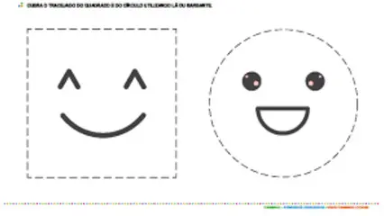
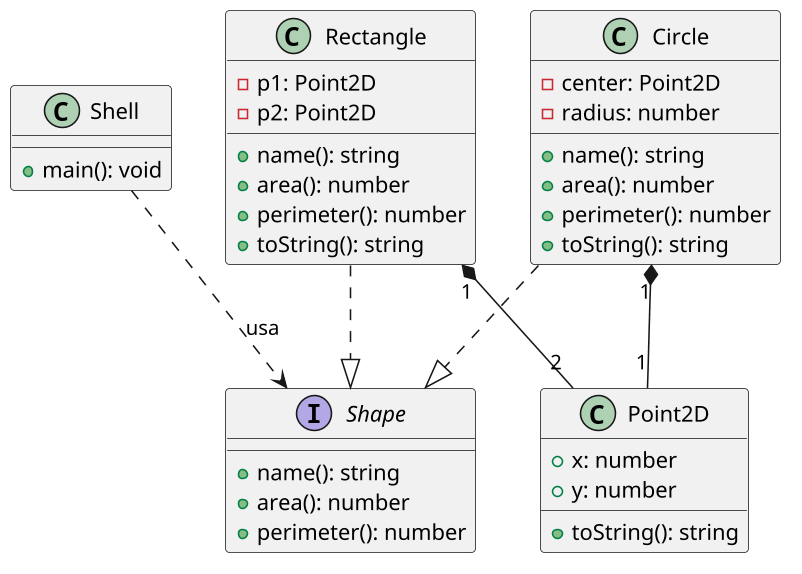

# [TRAIN] Shapes: interface e substituição geométrica

<!-- toc-table -->
[Intro](#intro) | [Regras](#regras) | [Diagrama](#diagrama) | [Guide](#guide) | [Shell](#shell) | [Draft](#draft)
-- | -- | -- | -- | -- | --
<!-- toc-table -->



## Intro

Um programa de desenho precisa armazenar círculos e retângulos e apresentar
suas medidas. As formas possuem dados diferentes, mas oferecem as mesmas
operações geométricas.

O objetivo principal é definir uma interface comum e escrever uma função que
trate formas diferentes por substituição. Em Python, a interface é representada
por um `Protocol`: uma classe pode ser usada como `Shape` quando possui o
contrato necessário.

## Regras

- `Point2D` representa uma coordenada imutável com `x` e `y`.
- `Circle` possui centro e raio, calcula área e perímetro e é exibido como
  `Circ: C=(x, y), R=r`.
- `Rectangle` possui dois vértices opostos, calcula área e perímetro e é
  exibido como `Rect: P1=(x1, y1) P2=(x2, y2)`.
- A interface `Shape` exige `name()`, `area()` e `perimeter()`.
- `info(shape: Shape)` deve funcionar para qualquer objeto compatível com a
  interface, sem testar sua classe concreta.
- `show` lista as formas na ordem de criação.
- `info` lista área (`A`) e perímetro (`P`) na ordem de criação, com duas casas.
- As formas são imutáveis depois de criadas.

## Diagrama



## Guide

1. Crie `Point2D` imutável e use-o como centro ou vértice.
2. Defina o `Protocol Shape` com as três operações comuns.
3. Implemente `Circle` e `Rectangle` sem criar uma classe base concreta.
4. Escreva `info(shape: Shape)` usando somente o contrato da interface.
5. Armazene as formas em `list[Shape]` e implemente `show` e `info` por
   percursos polimórficos.

O `Protocol` é suficiente porque o objetivo é o contrato comum, não o
compartilhamento de estado ou implementação. `Point2D` permanece separado por
ser um valor geométrico reutilizado pelas formas. Não há necessidade de uma
classe `Calc` enquanto nenhuma operação adicional fizer parte do contrato.

Perguntas de reflexão:

- Por que `info` não precisa saber se recebeu um círculo ou um retângulo?
- Qual é o benefício de usar uma lista de `Shape`?
- Por que `Point2D` não precisa conhecer as formas que o utilizam?
- Que nova forma poderia ser adicionada sem alterar `info`?

## Shell

```bash
#TEST_CASE creating and showing
$circle 2 3 5
$show
Circ: C=(2.00, 3.00), R=5.00
$rect 1 1 3 3
$rect 2 4.53 5 10
$circle 1 1 1.5
$show
Circ: C=(2.00, 3.00), R=5.00
Rect: P1=(1.00, 1.00) P2=(3.00, 3.00)
Rect: P1=(2.00, 4.53) P2=(5.00, 10.00)
Circ: C=(1.00, 1.00), R=1.50
$end
```

```bash
#TEST_CASE polymorphic information
$circle 2 3 5
$rect 1 1 3 3
$rect 2 4.53 5 10
$circle 1 1 1.5
$info
Circ: A=78.54 P=31.42
Rect: A=4.00 P=8.00
Rect: A=16.41 P=16.94
Circ: A=7.07 P=9.42
$end
```

```bash
#TEST_CASE invalid command
$triangle 0 0 2
fail: invalid command
$end
```

## Draft

<!-- links .cache/starter -->
<!-- links -->
