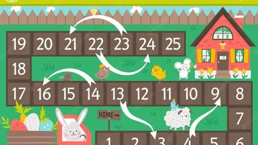
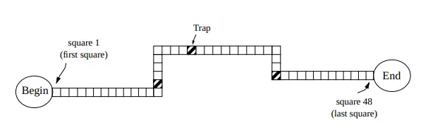
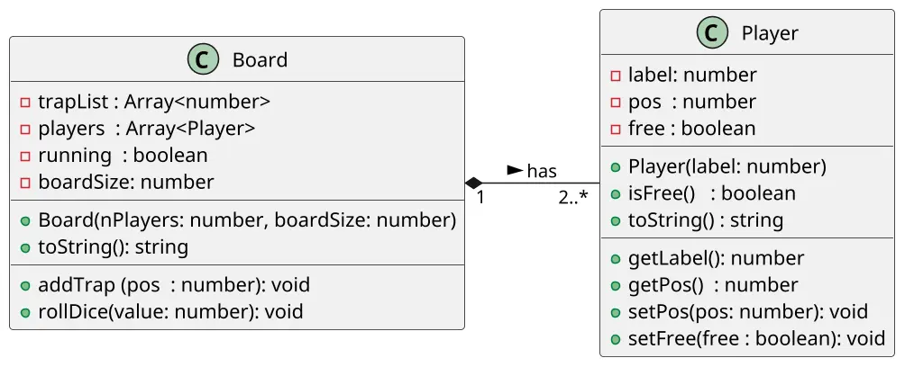

# [CHECK] Tabuleiro: coleções na simulação de turnos

<!-- toc-table -->



## Intro

Nosso jogo consiste em um tabuleiro contendo uma trilha de quadrados e um conjunto de peças coloridas. No início do jogo, cada jogador recebe uma peça; todas as peças são inicialmente posicionadas na posição 0 da trilha.

O jogo prossegue em rodadas. Em cada rodada, os jogadores rolam um D20 (dado de 20 faces) e movem suas peças para frente um número de quadrados igual ao resultado obtido pelos dados. Os jogadores rolam os dados sempre na mesma ordem (jogador A, depois jogador B, etc.) nas rodadas.

A maioria dos quadrados no tabuleiro são quadrados simples, mas alguns são “armadilhas”. Se a peça de um jogador cair em um quadrado da armadilha no final do movimento do jogador. O jogador ficará preso na armadilha até que na sua rodada jogue um número par se libertando da armadilha. Ao rolar um número par e se libertar da armadilha, sua peça não se move nessa rodada, mas na próxima poderá se mover normalmente.



Haverá exatamente três armadilhas na trilha.

O vencedor do jogo é o jogador cuja peça chega primeiro ao final da trilha. O fim da trilha é depois da última casa do tabuleiro. Considere, por exemplo, a placa da figura acima, que tem quadrados numerados de 1 a 48. No início, as peças são posicionadas no local marcado como 'Início', ou seja, antes do quadrado número 1. Portanto, se um jogador rolar um 7, sua peça é posicionada na casa número 7 no final da primeira rodada do jogo.
Além disso, se a peça de um jogador estiver posicionada na casa 41, o jogador precisa de um resultado de rolagem de pelo menos 8 para chegar ao final da trilha e ganhar o jogo. Observe também que não haverá empate no jogo.

___

Questão adaptada da maratona ACM 2003 por @WladimirTavares

## Objetivos pedagógicos

O objetivo principal é consolidar o uso de coleções para coordenar uma simulação de turnos. Como objetivos secundários, a atividade trabalha o encapsulamento do estado de cada jogador e a transição para um estado terminal quando alguém vence.

### Conhecimentos prévios

São necessários objetos, listas, condicionais, laços, métodos, índices e valores booleanos. A implementação canônica desta atividade é feita em Python.

### Invariantes e elementos observáveis

- os jogadores começam na posição `0` e cada um possui uma peça;
- a lista de jogadores representa a ordem dos turnos e gira após cada jogada;
- uma armadilha é verificada somente depois do movimento;
- jogador preso não se move até tirar um número par;
- ao se libertar, o jogador não se move naquela rodada;
- depois da vitória, novas rolagens não alteram o estado;
- a saída de `show` permite observar posições, ordem dos turnos e armadilhas.

Valores de rolagem são tratados como inteiros nos testes. O contexto usa um D20, mas a atividade não cria uma validação adicional de intervalo para manter o foco na simulação.

___

## Drafts

<!-- links .cache/starter -->
<!-- links -->

## Guide

[](https://youtu.be/x3_hlVYdCdU?si=g0fR-AAgvzkMxU9G)



Comece modelando `Player`, que possui sua posição e o estado `trapped`. Depois modele `Board`, que possui a lista de jogadores, as posições das armadilhas e o estado de execução.

Uma rodada deve retirar o primeiro jogador da lista, aplicar a regra correspondente e colocá-lo no final da lista. O domínio pode retornar eventos da rodada, como movimento, armadilha, libertação ou vitória; o Shell transforma esses eventos nas mensagens observáveis.

Ao testar, verifique tanto a mensagem produzida quanto a posição, o estado de prisão, a ordem dos turnos e o fato de que uma partida encerrada não muda mais.


<!-- load diagrama.puml fenced=ts:filter -->

<!-- load -->

___

## Shell

```s
#TEST_CASE init
$init 2 10
$show
player1: 1..........
player2: 2..........
traps__: ...........

$addTrap 2
$addTrap 4
$addTrap 8
$show
player1: 1..........
player2: 2..........
traps__: ..x.x...x..

#TEST_CASE move
$roll 1
player1 andou para 1

#TEST_CASE trap
$roll 2
player2 andou para 2
player2 caiu em uma armadilha

#TEST_CASE show
$show
player1: .1.........
player2: ..2........
traps__: ..x.x...x..

#TEST_CASE keep trapped
$roll 4
player1 andou para 5
$roll 3
player2 continua preso

$show
player1: .....1.....
player2: ..2........
traps__: ..x.x...x..

#TEST_CASE trap
$roll 3
player1 andou para 8
player1 caiu em uma armadilha

#TEST_CASE release
$roll 6
player2 se libertou

$show
player1: ........1..
player2: ..2........
traps__: ..x.x...x..

#TEST_CASE win
$roll 2
player1 se libertou
$roll 10
player2 ganhou

#TEST_CASE boundary
$show
player1: ........1..
player2: ..........2
traps__: ..x.x...x..

#TEST_CASE game over
$roll 1
game is over
$end
```

```s
#TEST_CASE vitória exata e estado terminal
$init 2 5
$roll 5
player1 ganhou
$roll 1
game is over
$show
player2: 2.....
player1: .....1
traps__: ......
$end
```
