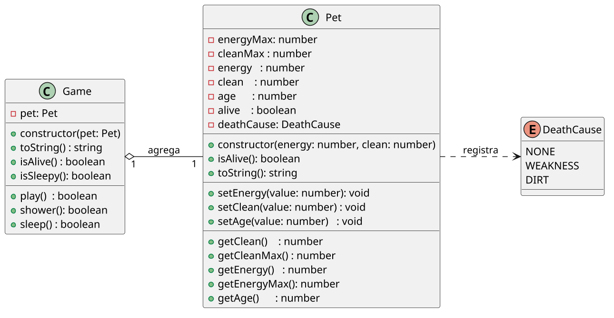

# Tamagotchi: coordenação, invariantes e estado terminal

<!-- toc-table -->
[Intro](#intro) | [Regras](#regras) | [Diagrama](#diagrama) | [Guide](#guide) | [Shell](#shell) | [Draft](#draft)
-- | -- | -- | -- | -- | --
<!-- toc-table -->


Você deve implementar um simulador de bichinho virtual. Ele poderá brincar, dormir e tomar banho. E eventualmente morrerá, se você não cuidar bem dele.

***

## Intro

Seu sistema deverá modelar um pet e um jogo que coordena suas ações.

O foco é separar o objeto que guarda os atributos e invariantes (`Pet`) do objeto que coordena as ações do jogo (`Game`).

## Regras

O sistema deverá:

- Classe `Pet`
  - É responsável por armazenar os dados relativos ao bichinho, controlar os limites permitidos para os atributos e registrar a morte.
  - A enumeração `DeathCause` representa o motivo da morte:
    - `NONE`: sem morte registrada.
    - `WEAKNESS`: morte por fraqueza.
    - `DIRT`: morte por sujeira.
  - Construtor
    - Recebe energia máxima`energyMax` e limpeza máxima `cleanMax` do pet que representam os valores máximo de energia e limpeza.
    - Energia `energy` e limpeza `clean` devem ser iniciados no máximo.
    - Idade `age` inicia em zero e aumenta a cada turno.
    - Vivo `alive` inicia como `true` porque o bichinho inicia vivo.
    - Causa da morte `deathCause` inicia como `NONE`.
  - Os métodos `setEnergy` e `setClean` alteram os valores dentro dos limites de 0 até o máximo permitido.
  - Se energia ou limpeza chegar a 0, o pet morre e registra a causa em `deathCause`.
  - O `toString` de um pet vivo mantém o formato `E:{energy}/{energyMax}, L:{clean}/{cleanMax}, I:{age}`.
  - O `toString` de um pet morto acrescenta a causa da morte:
    - `E:{energy}/{energyMax}, L:{clean}/{cleanMax}, I:{age}, D:{causa}`
- Classe `Game`
  - É responsável por armazenar o bichinho.
  - É onde estão localizadas as lógicas sobre as ações de brincar `play`, dar banho `shower` e dormir `sleep`.
  - Cada operação causa aumento e reduções nos atributos utilizando-se os métodos `set` e `get` do `Pet`.
  - Antes de brincar ou tomar banho, é necessário verificar se o bicho está vivo. Se ele estiver morto, a ação retorna `false` e não altera o estado.
  - Mesmo que uma ação mate o pet, ela deve retornar `true`, porque a interação aconteceu.
  - Em `play` e `shower`, `false` só deve ser retornado quando o pet já estava morto antes da chamada e por isso não era possível interagir.
  - Mandar dormir um pet que já está morto deve retornar `true` e não alterar o estado, porque a morte é tratada conceitualmente como um sono eterno.
  - `isSleepy` informa se o pet perdeu energia suficiente para dormir.
  - `isAlive` informa se o pet ainda pode interagir.
- A morte não deve ser impressa no momento da ação. Ela deve aparecer no próximo `$show`, por meio do `toString`.
- Tentar dormir sem sono continua sendo uma falha de interação e o `Shell` deve imprimir `fail: nao esta com sono`.
- `Game` agrega um `Pet` recebido no construtor. O pet é criado fora do jogo e pode continuar existindo sem o jogo.
- As classes de domínio não devem ler entrada nem imprimir mensagens. O `Shell` deve interpretar os retornos e cuidar da interface.

## Diagrama



## Guide

- Comece por `Pet`, mantendo energia, limpeza, idade, vivo e causa da morte como estado interno.
- Faça `setEnergy` e `setClean` preservarem os limites e registrarem a morte quando o valor chegar a zero.
- Use `DeathCause` para evitar que os métodos do domínio retornem textos como `fail: pet morreu de fraqueza`.
- Crie `Game` para coordenar as ações `play`, `shower` e `sleep`, delegando alterações de energia e limpeza para `Pet`.
- Antes de brincar ou tomar banho, verifique se o pet está vivo. Retorne `false` apenas quando a ação não puder começar porque o pet já estava morto.
- Em `sleep`, trate o pet morto como um caso válido e silencioso: retorne `true` sem alterar energia, limpeza ou idade.
- No `Shell`, crie um novo `Game` a cada `$init` e imprima apenas falhas que continuam sendo mensagens de ação, como `fail: nao esta com sono`.

Pergunta de reflexão: por que `sleep` em um pet morto é permitido, mas `play` e `shower` não são?

***

## Shell

```bash
#TEST_CASE inicio
# O comando "$init energia limpeza" recebe os valores do pet.
# O pet inicia com 0 de idade.
# Toda vez que $init é chamado, um novo pet é criado.
$init 20 15
# O comando "$show" mostra os parâmetros do Pet nesta ordem:
# Energia/Max, Limpeza/Max, Idade
$show
E:20/20, L:15/15, I:0
$init 10 50
$show
E:10/10, L:50/50, I:0
$end
```

***

```bash
#TEST_CASE play - Brincar 
# O comando "$play" altera em -2 energia, -3 limpeza, +1 idade.
$init 20 15
$play
$show
E:18/20, L:12/15, I:1
$play
$play
$show
E:14/20, L:6/15, I:3

#TEST_CASE dormir
# O comando "$sleep" aumenta energia até o máximo e a idade aumenta do número de turnos que o pet dormiu.
$sleep
$show
E:20/20, L:6/15, I:9

#TEST_CASE tomar banho
# O comando "$shower" altera em -3 energia, MAX na limpeza, +2 na idade.
$shower
$show
E:17/20, L:15/15, I:11

#TEST_CASE dormir sem sono
# Para dormir, precisa ter perdido pelo menos 5 unidades de energia
$sleep
fail: nao esta com sono

#TEST_CASE morrer
# Se algum atributo atingir 0, o pet morre e a causa aparece no próximo $show
$play
$play
$play
$play
$show
E:9/20, L:3/15, I:15
$play
$show
E:7/20, L:0/15, I:16, D:sujeira
$play
$shower
$sleep
$show
E:7/20, L:0/15, I:16, D:sujeira
$end
```

***

```bash
#TEST_CASE fraqueza
$init 5 10
$play
$play
$play

#TEST_CASE morto de fraqueza
$play
$show
E:0/5, L:1/10, I:3, D:fraqueza
$end
```

***

```bash
#TEST_CASE sono eterno
$init 5 10
$play
$play
$play
$sleep
$show
E:0/5, L:1/10, I:3, D:fraqueza
$end
```

## Draft

<!-- links .cache/starter -->
<!-- links -->
