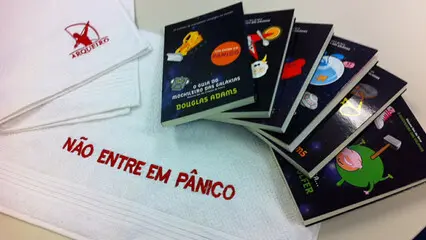
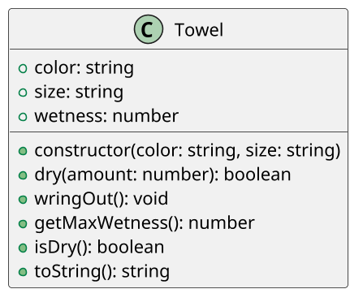

# [GUIA] Toalha, o item mais útil do universo

<!-- toc-table -->
<!-- toc-table -->

## Intro

O objetivo dessa atividade é implementar uma toalha que possa absorver água, ser torcida e informar seu estado.

## Regras

- A classe Toalha `Towel` possui os atributos cor `color`, tamanho `size` e umidade `wetness`.
- O construtor recebe a cor e o tamanho e inicia `wetness` com `0`.
- O método enxugar `dry` recebe uma quantidade inteira `amount` e aumenta `wetness` sem ultrapassar o limite.
- O método torcer `wringOut` zera `wetness`.
- O método `getMaxWetness` retorna o limite de umidade conforme o tamanho:
  - `P` -> `10`
  - `M` -> `20`
  - `G` -> `30`
- O método `isDry` retorna `true` quando `wetness` é `0` e `false` caso contrário.
- A classe `Towel` não deve ler entrada nem imprimir dados.
- Crie um código de teste para validar o comportamento da classe.

## Diagrama

O diagrama apresenta uma única classe porque cor, tamanho e umidade formam um comportamento coeso. Criar classes separadas para cada atributo aumentaria a complexidade sem melhorar a manutenção ou os testes nesta etapa.

## Guide

<!-- load src/py/solver.py --fenced -->
<!-- load -->

Implemente e teste a classe em partes: estado inicial, absorção, limite de umidade, torção e consulta de estado.

Esta atividade trabalha KISS, responsabilidade única, separação entre domínio e interface e testabilidade. A classe `Towel` mantém as regras da toalha; o código de demonstração deve apenas chamar seus métodos e apresentar os resultados.
