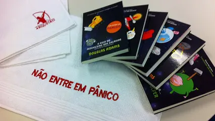
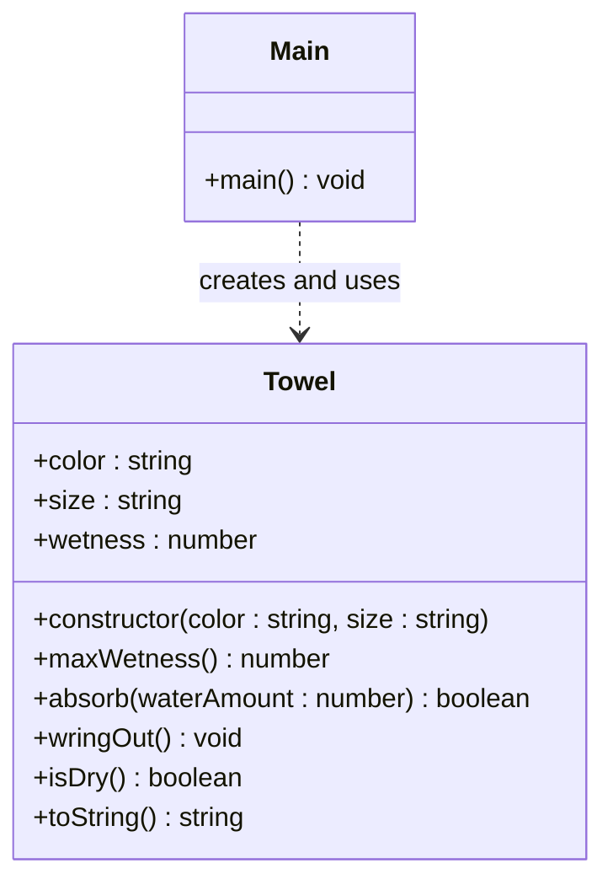

# [GUIDE] Toalha que enxuga

<!-- toc-table -->
[Intro](#intro) | [Regras](#regras) | [Diagrama](#diagrama) | [Guide](#guide)
-- | -- | -- | --
<!-- toc-table -->

## Intro

O objetivo dessa atividade é implementar uma toalha que possa absorver água, ser torcida e informar seu estado.

O foco é observar como uma classe junta estado e comportamento: a própria `Towel` controla sua umidade, enquanto o programa de demonstração apenas cria objetos e chama métodos.

## Regras

- A classe Toalha `Towel` possui os atributos cor `color`, tamanho `size` e umidade `wetness`.
- O construtor recebe a cor e o tamanho e inicia `wetness` com `0`.
- O método absorver `absorb` recebe uma quantidade inteira `water_amount` e aumenta `wetness` sem ultrapassar o limite.
  - Se `water_amount` for negativo, retorna `false` e preserva `wetness`.
  - Se a quantidade ultrapassar a capacidade, armazena apenas o limite e retorna `false`.
  - Caso consiga absorver toda a quantidade, retorna `true`.
- O método torcer `wring_out` zera `wetness`.
- O método `max_wetness` retorna o limite de umidade conforme o tamanho:
  - `P` -> `10`
  - `M` -> `20`
  - `G` -> `30`
- O método `is_dry` retorna `true` quando `wetness` é `0` e `false` caso contrário.
- `__str__` retorna o estado no formato `{color} {size} {wetness}`.
- A classe `Towel` não deve ler entrada nem imprimir dados.
- Use o programa de demonstração para verificar o comportamento da classe.

## Diagrama

`Towel` concentra cor, tamanho e umidade porque esses dados formam um comportamento coeso. `maxWetness()` mantém a regra da capacidade junto ao tamanho; `absorb()` aplica o limite; `Main` apenas cria a toalha e demonstra as operações.

```mermaid
%%{init: { "fontFamily": "monospace" } }%%
classDiagram
    direction TB

    class Towel {
        +color : string
        +size : string
        +wetness : number
        +constructor(color : string, size : string)
        +maxWetness() number
        +absorb(waterAmount : number) boolean
        +wringOut() void
        +isDry() boolean
        +toString() string
    }

    class Main {
        +main() void
    }

    Main ..> Towel : creates and uses
```

## Guide

Implemente e verifique a classe em partes: estado inicial, absorção, limite de umidade, torção e consulta de estado.

- Comece pelo construtor e confira se uma toalha nova sempre inicia com `wetness` igual a `0`.
- Implemente `max_wetness` antes de `absorb`, porque o limite depende do tamanho.
- Em `absorb`, rejeite quantidades negativas e aumente a umidade apenas até o limite retornado por `max_wetness`.
- Em `wring_out`, volte a umidade para `0`.
- Em `is_dry`, apenas consulte o estado, sem alterar a toalha.

Pergunta de reflexão: se o cálculo do limite ficasse espalhado pelo programa de demonstração, que mudança seria mais difícil quando surgisse um novo tamanho?

Verifique estes casos: uma toalha `P` começa seca, `absorb(5)` resulta em `wetness = 5`, `absorb(10)` limita a umidade em `10` e retorna `false`, `absorb(-1)` preserva a umidade, e `wring_out()` faz `is_dry()` retornar `true`.
