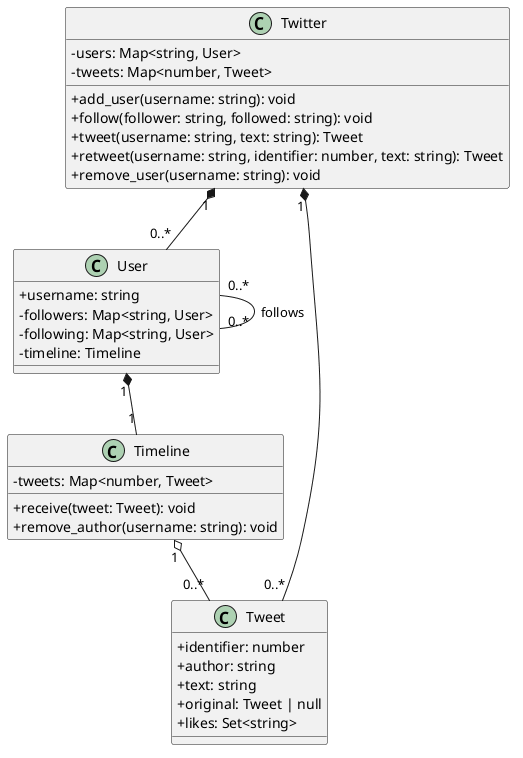

# Twitter — colaboração entre usuários e timelines

<toc-table />


## Intro

Esta atividade modela uma rede social pequena: usuários seguem usuários,
publicam tweets, recebem timelines, curtem mensagens e podem retuitar um tweet.
Também há remoção de usuários e dos tweets que eles publicaram.

O objetivo principal é praticar colaboração entre objetos e relações
bidirecionais. Como objetivo secundário, a atividade mostra por que uma
timeline deve ser um componente próprio, com responsabilidade de armazenar e
consultar tweets sem transformar `User` ou `Twitter` em um objeto monolítico.

## Regras

- usernames e tweet ids são únicos.
- Um usuário pode seguir outro usuário cadastrado; seguir a si mesmo não produz efeito.
- Um tweet aparece na timeline do autor e dos seus seguidores no momento da publicação.
- `like` só pode ser aplicado a um tweet presente na timeline do usuário.
- Curtidas são compartilhadas pelo tweet e não aparecem duplicadas.
- `unfollow` remove da timeline do seguidor os tweets do usuário deixado de seguir.
- `rt` cria um novo tweet e mantém referência ao tweet original.
- Remover usuário desfaz seus vínculos e marca seus tweets como removidos.
- Tweets removidos não aparecem sozinhos; uma referência de retweet ainda pode informar que o original foi removido.

## Diagrama



## Guide

1. Modele `Tweet` como objeto compartilhado. Curtidas precisam alterar o tweet
   visto por todas as timelines, não cópias desconectadas.
2. Crie `Timeline` para encapsular a coleção de tweets e as operações de
   receber, procurar e remover por autor. Isso dá coesão à leitura e à limpeza.
3. Faça `User` manter relações de seguidores e seguidos em ambas as direções.
   Toda alteração deve atualizar os dois lados, preservando a consistência.
4. Faça `Twitter` localizar objetos e coordenar a criação, distribuição,
   retweet e remoção. As regras de armazenamento da timeline permanecem nela.
5. Implemente o `Shell` depois do domínio, convertendo texto e apresentando
   exceções nomeadas. Teste relações, compartilhamento de curtidas e falhas.

A atividade trabalha composição e delegação: `Twitter` possui usuários e
tweets, `User` possui uma timeline, e a timeline recebe tweets compartilhados.
O custo é coordenar referências entre objetos; o benefício é que cada mudança
tem uma responsabilidade clara e a evolução não exige um único objeto com
todas as regras.

## Verificação

Execute `python3 -m unittest discover src/py` e verifique publicação para
seguidores, unfollow, curtidas, retweet, remoção e ids inexistentes.

## Shell

```sh
#TEST_CASE basic
$add goku
$add sara
$follow goku sara
$twittar sara hoje estou feliz
$like goku 0
$timeline goku
0:sara (hoje estou feliz) [goku]
$end
```
